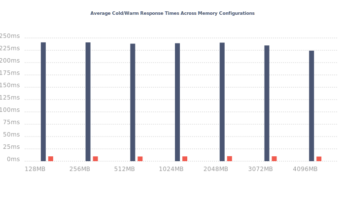

# Benchmark: Response Times

The following are the response time results from AWS XRay, generated after running `npm run benchmark`.

- 🔵: Average cold startup times
- 🔴: Average warm startup times

- 🔵: Fastest warm response time
- 🔴: Slowest warm response time
- 🟡: Fastest cold response time
- 🟠: Slowest cold response time

## Overview

  
- [Results for 128 MB](#results-for-128-mb)
- [Results for 256 MB](#results-for-256-mb)
- [Results for 512 MB](#results-for-512-mb)
- [Results for 1024 MB](#results-for-1024-mb)
- [Results for 2048 MB](#results-for-2048-mb)
- [Results for 3072 MB](#results-for-3072-mb)
- [Results for 4096 MB](#results-for-4096-mb)

## Results for 128 MB

| Measurement (128 MB) | Time (ms) |
|-------------|------|
| Average warm start response time | 9.8 ms |
| Average cold start response time | 241.1 ms |
| Fastest warm response time | 5.9 ms |
| Slowest warm response time | 36 ms |
| Fastest cold response time  | 177.9 ms |
| Slowest cold response time | 332.9 ms |
  

| Response time | Initialization | Invocation | Overhead | Cold/ Warm Start | Memory Size | Trace ID |
|---------------|----------------|------------|----------|------------------|-------------|----------|
| 200.9 ms | 96.3 ms | 9.1 ms | 0.2 ms | 🥶 | 128 MB | 1-5ff21526-56f57d1707b295bd4c8bfca2 |
| 8.9 ms |  | 1.7 ms | 0.2 ms | 🥵 | 128 MB | 1-5ff214b7-1dc4b0fa0ccaf7f649c3e711 |
| 220 ms | 111.7 ms | 8.4 ms | 0.3 ms | 🥶 | 128 MB | 1-5ff21455-0d28c6f334aff06b51c44729 |
| 10 ms |  | 1.8 ms | 0.2 ms | 🥵 | 128 MB | 1-5ff214c8-71d1a808372c9e772b6bc370 |
| 195.9 ms | 99.4 ms | 8.3 ms | 0.2 ms | 🥶 | 128 MB | 1-5ff214a1-127092613c656d00186b20f4 |
| 223 ms | 96.6 ms | 7.8 ms | 1.4 ms | 🥶 | 128 MB | 1-5ff214aa-00baed586286264f7306213e |
| 9.9 ms |  | 1.8 ms | 0.6 ms | 🥵 | 128 MB | 1-5ff21500-05dd292767508b1c29b6e373 |
| 264.9 ms | 94.8 ms | 7.6 ms | 0.4 ms | 🥶 | 128 MB | 1-5ff2143f-12ccf6f620be11013d0f3597 |
| 8 ms |  | 1.7 ms | 0.2 ms | 🥵 | 128 MB | 1-5ff214ba-390d9af040d65864164799dc |
| 9.9 ms |  | 1.8 ms | 0.1 ms | 🥵 | 128 MB | 1-5ff21471-46eec71e1e7762700d1553c0 |
| 188.9 ms | 94.7 ms | 7.5 ms | 0.2 ms | 🥶 | 128 MB | 1-5ff21533-4dbae0f31443d45a40b480f9 |
| 6.9 ms |  | 1.8 ms | 0.2 ms | 🥵 | 128 MB | 1-5ff21470-4a1173de4c5bdb471a9a93a6 |
| 9.9 ms |  | 1.7 ms | 0.2 ms | 🥵 | 128 MB | 1-5ff214b6-7fba990c5ffc13f079e68284 |
| 223 ms | 108.8 ms | 8.5 ms | 1.3 ms | 🥶 | 128 MB | 1-5ff21452-49e0e07c18c677bb0941870e |
| 213.9 ms | 103.6 ms | 10.4 ms | 0.3 ms | 🥶 | 128 MB | 1-5ff214a2-3cd469da07fefd096c2c2998 |
| 233 ms | 131.1 ms | 8.3 ms | 0.3 ms | 🥶 | 128 MB | 1-5ff2149b-13cf59df1f975aec24337713 |
| 197 ms | 100.6 ms | 7.2 ms | 0.1 ms | 🥶 | 128 MB | 1-5ff214d6-6dd5ecd629c5011708c3cc02 |
| 205.9 ms | 101.5 ms | 8.6 ms | 0.7 ms | 🥶 | 128 MB | 1-5ff214af-4aea1f347dfb6f0473c971a7 |
| 230 ms | 108 ms | 8.6 ms | 0.3 ms | 🥶 | 128 MB | 1-5ff214e3-5aa20f714921a6b123c8c8d7 |
| 13.9 ms |  | 1.8 ms | 0.1 ms | 🥵 | 128 MB | 1-5ff21431-7a62090635099a24783ada93 |
| 7.9 ms |  | 1.9 ms | 0.4 ms | 🥵 | 128 MB | 1-5ff2146e-274a1d4d662a108c3de22159 |
| 9 ms |  | 1.9 ms | 0.3 ms | 🥵 | 128 MB | 1-5ff214fd-57e4880e4cd230f948d33a94 |
| 9 ms |  | 1.8 ms | 0.3 ms | 🥵 | 128 MB | 1-5ff214bd-50a41ec97ccb53f94b70b431 |
| 239 ms | 121.8 ms | 8.3 ms | 0.2 ms | 🥶 | 128 MB | 1-5ff21457-310460854f726d1b6f2b6049 |
| 8.9 ms |  | 1.6 ms | 0.2 ms | 🥵 | 128 MB | 1-5ff21430-7336cbdd1d968748736e9a63 |
| 5.9 ms |  | 1.6 ms | 0.2 ms | 🥵 | 128 MB | 1-5ff21549-5b99fd4f3b233da9065324fd |
| 8.9 ms |  | 1.9 ms | 0.3 ms | 🥵 | 128 MB | 1-5ff21479-528d5d862af5e6b04eadbf7b |
| 200 ms | 94.6 ms | 8.1 ms | 0.5 ms | 🥶 | 128 MB | 1-5ff21525-3935c6ed46337d5b17b1bab8 |
| 9.9 ms |  | 1.9 ms | 0.2 ms | 🥵 | 128 MB | 1-5ff214b9-050256f0161f505e2200fb06 |
| 251.9 ms | 106.2 ms | 9.3 ms | 0.4 ms | 🥶 | 128 MB | 1-5ff214ea-35ada8a321a07e7030452fdc |
| 194.9 ms | 95 ms | 7.7 ms | 0.2 ms | 🥶 | 128 MB | 1-5ff214e6-117c2c7d67ab472a1b8fc1fc |
| 212 ms | 94.4 ms | 8.5 ms | 0.6 ms | 🥶 | 128 MB | 1-5ff2153d-3d45e3d365db502527c4d9e9 |
| 7.9 ms |  | 1.8 ms | 0.1 ms | 🥵 | 128 MB | 1-5ff21554-0d5e2749607fbd1a0955204b |
| 11.9 ms |  | 1.7 ms | 0.2 ms | 🥵 | 128 MB | 1-5ff21554-07c7039f5f0cdb3752899c61 |
| 16.9 ms |  | 2.1 ms | 0.5 ms | 🥵 | 128 MB | 1-5ff214ca-1b977d8c5db886ae5b243ebd |
| 9 ms |  | 1.8 ms | 0.3 ms | 🥵 | 128 MB | 1-5ff21550-49ce6e701d4ae48e7659a262 |
| 9.9 ms |  | 1.8 ms | 0.2 ms | 🥵 | 128 MB | 1-5ff2154b-3e4506b8002ea41e37912dd3 |
| 9 ms |  | 1.7 ms | 0.1 ms | 🥵 | 128 MB | 1-5ff214c1-3281f7cb14aabda6312ab844 |
| 9 ms |  | 1.8 ms | 0.3 ms | 🥵 | 128 MB | 1-5ff2146c-64e20ef612660a216f1e546d |
| 6.9 ms |  | 1.7 ms | 0.1 ms | 🥵 | 128 MB | 1-5ff21555-265a6f617ec89d4b1c5ede10 |
| 9 ms |  | 2 ms | 0.3 ms | 🥵 | 128 MB | 1-5ff2154e-0c4107f647d553da51babcb5 |
| 8 ms |  | 1.8 ms | 0.3 ms | 🥵 | 128 MB | 1-5ff21543-29be3e54729f347d275805a1 |
| 6.9 ms |  | 1.7 ms | 0.2 ms | 🥵 | 128 MB | 1-5ff21540-571458ee4421f39e6298d3fb |
| 197 ms | 97.7 ms | 7.5 ms | 0.2 ms | 🥶 | 128 MB | 1-5ff21445-61c73bec35736a116ae17f79 |
| 8 ms |  | 1.8 ms | 0.3 ms | 🥵 | 128 MB | 1-5ff2147b-7eb43f836ec5052d63981c43 |
| 210 ms | 100.5 ms | 8.2 ms | 1.3 ms | 🥶 | 128 MB | 1-5ff2152e-581f0a186ba531e9782f913e |
| 177.9 ms | 91.5 ms | 7.6 ms | 0.3 ms | 🥶 | 128 MB | 1-5ff21534-445bee1564dfdad66a05ec7e |
| 200.9 ms | 106 ms | 8.8 ms | 0.3 ms | 🥶 | 128 MB | 1-5ff214b1-6b06c3111201f31f6a094a79 |
| 232 ms | 105.3 ms | 7.8 ms | 0.6 ms | 🥶 | 128 MB | 1-5ff214d4-663c08d677286923514828e4 |
| 231 ms | 114.2 ms | 8.7 ms | 0.4 ms | 🥶 | 128 MB | 1-5ff214fa-66045847046ea15e59d783a7 |
| 203.9 ms | 105.4 ms | 8 ms | 0.3 ms | 🥶 | 128 MB | 1-5ff214ae-68daa74665ca006f7f428e26 |
| 8 ms |  | 1.8 ms | 0.2 ms | 🥵 | 128 MB | 1-5ff21470-7d2f61bb17fb808421a05e0e |
| 15 ms |  | 2 ms | 0.2 ms | 🥵 | 128 MB | 1-5ff21465-48f9cb5e12364f34561d3474 |
| 9 ms |  | 1.8 ms | 0.2 ms | 🥵 | 128 MB | 1-5ff214fb-42dac6e832a57e904c112360 |
| 9.9 ms |  | 1.9 ms | 0.2 ms | 🥵 | 128 MB | 1-5ff2150b-5acc96cb22a4dcd53fcae4fe |
| 8.9 ms |  | 1.8 ms | 0.3 ms | 🥵 | 128 MB | 1-5ff2154d-7093c7c253ac1de74fe44637 |
| 8 ms |  | 1.8 ms | 0.3 ms | 🥵 | 128 MB | 1-5ff214c4-1ce1ce747d5e60fb4fbe0c2a |
| 13.9 ms |  | 1.8 ms | 0.3 ms | 🥵 | 128 MB | 1-5ff214ce-0640ea5b1ac8f16752a1d2cf |
| 217.9 ms | 111.6 ms | 8.1 ms | 0.6 ms | 🥶 | 128 MB | 1-5ff214f5-6f1613c80c34d82b3b1762c8 |
| 9.9 ms |  | 1.9 ms | 0.2 ms | 🥵 | 128 MB | 1-5ff214cc-5cba78e13065a9e904199e33 |
| 9 ms |  | 1.8 ms | 0.2 ms | 🥵 | 128 MB | 1-5ff21463-25668fb638b92bf068fdd62d |
| 332.9 ms | 102.3 ms | 8.4 ms | 1.1 ms | 🥶 | 128 MB | 1-5ff214b4-79c4789e42ad0a7e54f5ac36 |
| 9 ms |  | 1.7 ms | 0.2 ms | 🥵 | 128 MB | 1-5ff214bc-3d7f129414a46f9709327e6f |
| 212 ms | 110.9 ms | 8.4 ms | 0.3 ms | 🥶 | 128 MB | 1-5ff21497-1e78797976084af0345834e4 |
| 9 ms |  | 1.8 ms | 0.3 ms | 🥵 | 128 MB | 1-5ff214c7-197c3edd052810ff1bd62d33 |
| 278 ms | 128 ms | 11.3 ms | 0.1 ms | 🥶 | 128 MB | 1-5ff21519-58a3952765fe2e8809e51f3a |
| 228 ms | 106 ms | 10.3 ms | 1.5 ms | 🥶 | 128 MB | 1-5ff2145c-2775979778fb7f3b56a8eb98 |
| 210 ms | 94.4 ms | 8.4 ms | 0.9 ms | 🥶 | 128 MB | 1-5ff2148f-4dfd5efc3cdd4fad0bde3078 |
| 250 ms | 119.1 ms | 12.7 ms | 0.6 ms | 🥶 | 128 MB | 1-5ff214d1-791f0aa76d0c865d7fbcc9ce |
| 11 ms |  | 1.9 ms | 0.3 ms | 🥵 | 128 MB | 1-5ff21475-35f45e3e58ef33fb0157d3a9 |
| 231 ms | 115 ms | 8.4 ms | 0.5 ms | 🥶 | 128 MB | 1-5ff21520-578f117516ad98431016190d |
| 206 ms | 96.2 ms | 7.4 ms | 0.3 ms | 🥶 | 128 MB | 1-5ff2145b-7777f874125a6a4c735e1ebb |
| 9 ms |  | 1.7 ms | 0.3 ms | 🥵 | 128 MB | 1-5ff21434-2543d2f4378fda0e0dd1b733 |
| 226 ms | 102.2 ms | 9.4 ms | 0.3 ms | 🥶 | 128 MB | 1-5ff2144b-0f9e16236d35a11148ad221a |
| 8 ms |  | 1.9 ms | 0.1 ms | 🥵 | 128 MB | 1-5ff21462-79ba75e55d85082416bc9d83 |
| 16.9 ms |  | 1.8 ms | 0.2 ms | 🥵 | 128 MB | 1-5ff214b7-753406120701e4357d240796 |
| 8 ms |  | 1.9 ms | 0.5 ms | 🥵 | 128 MB | 1-5ff2146f-7b7136b5071a7dc869c1ee13 |
| 9 ms |  | 2.1 ms | 0.2 ms | 🥵 | 128 MB | 1-5ff2146b-375e5ae33b0af72c63575bfb |
| 243 ms | 123.3 ms | 10.9 ms | 0.9 ms | 🥶 | 128 MB | 1-5ff214e4-3582dee406666b2423769ad9 |
| 13 ms |  | 1.7 ms | 0.2 ms | 🥵 | 128 MB | 1-5ff21433-5119bef4015d00801dd23646 |
| 9 ms |  | 1.7 ms | 0.1 ms | 🥵 | 128 MB | 1-5ff2150a-57356bd332094ecc65110b14 |
| 186 ms | 95 ms | 7.4 ms | 0.3 ms | 🥶 | 128 MB | 1-5ff21496-412036b719ce76550abb1316 |
| 7.9 ms |  | 1.8 ms | 0.2 ms | 🥵 | 128 MB | 1-5ff214ca-39b97e1c592497294d8e8553 |
| 20.9 ms |  | 4.7 ms | 0.4 ms | 🥵 | 128 MB | 1-5ff21501-018226eb525c41882f7ebfe0 |
| 8.9 ms |  | 1.8 ms | 0.3 ms | 🥵 | 128 MB | 1-5ff21508-1b9fe56a2ebd49f849bd1320 |
| 8 ms |  | 1.7 ms | 0.2 ms | 🥵 | 128 MB | 1-5ff21551-6a315d7878a237bc1b33749a |
| 234.9 ms | 106.1 ms | 10.5 ms | 1.6 ms | 🥶 | 128 MB | 1-5ff2151e-56777c3a7f4583c3584d99ed |
| 225 ms | 94.3 ms | 8.5 ms | 0.5 ms | 🥶 | 128 MB | 1-5ff214f1-5ab665057876eaec61eaeb67 |
| 14.9 ms |  | 2.2 ms | 0.2 ms | 🥵 | 128 MB | 1-5ff21478-0808320545a775ef77c4a669 |
| 241.9 ms | 142.5 ms | 8.4 ms | 0.4 ms | 🥶 | 128 MB | 1-5ff214b5-23b5a3762c6627a41fd765cf |
| 217.9 ms | 107.3 ms | 8.7 ms | 2.5 ms | 🥶 | 128 MB | 1-5ff2145d-1fd1bd3150d0134c7e00fbed |
| 8.9 ms |  | 1.8 ms | 0.2 ms | 🥵 | 128 MB | 1-5ff21503-489a7a516348f2e240853261 |
| 204.9 ms | 95.6 ms | 7.2 ms | 0.2 ms | 🥶 | 128 MB | 1-5ff21522-08572f19415f6c2970157c7f |
| 9 ms |  | 1.9 ms | 0.3 ms | 🥵 | 128 MB | 1-5ff214ba-02a956b255dc9c6c59b59548 |
| 8.9 ms |  | 1.8 ms | 0.3 ms | 🥵 | 128 MB | 1-5ff2146a-6bbd6bc303865d443bea49ff |
| 10.9 ms |  | 1.8 ms | 0.3 ms | 🥵 | 128 MB | 1-5ff214d0-063ac5a84adcf3c0648a398a |
| 8.9 ms |  | 1.8 ms | 0.2 ms | 🥵 | 128 MB | 1-5ff214be-35a7c0600dccc8172fd3da92 |
| 9.9 ms |  | 2.5 ms | 0.4 ms | 🥵 | 128 MB | 1-5ff214cc-2f5596dc1a88978664cc6fb3 |
| 9 ms |  | 1.8 ms | 0.2 ms | 🥵 | 128 MB | 1-5ff21435-1ecd142e60411f9e590d8dba |
| 8.9 ms |  | 1.9 ms | 0.2 ms | 🥵 | 128 MB | 1-5ff21437-3bf4a2d658fbd38e14440f97 |
| 213.9 ms | 101.2 ms | 8.1 ms | 0.4 ms | 🥶 | 128 MB | 1-5ff2151b-78fc025e0e986eb8777d5891 |
| 36 ms |  | 1.8 ms | 0.2 ms | 🥵 | 128 MB | 1-5ff21431-10e8d3cd4a9c68a7378ef7ec |
| 9.9 ms |  | 1.7 ms | 0.1 ms | 🥵 | 128 MB | 1-5ff21434-3d72ddb73d9b86e97ce390fa |
| 29.9 ms |  | 1.7 ms | 0.2 ms | 🥵 | 128 MB | 1-5ff21552-3c96765819f2cad05f7638cc |
| 210 ms | 98.9 ms | 7.8 ms | 0.4 ms | 🥶 | 128 MB | 1-5ff214da-2e9cf01267fcf151089abdec |
| 9 ms |  | 1.8 ms | 0.2 ms | 🥵 | 128 MB | 1-5ff2150f-4f008e7a417104852c898e61 |
| 239 ms | 103.7 ms | 8.7 ms | 0.2 ms | 🥶 | 128 MB | 1-5ff214e5-18a0d8132201815647d1a8ec |
| 217 ms | 108.9 ms | 8.9 ms | 0.2 ms | 🥶 | 128 MB | 1-5ff21439-0f14f7dd02b209cb4bbf2ebb |
| 9.9 ms |  | 1.7 ms | 1.1 ms | 🥵 | 128 MB | 1-5ff2150e-3226f2e0656ac4134fd6abaf |
| 8.9 ms |  | 1.8 ms | 0.2 ms | 🥵 | 128 MB | 1-5ff21543-7a029c7554e62dc123a16e20 |
| 8 ms |  | 1.8 ms | 0.6 ms | 🥵 | 128 MB | 1-5ff2146b-666a831d1460a2155256620d |
| 220 ms | 106.1 ms | 15.1 ms | 0.5 ms | 🥶 | 128 MB | 1-5ff214ec-6512e0d52527f42f1a38f4fc |
| 195.9 ms | 96.6 ms | 23.3 ms | 2 ms | 🥶 | 128 MB | 1-5ff2144f-78278f6b69bddf3a49d10fdf |
| 194 ms | 93.2 ms | 7.7 ms | 0.2 ms | 🥶 | 128 MB | 1-5ff214ee-3eee24c800c2727a5407f8c9 |
| 7.9 ms |  | 1.9 ms | 0.2 ms | 🥵 | 128 MB | 1-5ff21467-225ba2ca2e13191b02eeff2a |
| 8.9 ms |  | 1.8 ms | 0.3 ms | 🥵 | 128 MB | 1-5ff21511-5039611f1c31ef82010a1700 |
| 224.9 ms | 105.1 ms | 8.2 ms | 0.3 ms | 🥶 | 128 MB | 1-5ff21450-317d5a50096b0c42415c347f |
| 16 ms |  | 1.8 ms | 0.2 ms | 🥵 | 128 MB | 1-5ff21502-1330c174418a7a193ff80a5a |
| 212 ms | 106.8 ms | 8.1 ms | 0.3 ms | 🥶 | 128 MB | 1-5ff2151c-0e2afca1296be07972eb73ba |
| 197 ms | 95.6 ms | 8 ms | 0.6 ms | 🥶 | 128 MB | 1-5ff21518-71dee55f2596a7176403ff5c |
| 9 ms |  | 1.7 ms | 0.2 ms | 🥵 | 128 MB | 1-5ff214b6-2ab57279094a935f4dc8b481 |
| 8.9 ms |  | 1.8 ms | 0.2 ms | 🥵 | 128 MB | 1-5ff214be-57098de5661116927072d06f |
| 210.9 ms | 112.1 ms | 11.7 ms | 0.1 ms | 🥶 | 128 MB | 1-5ff2152a-47d7430d26ce3eab3182fbc5 |
| 8 ms |  | 1.8 ms | 0.3 ms | 🥵 | 128 MB | 1-5ff2154e-6c85007802a5fa0c08bce4a4 |
| 9 ms |  | 1.8 ms | 0.1 ms | 🥵 | 128 MB | 1-5ff214fd-06705f67305e114d5d11902c |
| 8 ms |  | 1.8 ms | 0.3 ms | 🥵 | 128 MB | 1-5ff21463-278f0ad0218ed8653e7b937f |
| 9.9 ms |  | 1.9 ms | 0.2 ms | 🥵 | 128 MB | 1-5ff21435-3e6865610717d80843e34269 |
| 9 ms |  | 1.8 ms | 0.2 ms | 🥵 | 128 MB | 1-5ff21464-2315bf685431a1f75d52b901 |
| 12 ms |  | 1.7 ms | 0.2 ms | 🥵 | 128 MB | 1-5ff21511-070a4009282c226178fbdb59 |
| 203 ms | 101.4 ms | 7.5 ms | 0.2 ms | 🥶 | 128 MB | 1-5ff21455-296ff23133c5a10e1b5374e4 |
| 13.9 ms |  | 1.8 ms | 0.2 ms | 🥵 | 128 MB | 1-5ff21547-09ed2f9960c25d24236dfd45 |
| 236.9 ms | 120.9 ms | 10 ms | 0.3 ms | 🥶 | 128 MB | 1-5ff214a4-0045955d1653257c2eb83ad2 |
| 9.9 ms |  | 1.9 ms | 0.3 ms | 🥵 | 128 MB | 1-5ff21504-08411f0e64862b072844722e |
| 202.9 ms | 98.6 ms | 8 ms | 0.4 ms | 🥶 | 128 MB | 1-5ff21498-7eb7c876245433dc1c763feb |
| 11 ms |  | 1.9 ms | 0.2 ms | 🥵 | 128 MB | 1-5ff21467-0a0dc8b6571f91bd6bdb0fce |
| 12 ms |  | 1.8 ms | 0.3 ms | 🥵 | 128 MB | 1-5ff21501-32979e852116f79b3288a255 |
| 9 ms |  | 1.9 ms | 0.2 ms | 🥵 | 128 MB | 1-5ff21544-6be6b2783a15fa9a655d982b |
| 221 ms | 114.7 ms | 8.6 ms | 0.2 ms | 🥶 | 128 MB | 1-5ff21532-56573c3e3206c6ed2962657a |
| 9.9 ms |  | 1.7 ms | 0.2 ms | 🥵 | 128 MB | 1-5ff21436-07e4a22e731f09d84443d17e |
| 16 ms |  | 1.8 ms | 0.1 ms | 🥵 | 128 MB | 1-5ff2153f-0b8a870d365f494876bb6631 |
| 207.9 ms | 104.4 ms | 8.2 ms | 0.7 ms | 🥶 | 128 MB | 1-5ff2149f-5324b2442d0666371b335bed |
| 9 ms |  | 1.8 ms | 0.3 ms | 🥵 | 128 MB | 1-5ff21509-61cb61e756fc6db602a371f9 |
| 214.9 ms | 106.6 ms | 8.5 ms | 0.5 ms | 🥶 | 128 MB | 1-5ff21447-7f564fcf01bc6dae38877ff8 |
| 13 ms |  | 1.8 ms | 0.5 ms | 🥵 | 128 MB | 1-5ff21545-6561153355af98350f425c80 |
| 217 ms | 111.6 ms | 9.6 ms | 0.6 ms | 🥶 | 128 MB | 1-5ff214d9-37c289d4384f418e164cf4e4 |
| 236.9 ms | 95.6 ms | 7.4 ms | 0.6 ms | 🥶 | 128 MB | 1-5ff2153a-1fbc692f6affa5ef60d58733 |
| 9 ms |  | 1.8 ms | 0.2 ms | 🥵 | 128 MB | 1-5ff21507-2c6d772455103a6148aa30a7 |
| 9 ms |  | 1.8 ms | 0.2 ms | 🥵 | 128 MB | 1-5ff2154a-39fe4ea07bc5e39c49acad4e |
| 210 ms | 93.4 ms | 8.4 ms | 3.2 ms | 🥶 | 128 MB | 1-5ff21492-3adabe234669b31c055e3e0e |
| 202 ms | 105.5 ms | 8.8 ms | 0.3 ms | 🥶 | 128 MB | 1-5ff214a8-35aaf75e2e0fddcb3bbbdf33 |
| 8 ms |  | 1.8 ms | 0.2 ms | 🥵 | 128 MB | 1-5ff214c2-004f79900311386a3631ed43 |
| 8.9 ms |  | 1.7 ms | 0.1 ms | 🥵 | 128 MB | 1-5ff21500-173c5d397c13a06a3a1071d3 |
| 9 ms |  | 1.9 ms | 0.3 ms | 🥵 | 128 MB | 1-5ff21472-131fe58814aae9e93a70c494 |
| 7.9 ms |  | 1.8 ms | 0.3 ms | 🥵 | 128 MB | 1-5ff21469-71cec3744e0f2a467e6333c3 |
| 10.9 ms |  | 1.9 ms | 0.3 ms | 🥵 | 128 MB | 1-5ff2147a-31fd86e071b6007d31962e14 |
| 9.9 ms |  | 1.6 ms | 0.1 ms | 🥵 | 128 MB | 1-5ff21433-66aa25872be04431283dff93 |
| 217.9 ms | 106.6 ms | 8.9 ms | 0.4 ms | 🥶 | 128 MB | 1-5ff21535-1db6d5766c81d2924afd3848 |
| 213.9 ms | 106.7 ms | 8 ms | 0.3 ms | 🥶 | 128 MB | 1-5ff214b0-7dd619d0122feec7711a3fa2 |
| 204.9 ms | 102.9 ms | 9 ms | 0.6 ms | 🥶 | 128 MB | 1-5ff2153a-13469bbd69de0001757fe7b9 |
| 8 ms |  | 1.7 ms | 0.1 ms | 🥵 | 128 MB | 1-5ff2154f-70bd01324b08552e6379a615 |
| 14.9 ms |  | 1.7 ms | 0.3 ms | 🥵 | 128 MB | 1-5ff214c5-5aed326a79e6e13b2ffa2325 |
| 243 ms | 128.1 ms | 8.6 ms | 0.1 ms | 🥶 | 128 MB | 1-5ff21521-487bb36757d8d6d5017c486b |
| 223.9 ms | 130.4 ms | 8.2 ms | 0.3 ms | 🥶 | 128 MB | 1-5ff214a5-334e82ec4ea7077d164fa809 |
| 204.9 ms | 95.5 ms | 7.8 ms | 0.3 ms | 🥶 | 128 MB | 1-5ff214f0-2c74a87e1ead1df304d31341 |
| 9 ms |  | 1.7 ms | 0.2 ms | 🥵 | 128 MB | 1-5ff214bf-6e9ced09222f390775d965b8 |
| 220.9 ms | 106.1 ms | 8.6 ms | 0.5 ms | 🥶 | 128 MB | 1-5ff214e3-0e1f363c3701566e58328684 |
| 16 ms |  | 1.8 ms | 0.2 ms | 🥵 | 128 MB | 1-5ff2150a-4669064063a9707e60e212aa |
| 207 ms | 103.9 ms | 7.9 ms | 0.3 ms | 🥶 | 128 MB | 1-5ff2152d-0af1aee56263a02048f89a80 |
| 9.9 ms |  | 1.8 ms | 0.5 ms | 🥵 | 128 MB | 1-5ff2146f-19f7ba32712f5589780a0abd |
| 198.9 ms | 101.9 ms | 8.8 ms | 0.4 ms | 🥶 | 128 MB | 1-5ff2149c-0ad8a6523b89d2c560670345 |
| 229 ms | 129 ms | 12.5 ms | 0.5 ms | 🥶 | 128 MB | 1-5ff2145f-1fd2b07d0b836fe2475943fd |
| 10.9 ms |  | 2 ms | 0.3 ms | 🥵 | 128 MB | 1-5ff21505-2eaf51b9601005af475b5070 |
| 218.9 ms | 97.9 ms | 7.4 ms | 0.4 ms | 🥶 | 128 MB | 1-5ff2151a-494c670f7f2ac844494dd8cb |
| 24.9 ms |  | 1.8 ms | 0.2 ms | 🥵 | 128 MB | 1-5ff214fe-5be69195385247bd74b42085 |
| 6.9 ms |  | 1.7 ms | 0.3 ms | 🥵 | 128 MB | 1-5ff21553-5344180b55961ce125ecc550 |
| 207 ms | 109.8 ms | 8.4 ms | 0.2 ms | 🥶 | 128 MB | 1-5ff21528-4ef761672d2d97b3494867af |
| 200 ms | 97.9 ms | 8.4 ms | 1.8 ms | 🥶 | 128 MB | 1-5ff2144e-635d178008b5853d40b2286a |
| 9 ms |  | 1.8 ms | 0.2 ms | 🥵 | 128 MB | 1-5ff21510-63370e0b13a6bbc41cf25822 |
| 243 ms | 106.9 ms | 8.3 ms | 0.3 ms | 🥶 | 128 MB | 1-5ff214a3-720f3b732477c00c0fa24d3b |
| 205 ms | 100.5 ms | 8.4 ms | 0.5 ms | 🥶 | 128 MB | 1-5ff2151b-7528f7252cb2b43c495c6b00 |
| 207.9 ms | 97.6 ms | 7.3 ms | 0.2 ms | 🥶 | 128 MB | 1-5ff21439-65447eb3141515d7744e8851 |
| 7 ms |  | 1.7 ms | 0.2 ms | 🥵 | 128 MB | 1-5ff2153e-10f7dca306990876496441bf |
| 9.9 ms |  | 1.8 ms | 0.2 ms | 🥵 | 128 MB | 1-5ff214cf-2b0a249167468156489ed263 |
| 9.9 ms |  | 1.8 ms | 0.2 ms | 🥵 | 128 MB | 1-5ff21510-24f8669076c807a67d81a349 |
| 270.9 ms | 142 ms | 24.6 ms | 0.4 ms | 🥶 | 128 MB | 1-5ff2144c-239b825e603f980e0b1e5be9 |
| 203 ms | 94.9 ms | 8 ms | 0.2 ms | 🥶 | 128 MB | 1-5ff214b2-2364e9671795d9e473e87a21 |
| 9 ms |  | 1.8 ms | 0.2 ms | 🥵 | 128 MB | 1-5ff21513-41ebac2c074331345e927eca |
| 197 ms | 112.7 ms | 8.6 ms | 0.3 ms | 🥶 | 128 MB | 1-5ff21458-2e567d330bae8e905ebba41f |
| 197 ms | 93.4 ms | 7.8 ms | 0.1 ms | 🥶 | 128 MB | 1-5ff21450-7f190fdd182f6c4e36a411ce |
| 7.9 ms |  | 2 ms | 0.2 ms | 🥵 | 128 MB | 1-5ff21479-35434519298d47de697c6b8a |
| 207 ms | 98.8 ms | 7.6 ms | 0 ms | 🥶 | 128 MB | 1-5ff21523-7b1562a412a13a0835058300 |
| 8 ms |  | 1.8 ms | 0.2 ms | 🥵 | 128 MB | 1-5ff214c3-3ac6e17b0419b9406bd3fc43 |
| 7.9 ms |  | 2.1 ms | 0.3 ms | 🥵 | 128 MB | 1-5ff21473-127b510a5d10039356a155d1 |
| 208.9 ms | 108.3 ms | 8.6 ms | 0.5 ms | 🥶 | 128 MB | 1-5ff214f2-048ae31b77ad70c166f3733f |
| 9 ms |  | 1.8 ms | 0.3 ms | 🥵 | 128 MB | 1-5ff21541-7763e8881be99ca062ac3663 |
| 271 ms | 133.8 ms | 8.7 ms | 0.5 ms | 🥶 | 128 MB | 1-5ff214d5-035f3a785ddeb33c648408d9 |
| 201.9 ms | 95.2 ms | 7.8 ms | 0.4 ms | 🥶 | 128 MB | 1-5ff21493-32d850030c065ca64f6258c0 |
| 19 ms |  | 1.8 ms | 0.2 ms | 🥵 | 128 MB | 1-5ff2146a-398646336f9015fa72c1c526 |
| 193 ms | 105.3 ms | 8.6 ms | 0.3 ms | 🥶 | 128 MB | 1-5ff2144b-0eadce371e0687f128161e05 |
| 200.9 ms | 94.5 ms | 7.3 ms | 0.3 ms | 🥶 | 128 MB | 1-5ff214f8-4705dcfd654cf3a57d9e0f82 |
| 219.9 ms | 107.7 ms | 8.8 ms | 1.3 ms | 🥶 | 128 MB | 1-5ff214a6-79f83a976b0a1fbf574f210d |
| 185.9 ms | 96.8 ms | 8 ms | 1.6 ms | 🥶 | 128 MB | 1-5ff21453-195d14500c98005b745287f4 |
| 7.9 ms |  | 1.7 ms | 0.3 ms | 🥵 | 128 MB | 1-5ff21547-794360dd0d2836d25da69668 |
| 228.9 ms | 105.5 ms | 8.5 ms | 1.8 ms | 🥶 | 128 MB | 1-5ff214b3-1e0e227428c5bd4b568a4c37 |
| 228.9 ms | 116.2 ms | 9.5 ms | 0.3 ms | 🥶 | 128 MB | 1-5ff214d8-724d3c3842abb91d27d344e7 |
| 7.9 ms |  | 1.8 ms | 0.4 ms | 🥵 | 128 MB | 1-5ff214bb-7fd61ff478a4a944146bc581 |
| 208.9 ms | 106.8 ms | 8.3 ms | 0.4 ms | 🥶 | 128 MB | 1-5ff214d7-68cbab5369c5148341efa3b2 |
| 9 ms |  | 2 ms | 0.3 ms | 🥵 | 128 MB | 1-5ff214c6-16434cb5267171bb7aaaf7ea |
| 6.9 ms |  | 1.7 ms | 0.2 ms | 🥵 | 128 MB | 1-5ff21542-015950147e97c90668c849d6 |
| 274.9 ms | 107.9 ms | 8.4 ms | 0.8 ms | 🥶 | 128 MB | 1-5ff214f9-688b234b1110a3f76dae2710 |
| 207 ms | 97 ms | 11.6 ms | 0.6 ms | 🥶 | 128 MB | 1-5ff2149d-5d097915028c62a162d20562 |
| 190.9 ms | 99.4 ms | 7.7 ms | 0.4 ms | 🥶 | 128 MB | 1-5ff214f3-10d66c541b20d2e51943e9e9 |
| 259 ms | 134.3 ms | 9.8 ms | 0.6 ms | 🥶 | 128 MB | 1-5ff21460-59bbe2e22567f40930c78f9f |
| 216 ms | 120.6 ms | 8.8 ms | 0.5 ms | 🥶 | 128 MB | 1-5ff21459-4f3406d83181bc9f3527398b |
| 197.9 ms | 104.8 ms | 8.2 ms | 0.4 ms | 🥶 | 128 MB | 1-5ff2145e-095c0771425324620cfadb1a |
| 9 ms |  | 1.8 ms | 0.3 ms | 🥵 | 128 MB | 1-5ff21506-0af0caac4c9663c5084c69ac |
| 210 ms | 103 ms | 9.1 ms | 0.2 ms | 🥶 | 128 MB | 1-5ff214dc-6646a4071845f8d944bca53c |
| 10 ms |  | 2.2 ms | 0.4 ms | 🥵 | 128 MB | 1-5ff214cd-4039387d2830696c25c195c9 |
| 13 ms |  | 1.7 ms | 0.2 ms | 🥵 | 128 MB | 1-5ff214fb-3bc410a26e1b03927b9f6b4a |
| 11 ms |  | 1.7 ms | 0.1 ms | 🥵 | 128 MB | 1-5ff2150e-6fc75b49559f23a809a48a03 |
| 9.9 ms |  | 1.9 ms | 0.3 ms | 🥵 | 128 MB | 1-5ff214bb-1e1ac2c82724e1fa3b16cb97 |
| 9 ms |  | 1.8 ms | 0.2 ms | 🥵 | 128 MB | 1-5ff21512-3af7843c198fa2fd1a6f6153 |
| 6.9 ms |  | 1.8 ms | 0.2 ms | 🥵 | 128 MB | 1-5ff21540-344c3e4c71b88a1627e039cd |
| 219.9 ms | 111.3 ms | 8.5 ms | 0.5 ms | 🥶 | 128 MB | 1-5ff21531-2ffb9ab1378fdfda3f30baa1 |
| 207 ms | 106.9 ms | 8.3 ms | 0.1 ms | 🥶 | 128 MB | 1-5ff21529-771848a062665168288ac359 |
| 223.9 ms | 99 ms | 8.8 ms | 0.6 ms | 🥶 | 128 MB | 1-5ff214a7-1e59839d1fed96f93682ca25 |
| 218.9 ms | 107.6 ms | 8.7 ms | 0.6 ms | 🥶 | 128 MB | 1-5ff214f0-0397a46169cdd13d394e7a69 |
| 213 ms | 109.9 ms | 13.4 ms | 0.6 ms | 🥶 | 128 MB | 1-5ff2152c-03169d61679bedf23fb7f7c3 |
| 275 ms | 106.6 ms | 8.6 ms | 0.3 ms | 🥶 | 128 MB | 1-5ff214f6-26cec8ce2709c87e18b167e4 |
| 9 ms |  | 1.8 ms | 0.2 ms | 🥵 | 128 MB | 1-5ff2154b-69544ff67314cc9d4ca90cf7 |
| 250.9 ms | 134.4 ms | 8.5 ms | 0.5 ms | 🥶 | 128 MB | 1-5ff2145a-301d82cf1cec15b114859d19 |
| 9.9 ms |  | 1.8 ms | 0.2 ms | 🥵 | 128 MB | 1-5ff214cf-3f223a0275f824163d9546fc |
| 234.9 ms | 107.1 ms | 9.1 ms | 0.3 ms | 🥶 | 128 MB | 1-5ff21524-31ecc2dc6a696fd23792adb5 |
| 200 ms | 92.7 ms | 7.5 ms | 0.2 ms | 🥶 | 128 MB | 1-5ff21495-2bad0319587375990c0187e5 |
| 200.9 ms | 108.3 ms | 8.4 ms | 0.3 ms | 🥶 | 128 MB | 1-5ff21536-4ec047912948dbcb32ecba09 |
| 220 ms | 97.6 ms | 7.9 ms | 0.6 ms | 🥶 | 128 MB | 1-5ff214a1-1a122fbc5fbda48f15da7708 |
| 6.9 ms |  | 1.8 ms | 0.3 ms | 🥵 | 128 MB | 1-5ff21469-22eb53677f3078e050e0c944 |
| 6 ms |  | 1.8 ms | 0.1 ms | 🥵 | 128 MB | 1-5ff21473-68192f9246c289477f773418 |
| 213.9 ms | 108.3 ms | 8.3 ms | 0.4 ms | 🥶 | 128 MB | 1-5ff214ed-7c3bcc49168553270df4a208 |
| 8.9 ms |  | 1.7 ms | 0.2 ms | 🥵 | 128 MB | 1-5ff21512-416ce9b4582020b078f49643 |
| 205.9 ms | 106.5 ms | 8.3 ms | 0.3 ms | 🥶 | 128 MB | 1-5ff21528-7eee552c524eea4722dc4208 |
| 197 ms | 108.4 ms | 8.2 ms | 0.4 ms | 🥶 | 128 MB | 1-5ff21494-3f36119d49eb2c03759142c4 |
| 256 ms | 108 ms | 8.6 ms | 1 ms | 🥶 | 128 MB | 1-5ff2152f-07cd9e115ae6655327afa47f |
| 220.9 ms | 108.8 ms | 8.7 ms | 1.3 ms | 🥶 | 128 MB | 1-5ff2143c-6aa70d694b2f32f5362a1ceb |
| 207.9 ms | 108.4 ms | 8.4 ms | 1.3 ms | 🥶 | 128 MB | 1-5ff214a9-024be2e532eae8a50c9626f6 |
| 200 ms | 107.7 ms | 9.2 ms | 0.5 ms | 🥶 | 128 MB | 1-5ff21440-71f2477975d47060686b6d37 |
| 9.9 ms |  | 1.8 ms | 0.8 ms | 🥵 | 128 MB | 1-5ff21503-6b72d4e8005708870490ea20 |
| 226 ms | 120.3 ms | 8.4 ms | 0.3 ms | 🥶 | 128 MB | 1-5ff21530-7f11fb7e28cfcf441457f9c6 |
| 9 ms |  | 1.8 ms | 0.2 ms | 🥵 | 128 MB | 1-5ff214cb-74a8053e335bde2e60b31a76 |
| 219 ms | 100.1 ms | 7.8 ms | 0.4 ms | 🥶 | 128 MB | 1-5ff21454-12c7d6db13f5931834eb422d |
| 231.9 ms | 98.9 ms | 7.6 ms | 0.2 ms | 🥶 | 128 MB | 1-5ff21531-619db8526ac2e8f51d1459b1 |
| 203.9 ms | 97.3 ms | 7.7 ms | 0.9 ms | 🥶 | 128 MB | 1-5ff214ac-15b0aefe603965d328c47576 |
| 9 ms |  | 1.9 ms | 0.3 ms | 🥵 | 128 MB | 1-5ff21471-766f0a441fdf127765b29ecb |
| 9 ms |  | 1.8 ms | 0.1 ms | 🥵 | 128 MB | 1-5ff2150d-2d9b1b2b790f16f54de362d2 |
| 9 ms |  | 1.8 ms | 0.3 ms | 🥵 | 128 MB | 1-5ff2154a-2f87fc4b657031f877ae9b60 |
| 9.9 ms |  | 2.2 ms | 0.3 ms | 🥵 | 128 MB | 1-5ff21552-06eb295c4ae4db7562428b5b |
| 197 ms | 94.8 ms | 7.5 ms | 0.4 ms | 🥶 | 128 MB | 1-5ff21442-668342da0ecc09d4054ff58d |
| 10.9 ms |  | 1.8 ms | 0.2 ms | 🥵 | 128 MB | 1-5ff214c0-7e149770571686276f8928c2 |
| 12 ms |  | 1.8 ms | 0.2 ms | 🥵 | 128 MB | 1-5ff214c0-4af0e4377036a0a633bf82d7 |
| 233 ms | 107.1 ms | 9.2 ms | 0.5 ms | 🥶 | 128 MB | 1-5ff2151f-2fbefdd90356000b6a160f9a |
| 7.9 ms |  | 1.7 ms | 0.5 ms | 🥵 | 128 MB | 1-5ff214b9-1bd7b08f1d1a46e02c56955c |
| 12.9 ms |  | 1.8 ms | 0.3 ms | 🥵 | 128 MB | 1-5ff214bf-493492ec3a1be82274de4d5f |
| 215 ms | 110.2 ms | 9.9 ms | 0.2 ms | 🥶 | 128 MB | 1-5ff214e1-467e035824a5746f345703e8 |
| 8 ms |  | 1.8 ms | 0.2 ms | 🥵 | 128 MB | 1-5ff2147a-0d2544fc390e60160ad67117 |
| 250.9 ms | 107.4 ms | 8.8 ms | 0.6 ms | 🥶 | 128 MB | 1-5ff214dd-524e22db57ddad6811f9e339 |
| 230.9 ms | 108.6 ms | 8.1 ms | 0.3 ms | 🥶 | 128 MB | 1-5ff21498-0dfe5cac541ef972143db07a |
| 205 ms | 101.4 ms | 7.9 ms | 0.3 ms | 🥶 | 128 MB | 1-5ff2149e-219114be3f11e9c037d22e62 |
| 207 ms | 100.6 ms | 8.1 ms | 0.4 ms | 🥶 | 128 MB | 1-5ff214a5-44169aa96b94ca4770ddec3a |
| 7 ms |  | 1.8 ms | 0.2 ms | 🥵 | 128 MB | 1-5ff21466-59b40ea950bd32ec0ed89e2d |
| 8 ms |  | 1.8 ms | 0.3 ms | 🥵 | 128 MB | 1-5ff21553-1191db3b283090683d58caf5 |
| 10.9 ms |  | 1.7 ms | 0.3 ms | 🥵 | 128 MB | 1-5ff21507-451d8fb224de038c5f11788e |
| 9.9 ms |  | 1.8 ms | 0.2 ms | 🥵 | 128 MB | 1-5ff2150c-083457273474bebe2f750d35 |
| 9 ms |  | 1.7 ms | 0.2 ms | 🥵 | 128 MB | 1-5ff2150f-45720a0976df4f501281f4ba |
| 9.9 ms |  | 1.7 ms | 0.2 ms | 🥵 | 128 MB | 1-5ff21546-03877b936320d7aa7c1f948b |
| 252.9 ms | 135.8 ms | 8.7 ms | 0.3 ms | 🥶 | 128 MB | 1-5ff2145e-55b73b3c5ae467c52af88b12 |
| 213 ms | 107.4 ms | 8.2 ms | 1.3 ms | 🥶 | 128 MB | 1-5ff2143e-0ba063d66da07b992a22259f |
| 8.9 ms |  | 1.7 ms | 0.2 ms | 🥵 | 128 MB | 1-5ff21542-6d63e81541d48fc048524e35 |
| 7.9 ms |  | 1.7 ms | 0.2 ms | 🥵 | 128 MB | 1-5ff214c6-70982f060b4f5bb61f669f9a |
| 9 ms |  | 1.8 ms | 0.3 ms | 🥵 | 128 MB | 1-5ff21548-79e4aba142e38ffe3bfc4cc6 |
| 8.9 ms |  | 1.8 ms | 0.3 ms | 🥵 | 128 MB | 1-5ff214c1-5c2e3040767263a34e833b8c |
| 11.9 ms |  | 1.7 ms | 0.4 ms | 🥵 | 128 MB | 1-5ff2146e-452da0c57a86a7b904fe46b8 |
| 213.9 ms | 105.9 ms | 8.3 ms | 0.2 ms | 🥶 | 128 MB | 1-5ff214ef-11959707564217df586efc4e |
| 221 ms | 106 ms | 8.4 ms | 0.4 ms | 🥶 | 128 MB | 1-5ff21494-069dc5e35e194ea0141345e6 |
| 10.9 ms |  | 1.9 ms | 0.4 ms | 🥵 | 128 MB | 1-5ff21472-63731bd720335891646741a9 |
| 9 ms |  | 1.8 ms | 0.4 ms | 🥵 | 128 MB | 1-5ff2146c-508638843f1125605d03b29a |
| 17.9 ms |  | 2.2 ms | 0.3 ms | 🥵 | 128 MB | 1-5ff2150b-75e0430953e040f86cf439b7 |
| 223.9 ms | 104.3 ms | 8.5 ms | 0.5 ms | 🥶 | 128 MB | 1-5ff214df-47d5cad75875d3ea43fd5e0e |
| 8 ms |  | 1.8 ms | 0.2 ms | 🥵 | 128 MB | 1-5ff214c7-264bddd853b2c7da4ec84565 |
| 9 ms |  | 1.9 ms | 0.3 ms | 🥵 | 128 MB | 1-5ff21468-453e7002704fd8d604178108 |
| 243.9 ms | 105.9 ms | 8 ms | 0 ms | 🥶 | 128 MB | 1-5ff214e2-2acd50686ef34c8c66fb3be7 |
| 259 ms | 106.1 ms | 8.5 ms | 0.3 ms | 🥶 | 128 MB | 1-5ff21491-050fc377791e86ad105cd065 |
| 317 ms | 106 ms | 11.8 ms | 0.4 ms | 🥶 | 128 MB | 1-5ff2152b-7e3942a1259b80cd66775876 |
| 186 ms | 95.5 ms | 7.1 ms | 0.3 ms | 🥶 | 128 MB | 1-5ff214eb-14e7c41d5c68c91c445f1f6f |
| 220 ms | 98.8 ms | 7.4 ms | 0.3 ms | 🥶 | 128 MB | 1-5ff214f4-6860c6e64771f25c26301a80 |
| 10.9 ms |  | 1.8 ms | 0.3 ms | 🥵 | 128 MB | 1-5ff21508-34baae4e2e9476ae25196f6f |
| 9.9 ms |  | 1.9 ms | 0.2 ms | 🥵 | 128 MB | 1-5ff214cb-72b60af45df5f4b86e91132d |
| 216 ms | 107.1 ms | 8.2 ms | 0.4 ms | 🥶 | 128 MB | 1-5ff21535-6b13138e0be18ed613b6cfe6 |
| 206 ms | 107.3 ms | 9.1 ms | 0.6 ms | 🥶 | 128 MB | 1-5ff2143b-025fd4b13d4be8b72f153cb9 |
| 6.9 ms |  | 1.8 ms | 0.2 ms | 🥵 | 128 MB | 1-5ff21548-61522fdb5f29218f2034ba6f |
| 9 ms |  | 1.7 ms | 0.1 ms | 🥵 | 128 MB | 1-5ff2153f-24678a1809247fa4631c73af |
| 9 ms |  | 1.6 ms | 0.2 ms | 🥵 | 128 MB | 1-5ff21430-70c6ba53424a3fb743927d02 |
| 252 ms | 130.4 ms | 10 ms | 0.4 ms | 🥶 | 128 MB | 1-5ff21446-11f53cf3270627ff34c1c386 |
| 196 ms | 95.9 ms | 7.7 ms | 1.4 ms | 🥶 | 128 MB | 1-5ff214b3-00eb850e01d94bcc62a0958f |
| 9 ms |  | 1.8 ms | 0.3 ms | 🥵 | 128 MB | 1-5ff214c8-46e5f80d7c985423555660da |
| 229 ms | 132.9 ms | 8.9 ms | 2.4 ms | 🥶 | 128 MB | 1-5ff21441-109f72516bfe99a2120a510e |
| 207 ms | 105.9 ms | 10.2 ms | 0.3 ms | 🥶 | 128 MB | 1-5ff214d2-24461c052dd0a1d0356b46d0 |
| 11 ms |  | 1.8 ms | 0.3 ms | 🥵 | 128 MB | 1-5ff2150d-5f596a154fd015ed22edf2db |
| 6.9 ms |  | 1.8 ms | 0.2 ms | 🥵 | 128 MB | 1-5ff21550-1e3b7b9f51d2ce1e13057dd9 |
| 196 ms | 96.1 ms | 7.5 ms | 0.2 ms | 🥶 | 128 MB | 1-5ff21499-0f859a2a041b11df7144b271 |
| 233.9 ms | 101.3 ms | 8.2 ms | 0.6 ms | 🥶 | 128 MB | 1-5ff21537-1ca601a9140d94984e311a94 |
| 190.9 ms | 95.2 ms | 8 ms | 0.3 ms | 🥶 | 128 MB | 1-5ff214de-235b8e6d286dea43000725be |
| 9.9 ms |  | 1.7 ms | 0.2 ms | 🥵 | 128 MB | 1-5ff21545-4f5a5d4976c8202b6c51cacd |
| 19.9 ms |  | 2.9 ms | 0.4 ms | 🥵 | 128 MB | 1-5ff214c5-02e80093653082f74f6c0185 |
| 217 ms | 103.7 ms | 8.2 ms | 0.5 ms | 🥶 | 128 MB | 1-5ff21527-3aa8a080564aa022362e14e0 |
| 220 ms | 109.8 ms | 8.7 ms | 0.3 ms | 🥶 | 128 MB | 1-5ff2153b-55e95f7c753c84d7204f99bf |
| 236 ms | 116.2 ms | 7.8 ms | 0.4 ms | 🥶 | 128 MB | 1-5ff214e7-70cbe2f7431bef565b7a0e25 |
| 12 ms |  | 2.2 ms | 0.3 ms | 🥵 | 128 MB | 1-5ff214ce-127142cf2f3c7e4725904294 |
| 217.9 ms | 104 ms | 7.5 ms | 0.3 ms | 🥶 | 128 MB | 1-5ff21459-28f5ec4a55510b6e47f45234 |
| 9.9 ms |  | 1.8 ms | 0.3 ms | 🥵 | 128 MB | 1-5ff21474-71f581d67632d69920ea717d |
| 190.9 ms | 92.1 ms | 7.5 ms | 0.3 ms | 🥶 | 128 MB | 1-5ff214ec-01b1d76c33bc60ce0981657b |
| 7 ms |  | 1.7 ms | 0.2 ms | 🥵 | 128 MB | 1-5ff21462-00446cf207154cac47e1da19 |
| 9 ms |  | 1.8 ms | 0.2 ms | 🥵 | 128 MB | 1-5ff21546-67752cb61f7883d143518e58 |
| 17.9 ms |  | 2.1 ms | 0.2 ms | 🥵 | 128 MB | 1-5ff21464-57552f5318eff8f91fdc325d |
| 9.9 ms |  | 1.8 ms | 0.2 ms | 🥵 | 128 MB | 1-5ff2154d-678a5eb60e155e7622b8d66d |
| 9.9 ms |  | 1.6 ms | 0.2 ms | 🥵 | 128 MB | 1-5ff21437-1c1a293369063e411b2f03a7 |
| 9.9 ms |  | 1.8 ms | 0.2 ms | 🥵 | 128 MB | 1-5ff21506-2608b7687771ae074fdfe74d |
| 6.9 ms |  | 1.7 ms | 0.2 ms | 🥵 | 128 MB | 1-5ff21549-2208bbad6a580325133c462c |
| 209 ms | 107.3 ms | 8.6 ms | 0.7 ms | 🥶 | 128 MB | 1-5ff214db-1e4e476167d1c7c652a25d6d |
| 6.9 ms |  | 1.8 ms | 0.3 ms | 🥵 | 128 MB | 1-5ff2154c-3a0ced62609b6c992648debd |
| 9.9 ms |  | 1.8 ms | 0.3 ms | 🥵 | 128 MB | 1-5ff2154f-3bf148936105fd74217ef29c |
| 216.9 ms | 108.4 ms | 9 ms | 1.9 ms | 🥶 | 128 MB | 1-5ff214e0-117979e50a166d5068bd7a4c |
| 9.9 ms |  | 1.8 ms | 0.1 ms | 🥵 | 128 MB | 1-5ff21505-73aff8d37bfcea882484a7b0 |
| 319 ms | 164.4 ms | 31.9 ms | 0.6 ms | 🥶 | 128 MB | 1-5ff2143d-61df13250c81d47555754a23 |
| 263 ms | 130.6 ms | 9 ms | 0.5 ms | 🥶 | 128 MB | 1-5ff21461-7d7e39b6791964214b1542f6 |
| 221.9 ms | 108.3 ms | 8.4 ms | 0.1 ms | 🥶 | 128 MB | 1-5ff2153e-75c97fe67b9932bb51df2e9d |
| 13 ms |  | 1.8 ms | 0.2 ms | 🥵 | 128 MB | 1-5ff214fc-1e477b6c20a43d7a54506010 |
| 206 ms | 104.5 ms | 8 ms | 0.3 ms | 🥶 | 128 MB | 1-5ff2147d-212acd935c632b283eaec152 |
| 9 ms |  | 1.8 ms | 0.5 ms | 🥵 | 128 MB | 1-5ff21504-791394a30ba45b56047e1e67 |
| 7.9 ms |  | 2.1 ms | 0.3 ms | 🥵 | 128 MB | 1-5ff21476-0b8177dc5c56fed66317c55b |
| 272 ms | 106.8 ms | 8.6 ms | 0.2 ms | 🥶 | 128 MB | 1-5ff214d3-044cbe793289317a42da70d4 |
| 202 ms | 108.2 ms | 8.2 ms | 0.5 ms | 🥶 | 128 MB | 1-5ff21449-69dcc9905757bb906d701ff4 |
| 210.9 ms | 108.8 ms | 12.3 ms | 0.5 ms | 🥶 | 128 MB | 1-5ff214de-59c070ff1faabdf17275ce2e |
| 9 ms |  | 1.9 ms | 0.3 ms | 🥵 | 128 MB | 1-5ff214c9-4d6f28b847d482ad1b282b96 |
| 297.9 ms | 107.3 ms | 9.4 ms | 0.5 ms | 🥶 | 128 MB | 1-5ff2144d-1d16c3807f997946221ee5f5 |
| 210.9 ms | 108.5 ms | 8.5 ms | 0.3 ms | 🥶 | 128 MB | 1-5ff21456-239339eb4e20dcfe0f73ae8b |
| 223.9 ms | 101.5 ms | 8.3 ms | 0.4 ms | 🥶 | 128 MB | 1-5ff2144a-4e99f0e05cfaf8fe7cdf8b49 |
| 268.9 ms | 98 ms | 16.7 ms | 0.4 ms | 🥶 | 128 MB | 1-5ff214e7-69879d6865996be15bba7319 |
| 219 ms | 106.4 ms | 8.2 ms | 0.6 ms | 🥶 | 128 MB | 1-5ff214e8-75e0131b678e523966c478b8 |
| 12 ms |  | 1.8 ms | 0.2 ms | 🥵 | 128 MB | 1-5ff21513-0feaa5706ea258d666655f93 |
| 7.9 ms |  | 1.7 ms | 0.3 ms | 🥵 | 128 MB | 1-5ff21551-0a39e0a7119522df41fe3ff8 |
| 212.9 ms | 118 ms | 9.2 ms | 0.3 ms | 🥶 | 128 MB | 1-5ff21538-0cf7cc5d5be5813e4992c5f4 |
| 207.9 ms | 106 ms | 12.2 ms | 0.3 ms | 🥶 | 128 MB | 1-5ff214a0-13f1a2b97b39abc50c0cd455 |
| 13 ms |  | 1.7 ms | 0.2 ms | 🥵 | 128 MB | 1-5ff21432-45406236570f49ac4f75fb7c |
| 9.9 ms |  | 2 ms | 0.2 ms | 🥵 | 128 MB | 1-5ff214fa-508207802c8ff00a67a2b670 |
| 198 ms | 108.5 ms | 8.9 ms | 0.5 ms | 🥶 | 128 MB | 1-5ff21539-305886331f8df1113850e71d |
| 277.9 ms | 95.7 ms | 8.2 ms | 0.3 ms | 🥶 | 128 MB | 1-5ff214ad-3e74491c49a7b874183923d0 |
| 9.9 ms |  | 1.8 ms | 0.3 ms | 🥵 | 128 MB | 1-5ff21477-5f5a2c8b7d2fa0e138804549 |
| 230 ms | 110.3 ms | 8.7 ms | 0.3 ms | 🥶 | 128 MB | 1-5ff214af-2c13c4cc50e99b0c5817b464 |
| 196 ms | 100.6 ms | 7.9 ms | 0.5 ms | 🥶 | 128 MB | 1-5ff21516-5571f7fa38e60182285cd4ec |
| 200 ms | 98.5 ms | 7.8 ms | 0.4 ms | 🥶 | 128 MB | 1-5ff2143e-518813ba10f328d17022f1b9 |
| 8.9 ms |  | 1.9 ms | 0.3 ms | 🥵 | 128 MB | 1-5ff214c4-71cc8f877f282ce64229aed8 |
| 231 ms | 92.3 ms | 7.5 ms | 0.2 ms | 🥶 | 128 MB | 1-5ff21443-6f6a4dbb61b9d48d16bddbf1 |
| 9.9 ms |  | 1.7 ms | 0.3 ms | 🥵 | 128 MB | 1-5ff214fc-72063b597c337d6236fcb7e5 |
| 8.9 ms |  | 1.7 ms | 0.2 ms | 🥵 | 128 MB | 1-5ff214c2-0a9e04c31cccb37636b83c42 |
| 9.9 ms |  | 1.8 ms | 0.2 ms | 🥵 | 128 MB | 1-5ff21477-4f396fba5b25ac4f3539d6ab |
| 9.9 ms |  | 2 ms | 0.2 ms | 🥵 | 128 MB | 1-5ff214bc-63f0c1b32c786c6073061616 |
| 216 ms | 106.9 ms | 8.3 ms | 0.6 ms | 🥶 | 128 MB | 1-5ff2151d-6ae4155a40f9bf9361e90ca8 |
| 214.9 ms | 106.1 ms | 8.1 ms | 0.1 ms | 🥶 | 128 MB | 1-5ff214e9-302214666012c11d49b0bd72 |
| 9 ms |  | 1.8 ms | 0.2 ms | 🥵 | 128 MB | 1-5ff214c9-45d0788b4be390ab2e2108e3 |
| 194.9 ms | 99.6 ms | 7.7 ms | 0.1 ms | 🥶 | 128 MB | 1-5ff214f5-73ae417304a2a43511f12d6b |
| 8.9 ms |  | 1.7 ms | 0.2 ms | 🥵 | 128 MB | 1-5ff21514-4f2f9b3d7696a63e3e537e88 |
| 233.9 ms | 113.8 ms | 29 ms | 0.5 ms | 🥶 | 128 MB | 1-5ff2143a-419411fc56eec63d753aa213 |
| 8.9 ms |  | 1.8 ms | 0.2 ms | 🥵 | 128 MB | 1-5ff214b8-55096f374cdf4c622e55aeac |
| 12 ms |  | 1.7 ms | 0.3 ms | 🥵 | 128 MB | 1-5ff2150c-7b77a29a2a3f62400d6fb10f |
| 226.9 ms | 116.1 ms | 8.7 ms | 0.5 ms | 🥶 | 128 MB | 1-5ff214f7-7f0fcdae54c2b09830cdffca |
| 221.9 ms | 114.6 ms | 8.9 ms | 0.3 ms | 🥶 | 128 MB | 1-5ff214ab-395721c1241b94892ea82464 |
| 8.9 ms |  | 1.8 ms | 0.3 ms | 🥵 | 128 MB | 1-5ff2146d-27164bfd037f520805e69229 |
| 257.9 ms | 99.6 ms | 7.3 ms | 0.4 ms | 🥶 | 128 MB | 1-5ff2153c-0eab794215817b9f79f3f188 |
| 241.9 ms | 133.3 ms | 8.4 ms | 1.3 ms | 🥶 | 128 MB | 1-5ff2149a-6e2d733e1b70c5816d100f7f |
| 9.9 ms |  | 2.4 ms | 0.4 ms | 🥵 | 128 MB | 1-5ff21502-5c7ea2715d3a4cb72bfe819c |

## Results for 256 MB

| Measurement (256 MB) | Time (ms) |
|-------------|------|
| Average warm start response time | 9.7 ms |
| Average cold start response time | 241 ms |
| Fastest warm response time | 5.9 ms |
| Slowest warm response time | 36 ms |
| Fastest cold response time  | 177.9 ms |
| Slowest cold response time | 332.9 ms |
  

| Response time | Initialization | Invocation | Overhead | Cold/ Warm Start | Memory Size | Trace ID |
|---------------|----------------|------------|----------|------------------|-------------|----------|
| 8.9 ms |  | 1.7 ms | 0.2 ms | 🥵 | 256 MB | 1-5ff214b7-1dc4b0fa0ccaf7f649c3e711 |
| 200.9 ms | 96.3 ms | 9.1 ms | 0.2 ms | 🥶 | 256 MB | 1-5ff21526-56f57d1707b295bd4c8bfca2 |
| 220 ms | 111.7 ms | 8.4 ms | 0.3 ms | 🥶 | 256 MB | 1-5ff21455-0d28c6f334aff06b51c44729 |
| 264.9 ms | 94.8 ms | 7.6 ms | 0.4 ms | 🥶 | 256 MB | 1-5ff2143f-12ccf6f620be11013d0f3597 |
| 10 ms |  | 1.8 ms | 0.2 ms | 🥵 | 256 MB | 1-5ff214c8-71d1a808372c9e772b6bc370 |
| 223 ms | 96.6 ms | 7.8 ms | 1.4 ms | 🥶 | 256 MB | 1-5ff214aa-00baed586286264f7306213e |
| 9.9 ms |  | 1.8 ms | 0.6 ms | 🥵 | 256 MB | 1-5ff21500-05dd292767508b1c29b6e373 |
| 9.9 ms |  | 1.8 ms | 0.1 ms | 🥵 | 256 MB | 1-5ff21471-46eec71e1e7762700d1553c0 |
| 8 ms |  | 1.7 ms | 0.2 ms | 🥵 | 256 MB | 1-5ff214ba-390d9af040d65864164799dc |
| 195.9 ms | 99.4 ms | 8.3 ms | 0.2 ms | 🥶 | 256 MB | 1-5ff214a1-127092613c656d00186b20f4 |
| 188.9 ms | 94.7 ms | 7.5 ms | 0.2 ms | 🥶 | 256 MB | 1-5ff21533-4dbae0f31443d45a40b480f9 |
| 6.9 ms |  | 1.8 ms | 0.2 ms | 🥵 | 256 MB | 1-5ff21470-4a1173de4c5bdb471a9a93a6 |
| 223 ms | 108.8 ms | 8.5 ms | 1.3 ms | 🥶 | 256 MB | 1-5ff21452-49e0e07c18c677bb0941870e |
| 9.9 ms |  | 1.7 ms | 0.2 ms | 🥵 | 256 MB | 1-5ff214b6-7fba990c5ffc13f079e68284 |
| 213.9 ms | 103.6 ms | 10.4 ms | 0.3 ms | 🥶 | 256 MB | 1-5ff214a2-3cd469da07fefd096c2c2998 |
| 233 ms | 131.1 ms | 8.3 ms | 0.3 ms | 🥶 | 256 MB | 1-5ff2149b-13cf59df1f975aec24337713 |
| 197 ms | 100.6 ms | 7.2 ms | 0.1 ms | 🥶 | 256 MB | 1-5ff214d6-6dd5ecd629c5011708c3cc02 |
| 205.9 ms | 101.5 ms | 8.6 ms | 0.7 ms | 🥶 | 256 MB | 1-5ff214af-4aea1f347dfb6f0473c971a7 |
| 230 ms | 108 ms | 8.6 ms | 0.3 ms | 🥶 | 256 MB | 1-5ff214e3-5aa20f714921a6b123c8c8d7 |
| 13.9 ms |  | 1.8 ms | 0.1 ms | 🥵 | 256 MB | 1-5ff21431-7a62090635099a24783ada93 |
| 7.9 ms |  | 1.9 ms | 0.4 ms | 🥵 | 256 MB | 1-5ff2146e-274a1d4d662a108c3de22159 |
| 9 ms |  | 1.9 ms | 0.3 ms | 🥵 | 256 MB | 1-5ff214fd-57e4880e4cd230f948d33a94 |
| 9 ms |  | 1.8 ms | 0.3 ms | 🥵 | 256 MB | 1-5ff214bd-50a41ec97ccb53f94b70b431 |
| 239 ms | 121.8 ms | 8.3 ms | 0.2 ms | 🥶 | 256 MB | 1-5ff21457-310460854f726d1b6f2b6049 |
| 8.9 ms |  | 1.6 ms | 0.2 ms | 🥵 | 256 MB | 1-5ff21430-7336cbdd1d968748736e9a63 |
| 5.9 ms |  | 1.6 ms | 0.2 ms | 🥵 | 256 MB | 1-5ff21549-5b99fd4f3b233da9065324fd |
| 200 ms | 94.6 ms | 8.1 ms | 0.5 ms | 🥶 | 256 MB | 1-5ff21525-3935c6ed46337d5b17b1bab8 |
| 8.9 ms |  | 1.9 ms | 0.3 ms | 🥵 | 256 MB | 1-5ff21479-528d5d862af5e6b04eadbf7b |
| 9.9 ms |  | 1.9 ms | 0.2 ms | 🥵 | 256 MB | 1-5ff214b9-050256f0161f505e2200fb06 |
| 251.9 ms | 106.2 ms | 9.3 ms | 0.4 ms | 🥶 | 256 MB | 1-5ff214ea-35ada8a321a07e7030452fdc |
| 194.9 ms | 95 ms | 7.7 ms | 0.2 ms | 🥶 | 256 MB | 1-5ff214e6-117c2c7d67ab472a1b8fc1fc |
| 212 ms | 94.4 ms | 8.5 ms | 0.6 ms | 🥶 | 256 MB | 1-5ff2153d-3d45e3d365db502527c4d9e9 |
| 7.9 ms |  | 1.8 ms | 0.1 ms | 🥵 | 256 MB | 1-5ff21554-0d5e2749607fbd1a0955204b |
| 11.9 ms |  | 1.7 ms | 0.2 ms | 🥵 | 256 MB | 1-5ff21554-07c7039f5f0cdb3752899c61 |
| 16.9 ms |  | 2.1 ms | 0.5 ms | 🥵 | 256 MB | 1-5ff214ca-1b977d8c5db886ae5b243ebd |
| 9 ms |  | 1.8 ms | 0.3 ms | 🥵 | 256 MB | 1-5ff21550-49ce6e701d4ae48e7659a262 |
| 9.9 ms |  | 1.8 ms | 0.2 ms | 🥵 | 256 MB | 1-5ff2154b-3e4506b8002ea41e37912dd3 |
| 9 ms |  | 1.8 ms | 0.3 ms | 🥵 | 256 MB | 1-5ff2146c-64e20ef612660a216f1e546d |
| 9 ms |  | 1.7 ms | 0.1 ms | 🥵 | 256 MB | 1-5ff214c1-3281f7cb14aabda6312ab844 |
| 6.9 ms |  | 1.7 ms | 0.1 ms | 🥵 | 256 MB | 1-5ff21555-265a6f617ec89d4b1c5ede10 |
| 9 ms |  | 2 ms | 0.3 ms | 🥵 | 256 MB | 1-5ff2154e-0c4107f647d553da51babcb5 |
| 6.9 ms |  | 1.7 ms | 0.2 ms | 🥵 | 256 MB | 1-5ff21540-571458ee4421f39e6298d3fb |
| 8 ms |  | 1.8 ms | 0.3 ms | 🥵 | 256 MB | 1-5ff21543-29be3e54729f347d275805a1 |
| 197 ms | 97.7 ms | 7.5 ms | 0.2 ms | 🥶 | 256 MB | 1-5ff21445-61c73bec35736a116ae17f79 |
| 8 ms |  | 1.8 ms | 0.3 ms | 🥵 | 256 MB | 1-5ff2147b-7eb43f836ec5052d63981c43 |
| 210 ms | 100.5 ms | 8.2 ms | 1.3 ms | 🥶 | 256 MB | 1-5ff2152e-581f0a186ba531e9782f913e |
| 177.9 ms | 91.5 ms | 7.6 ms | 0.3 ms | 🥶 | 256 MB | 1-5ff21534-445bee1564dfdad66a05ec7e |
| 232 ms | 105.3 ms | 7.8 ms | 0.6 ms | 🥶 | 256 MB | 1-5ff214d4-663c08d677286923514828e4 |
| 200.9 ms | 106 ms | 8.8 ms | 0.3 ms | 🥶 | 256 MB | 1-5ff214b1-6b06c3111201f31f6a094a79 |
| 231 ms | 114.2 ms | 8.7 ms | 0.4 ms | 🥶 | 256 MB | 1-5ff214fa-66045847046ea15e59d783a7 |
| 203.9 ms | 105.4 ms | 8 ms | 0.3 ms | 🥶 | 256 MB | 1-5ff214ae-68daa74665ca006f7f428e26 |
| 8 ms |  | 1.8 ms | 0.2 ms | 🥵 | 256 MB | 1-5ff21470-7d2f61bb17fb808421a05e0e |
| 15 ms |  | 2 ms | 0.2 ms | 🥵 | 256 MB | 1-5ff21465-48f9cb5e12364f34561d3474 |
| 9 ms |  | 1.8 ms | 0.2 ms | 🥵 | 256 MB | 1-5ff214fb-42dac6e832a57e904c112360 |
| 9.9 ms |  | 1.9 ms | 0.2 ms | 🥵 | 256 MB | 1-5ff2150b-5acc96cb22a4dcd53fcae4fe |
| 8.9 ms |  | 1.8 ms | 0.3 ms | 🥵 | 256 MB | 1-5ff2154d-7093c7c253ac1de74fe44637 |
| 8 ms |  | 1.8 ms | 0.3 ms | 🥵 | 256 MB | 1-5ff214c4-1ce1ce747d5e60fb4fbe0c2a |
| 13.9 ms |  | 1.8 ms | 0.3 ms | 🥵 | 256 MB | 1-5ff214ce-0640ea5b1ac8f16752a1d2cf |
| 9.9 ms |  | 1.9 ms | 0.2 ms | 🥵 | 256 MB | 1-5ff214cc-5cba78e13065a9e904199e33 |
| 217.9 ms | 111.6 ms | 8.1 ms | 0.6 ms | 🥶 | 256 MB | 1-5ff214f5-6f1613c80c34d82b3b1762c8 |
| 9 ms |  | 1.8 ms | 0.2 ms | 🥵 | 256 MB | 1-5ff21463-25668fb638b92bf068fdd62d |
| 332.9 ms | 102.3 ms | 8.4 ms | 1.1 ms | 🥶 | 256 MB | 1-5ff214b4-79c4789e42ad0a7e54f5ac36 |
| 9 ms |  | 1.7 ms | 0.2 ms | 🥵 | 256 MB | 1-5ff214bc-3d7f129414a46f9709327e6f |
| 9 ms |  | 1.8 ms | 0.3 ms | 🥵 | 256 MB | 1-5ff214c7-197c3edd052810ff1bd62d33 |
| 212 ms | 110.9 ms | 8.4 ms | 0.3 ms | 🥶 | 256 MB | 1-5ff21497-1e78797976084af0345834e4 |
| 278 ms | 128 ms | 11.3 ms | 0.1 ms | 🥶 | 256 MB | 1-5ff21519-58a3952765fe2e8809e51f3a |
| 228 ms | 106 ms | 10.3 ms | 1.5 ms | 🥶 | 256 MB | 1-5ff2145c-2775979778fb7f3b56a8eb98 |
| 210 ms | 94.4 ms | 8.4 ms | 0.9 ms | 🥶 | 256 MB | 1-5ff2148f-4dfd5efc3cdd4fad0bde3078 |
| 11 ms |  | 1.9 ms | 0.3 ms | 🥵 | 256 MB | 1-5ff21475-35f45e3e58ef33fb0157d3a9 |
| 250 ms | 119.1 ms | 12.7 ms | 0.6 ms | 🥶 | 256 MB | 1-5ff214d1-791f0aa76d0c865d7fbcc9ce |
| 231 ms | 115 ms | 8.4 ms | 0.5 ms | 🥶 | 256 MB | 1-5ff21520-578f117516ad98431016190d |
| 206 ms | 96.2 ms | 7.4 ms | 0.3 ms | 🥶 | 256 MB | 1-5ff2145b-7777f874125a6a4c735e1ebb |
| 9 ms |  | 1.7 ms | 0.3 ms | 🥵 | 256 MB | 1-5ff21434-2543d2f4378fda0e0dd1b733 |
| 226 ms | 102.2 ms | 9.4 ms | 0.3 ms | 🥶 | 256 MB | 1-5ff2144b-0f9e16236d35a11148ad221a |
| 8 ms |  | 1.9 ms | 0.1 ms | 🥵 | 256 MB | 1-5ff21462-79ba75e55d85082416bc9d83 |
| 16.9 ms |  | 1.8 ms | 0.2 ms | 🥵 | 256 MB | 1-5ff214b7-753406120701e4357d240796 |
| 9 ms |  | 2.1 ms | 0.2 ms | 🥵 | 256 MB | 1-5ff2146b-375e5ae33b0af72c63575bfb |
| 8 ms |  | 1.9 ms | 0.5 ms | 🥵 | 256 MB | 1-5ff2146f-7b7136b5071a7dc869c1ee13 |
| 9 ms |  | 1.7 ms | 0.1 ms | 🥵 | 256 MB | 1-5ff2150a-57356bd332094ecc65110b14 |
| 243 ms | 123.3 ms | 10.9 ms | 0.9 ms | 🥶 | 256 MB | 1-5ff214e4-3582dee406666b2423769ad9 |
| 234.9 ms | 106.1 ms | 10.5 ms | 1.6 ms | 🥶 | 256 MB | 1-5ff2151e-56777c3a7f4583c3584d99ed |
| 7.9 ms |  | 1.8 ms | 0.2 ms | 🥵 | 256 MB | 1-5ff214ca-39b97e1c592497294d8e8553 |
| 20.9 ms |  | 4.7 ms | 0.4 ms | 🥵 | 256 MB | 1-5ff21501-018226eb525c41882f7ebfe0 |
| 8.9 ms |  | 1.8 ms | 0.3 ms | 🥵 | 256 MB | 1-5ff21508-1b9fe56a2ebd49f849bd1320 |
| 13 ms |  | 1.7 ms | 0.2 ms | 🥵 | 256 MB | 1-5ff21433-5119bef4015d00801dd23646 |
| 8 ms |  | 1.7 ms | 0.2 ms | 🥵 | 256 MB | 1-5ff21551-6a315d7878a237bc1b33749a |
| 225 ms | 94.3 ms | 8.5 ms | 0.5 ms | 🥶 | 256 MB | 1-5ff214f1-5ab665057876eaec61eaeb67 |
| 186 ms | 95 ms | 7.4 ms | 0.3 ms | 🥶 | 256 MB | 1-5ff21496-412036b719ce76550abb1316 |
| 14.9 ms |  | 2.2 ms | 0.2 ms | 🥵 | 256 MB | 1-5ff21478-0808320545a775ef77c4a669 |
| 241.9 ms | 142.5 ms | 8.4 ms | 0.4 ms | 🥶 | 256 MB | 1-5ff214b5-23b5a3762c6627a41fd765cf |
| 217.9 ms | 107.3 ms | 8.7 ms | 2.5 ms | 🥶 | 256 MB | 1-5ff2145d-1fd1bd3150d0134c7e00fbed |
| 8.9 ms |  | 1.8 ms | 0.2 ms | 🥵 | 256 MB | 1-5ff21503-489a7a516348f2e240853261 |
| 204.9 ms | 95.6 ms | 7.2 ms | 0.2 ms | 🥶 | 256 MB | 1-5ff21522-08572f19415f6c2970157c7f |
| 8.9 ms |  | 1.8 ms | 0.3 ms | 🥵 | 256 MB | 1-5ff2146a-6bbd6bc303865d443bea49ff |
| 9 ms |  | 1.9 ms | 0.3 ms | 🥵 | 256 MB | 1-5ff214ba-02a956b255dc9c6c59b59548 |
| 10.9 ms |  | 1.8 ms | 0.3 ms | 🥵 | 256 MB | 1-5ff214d0-063ac5a84adcf3c0648a398a |
| 8.9 ms |  | 1.8 ms | 0.2 ms | 🥵 | 256 MB | 1-5ff214be-35a7c0600dccc8172fd3da92 |
| 9.9 ms |  | 2.5 ms | 0.4 ms | 🥵 | 256 MB | 1-5ff214cc-2f5596dc1a88978664cc6fb3 |
| 9 ms |  | 1.8 ms | 0.2 ms | 🥵 | 256 MB | 1-5ff21435-1ecd142e60411f9e590d8dba |
| 8.9 ms |  | 1.9 ms | 0.2 ms | 🥵 | 256 MB | 1-5ff21437-3bf4a2d658fbd38e14440f97 |
| 213.9 ms | 101.2 ms | 8.1 ms | 0.4 ms | 🥶 | 256 MB | 1-5ff2151b-78fc025e0e986eb8777d5891 |
| 36 ms |  | 1.8 ms | 0.2 ms | 🥵 | 256 MB | 1-5ff21431-10e8d3cd4a9c68a7378ef7ec |
| 9.9 ms |  | 1.7 ms | 0.1 ms | 🥵 | 256 MB | 1-5ff21434-3d72ddb73d9b86e97ce390fa |
| 29.9 ms |  | 1.7 ms | 0.2 ms | 🥵 | 256 MB | 1-5ff21552-3c96765819f2cad05f7638cc |
| 210 ms | 98.9 ms | 7.8 ms | 0.4 ms | 🥶 | 256 MB | 1-5ff214da-2e9cf01267fcf151089abdec |
| 9 ms |  | 1.8 ms | 0.2 ms | 🥵 | 256 MB | 1-5ff2150f-4f008e7a417104852c898e61 |
| 239 ms | 103.7 ms | 8.7 ms | 0.2 ms | 🥶 | 256 MB | 1-5ff214e5-18a0d8132201815647d1a8ec |
| 217 ms | 108.9 ms | 8.9 ms | 0.2 ms | 🥶 | 256 MB | 1-5ff21439-0f14f7dd02b209cb4bbf2ebb |
| 9.9 ms |  | 1.7 ms | 1.1 ms | 🥵 | 256 MB | 1-5ff2150e-3226f2e0656ac4134fd6abaf |
| 8.9 ms |  | 1.8 ms | 0.2 ms | 🥵 | 256 MB | 1-5ff21543-7a029c7554e62dc123a16e20 |
| 8 ms |  | 1.8 ms | 0.6 ms | 🥵 | 256 MB | 1-5ff2146b-666a831d1460a2155256620d |
| 220 ms | 106.1 ms | 15.1 ms | 0.5 ms | 🥶 | 256 MB | 1-5ff214ec-6512e0d52527f42f1a38f4fc |
| 195.9 ms | 96.6 ms | 23.3 ms | 2 ms | 🥶 | 256 MB | 1-5ff2144f-78278f6b69bddf3a49d10fdf |
| 194 ms | 93.2 ms | 7.7 ms | 0.2 ms | 🥶 | 256 MB | 1-5ff214ee-3eee24c800c2727a5407f8c9 |
| 7.9 ms |  | 1.9 ms | 0.2 ms | 🥵 | 256 MB | 1-5ff21467-225ba2ca2e13191b02eeff2a |
| 8.9 ms |  | 1.8 ms | 0.3 ms | 🥵 | 256 MB | 1-5ff21511-5039611f1c31ef82010a1700 |
| 224.9 ms | 105.1 ms | 8.2 ms | 0.3 ms | 🥶 | 256 MB | 1-5ff21450-317d5a50096b0c42415c347f |
| 16 ms |  | 1.8 ms | 0.2 ms | 🥵 | 256 MB | 1-5ff21502-1330c174418a7a193ff80a5a |
| 212 ms | 106.8 ms | 8.1 ms | 0.3 ms | 🥶 | 256 MB | 1-5ff2151c-0e2afca1296be07972eb73ba |
| 197 ms | 95.6 ms | 8 ms | 0.6 ms | 🥶 | 256 MB | 1-5ff21518-71dee55f2596a7176403ff5c |
| 9 ms |  | 1.7 ms | 0.2 ms | 🥵 | 256 MB | 1-5ff214b6-2ab57279094a935f4dc8b481 |
| 8.9 ms |  | 1.8 ms | 0.2 ms | 🥵 | 256 MB | 1-5ff214be-57098de5661116927072d06f |
| 210.9 ms | 112.1 ms | 11.7 ms | 0.1 ms | 🥶 | 256 MB | 1-5ff2152a-47d7430d26ce3eab3182fbc5 |
| 8 ms |  | 1.8 ms | 0.3 ms | 🥵 | 256 MB | 1-5ff2154e-6c85007802a5fa0c08bce4a4 |
| 9 ms |  | 1.8 ms | 0.1 ms | 🥵 | 256 MB | 1-5ff214fd-06705f67305e114d5d11902c |
| 9.9 ms |  | 1.9 ms | 0.3 ms | 🥵 | 256 MB | 1-5ff21504-08411f0e64862b072844722e |
| 8 ms |  | 1.8 ms | 0.3 ms | 🥵 | 256 MB | 1-5ff21463-278f0ad0218ed8653e7b937f |
| 9.9 ms |  | 1.9 ms | 0.2 ms | 🥵 | 256 MB | 1-5ff21435-3e6865610717d80843e34269 |
| 12 ms |  | 1.7 ms | 0.2 ms | 🥵 | 256 MB | 1-5ff21511-070a4009282c226178fbdb59 |
| 203 ms | 101.4 ms | 7.5 ms | 0.2 ms | 🥶 | 256 MB | 1-5ff21455-296ff23133c5a10e1b5374e4 |
| 13.9 ms |  | 1.8 ms | 0.2 ms | 🥵 | 256 MB | 1-5ff21547-09ed2f9960c25d24236dfd45 |
| 236.9 ms | 120.9 ms | 10 ms | 0.3 ms | 🥶 | 256 MB | 1-5ff214a4-0045955d1653257c2eb83ad2 |
| 202.9 ms | 98.6 ms | 8 ms | 0.4 ms | 🥶 | 256 MB | 1-5ff21498-7eb7c876245433dc1c763feb |
| 11 ms |  | 1.9 ms | 0.2 ms | 🥵 | 256 MB | 1-5ff21467-0a0dc8b6571f91bd6bdb0fce |
| 9 ms |  | 1.8 ms | 0.2 ms | 🥵 | 256 MB | 1-5ff21464-2315bf685431a1f75d52b901 |
| 9 ms |  | 1.9 ms | 0.2 ms | 🥵 | 256 MB | 1-5ff21544-6be6b2783a15fa9a655d982b |
| 12 ms |  | 1.8 ms | 0.3 ms | 🥵 | 256 MB | 1-5ff21501-32979e852116f79b3288a255 |
| 221 ms | 114.7 ms | 8.6 ms | 0.2 ms | 🥶 | 256 MB | 1-5ff21532-56573c3e3206c6ed2962657a |
| 9.9 ms |  | 1.7 ms | 0.2 ms | 🥵 | 256 MB | 1-5ff21436-07e4a22e731f09d84443d17e |
| 16 ms |  | 1.8 ms | 0.1 ms | 🥵 | 256 MB | 1-5ff2153f-0b8a870d365f494876bb6631 |
| 207.9 ms | 104.4 ms | 8.2 ms | 0.7 ms | 🥶 | 256 MB | 1-5ff2149f-5324b2442d0666371b335bed |
| 9 ms |  | 1.8 ms | 0.3 ms | 🥵 | 256 MB | 1-5ff21509-61cb61e756fc6db602a371f9 |
| 214.9 ms | 106.6 ms | 8.5 ms | 0.5 ms | 🥶 | 256 MB | 1-5ff21447-7f564fcf01bc6dae38877ff8 |
| 13 ms |  | 1.8 ms | 0.5 ms | 🥵 | 256 MB | 1-5ff21545-6561153355af98350f425c80 |
| 217 ms | 111.6 ms | 9.6 ms | 0.6 ms | 🥶 | 256 MB | 1-5ff214d9-37c289d4384f418e164cf4e4 |
| 236.9 ms | 95.6 ms | 7.4 ms | 0.6 ms | 🥶 | 256 MB | 1-5ff2153a-1fbc692f6affa5ef60d58733 |
| 9 ms |  | 1.8 ms | 0.2 ms | 🥵 | 256 MB | 1-5ff2154a-39fe4ea07bc5e39c49acad4e |
| 9 ms |  | 1.8 ms | 0.2 ms | 🥵 | 256 MB | 1-5ff21507-2c6d772455103a6148aa30a7 |
| 210 ms | 93.4 ms | 8.4 ms | 3.2 ms | 🥶 | 256 MB | 1-5ff21492-3adabe234669b31c055e3e0e |
| 202 ms | 105.5 ms | 8.8 ms | 0.3 ms | 🥶 | 256 MB | 1-5ff214a8-35aaf75e2e0fddcb3bbbdf33 |
| 8 ms |  | 1.8 ms | 0.2 ms | 🥵 | 256 MB | 1-5ff214c2-004f79900311386a3631ed43 |
| 8.9 ms |  | 1.7 ms | 0.1 ms | 🥵 | 256 MB | 1-5ff21500-173c5d397c13a06a3a1071d3 |
| 7.9 ms |  | 1.8 ms | 0.3 ms | 🥵 | 256 MB | 1-5ff21469-71cec3744e0f2a467e6333c3 |
| 9 ms |  | 1.9 ms | 0.3 ms | 🥵 | 256 MB | 1-5ff21472-131fe58814aae9e93a70c494 |
| 10.9 ms |  | 1.9 ms | 0.3 ms | 🥵 | 256 MB | 1-5ff2147a-31fd86e071b6007d31962e14 |
| 9.9 ms |  | 1.6 ms | 0.1 ms | 🥵 | 256 MB | 1-5ff21433-66aa25872be04431283dff93 |
| 217.9 ms | 106.6 ms | 8.9 ms | 0.4 ms | 🥶 | 256 MB | 1-5ff21535-1db6d5766c81d2924afd3848 |
| 213.9 ms | 106.7 ms | 8 ms | 0.3 ms | 🥶 | 256 MB | 1-5ff214b0-7dd619d0122feec7711a3fa2 |
| 204.9 ms | 102.9 ms | 9 ms | 0.6 ms | 🥶 | 256 MB | 1-5ff2153a-13469bbd69de0001757fe7b9 |
| 8 ms |  | 1.7 ms | 0.1 ms | 🥵 | 256 MB | 1-5ff2154f-70bd01324b08552e6379a615 |
| 243 ms | 128.1 ms | 8.6 ms | 0.1 ms | 🥶 | 256 MB | 1-5ff21521-487bb36757d8d6d5017c486b |
| 14.9 ms |  | 1.7 ms | 0.3 ms | 🥵 | 256 MB | 1-5ff214c5-5aed326a79e6e13b2ffa2325 |
| 14.9 ms |  | 2 ms | 0.2 ms | 🥵 | 256 MB | 1-5ff21555-087fc4cc311536766e9f379b |
| 223.9 ms | 130.4 ms | 8.2 ms | 0.3 ms | 🥶 | 256 MB | 1-5ff214a5-334e82ec4ea7077d164fa809 |
| 204.9 ms | 95.5 ms | 7.8 ms | 0.3 ms | 🥶 | 256 MB | 1-5ff214f0-2c74a87e1ead1df304d31341 |
| 16 ms |  | 1.8 ms | 0.2 ms | 🥵 | 256 MB | 1-5ff2150a-4669064063a9707e60e212aa |
| 207 ms | 103.9 ms | 7.9 ms | 0.3 ms | 🥶 | 256 MB | 1-5ff2152d-0af1aee56263a02048f89a80 |
| 9.9 ms |  | 1.8 ms | 0.5 ms | 🥵 | 256 MB | 1-5ff2146f-19f7ba32712f5589780a0abd |
| 198.9 ms | 101.9 ms | 8.8 ms | 0.4 ms | 🥶 | 256 MB | 1-5ff2149c-0ad8a6523b89d2c560670345 |
| 9 ms |  | 1.7 ms | 0.2 ms | 🥵 | 256 MB | 1-5ff214bf-6e9ced09222f390775d965b8 |
| 220.9 ms | 106.1 ms | 8.6 ms | 0.5 ms | 🥶 | 256 MB | 1-5ff214e3-0e1f363c3701566e58328684 |
| 10.9 ms |  | 2 ms | 0.3 ms | 🥵 | 256 MB | 1-5ff21505-2eaf51b9601005af475b5070 |
| 218.9 ms | 97.9 ms | 7.4 ms | 0.4 ms | 🥶 | 256 MB | 1-5ff2151a-494c670f7f2ac844494dd8cb |
| 6.9 ms |  | 1.7 ms | 0.3 ms | 🥵 | 256 MB | 1-5ff21553-5344180b55961ce125ecc550 |
| 24.9 ms |  | 1.8 ms | 0.2 ms | 🥵 | 256 MB | 1-5ff214fe-5be69195385247bd74b42085 |
| 229 ms | 129 ms | 12.5 ms | 0.5 ms | 🥶 | 256 MB | 1-5ff2145f-1fd2b07d0b836fe2475943fd |
| 207 ms | 109.8 ms | 8.4 ms | 0.2 ms | 🥶 | 256 MB | 1-5ff21528-4ef761672d2d97b3494867af |
| 200 ms | 97.9 ms | 8.4 ms | 1.8 ms | 🥶 | 256 MB | 1-5ff2144e-635d178008b5853d40b2286a |
| 243 ms | 106.9 ms | 8.3 ms | 0.3 ms | 🥶 | 256 MB | 1-5ff214a3-720f3b732477c00c0fa24d3b |
| 205 ms | 100.5 ms | 8.4 ms | 0.5 ms | 🥶 | 256 MB | 1-5ff2151b-7528f7252cb2b43c495c6b00 |
| 207.9 ms | 97.6 ms | 7.3 ms | 0.2 ms | 🥶 | 256 MB | 1-5ff21439-65447eb3141515d7744e8851 |
| 9 ms |  | 1.8 ms | 0.2 ms | 🥵 | 256 MB | 1-5ff21510-63370e0b13a6bbc41cf25822 |
| 7 ms |  | 1.7 ms | 0.2 ms | 🥵 | 256 MB | 1-5ff2153e-10f7dca306990876496441bf |
| 9.9 ms |  | 1.8 ms | 0.2 ms | 🥵 | 256 MB | 1-5ff214cf-2b0a249167468156489ed263 |
| 270.9 ms | 142 ms | 24.6 ms | 0.4 ms | 🥶 | 256 MB | 1-5ff2144c-239b825e603f980e0b1e5be9 |
| 203 ms | 94.9 ms | 8 ms | 0.2 ms | 🥶 | 256 MB | 1-5ff214b2-2364e9671795d9e473e87a21 |
| 197 ms | 112.7 ms | 8.6 ms | 0.3 ms | 🥶 | 256 MB | 1-5ff21458-2e567d330bae8e905ebba41f |
| 197 ms | 93.4 ms | 7.8 ms | 0.1 ms | 🥶 | 256 MB | 1-5ff21450-7f190fdd182f6c4e36a411ce |
| 7.9 ms |  | 2 ms | 0.2 ms | 🥵 | 256 MB | 1-5ff21479-35434519298d47de697c6b8a |
| 9.9 ms |  | 1.8 ms | 0.2 ms | 🥵 | 256 MB | 1-5ff21510-24f8669076c807a67d81a349 |
| 207 ms | 98.8 ms | 7.6 ms | 0 ms | 🥶 | 256 MB | 1-5ff21523-7b1562a412a13a0835058300 |
| 9 ms |  | 1.8 ms | 0.2 ms | 🥵 | 256 MB | 1-5ff21513-41ebac2c074331345e927eca |
| 7.9 ms |  | 2.1 ms | 0.3 ms | 🥵 | 256 MB | 1-5ff21473-127b510a5d10039356a155d1 |
| 208.9 ms | 108.3 ms | 8.6 ms | 0.5 ms | 🥶 | 256 MB | 1-5ff214f2-048ae31b77ad70c166f3733f |
| 9 ms |  | 1.8 ms | 0.3 ms | 🥵 | 256 MB | 1-5ff21541-7763e8881be99ca062ac3663 |
| 271 ms | 133.8 ms | 8.7 ms | 0.5 ms | 🥶 | 256 MB | 1-5ff214d5-035f3a785ddeb33c648408d9 |
| 19 ms |  | 1.8 ms | 0.2 ms | 🥵 | 256 MB | 1-5ff2146a-398646336f9015fa72c1c526 |
| 8 ms |  | 1.8 ms | 0.2 ms | 🥵 | 256 MB | 1-5ff214c3-3ac6e17b0419b9406bd3fc43 |
| 200.9 ms | 94.5 ms | 7.3 ms | 0.3 ms | 🥶 | 256 MB | 1-5ff214f8-4705dcfd654cf3a57d9e0f82 |
| 193 ms | 105.3 ms | 8.6 ms | 0.3 ms | 🥶 | 256 MB | 1-5ff2144b-0eadce371e0687f128161e05 |
| 201.9 ms | 95.2 ms | 7.8 ms | 0.4 ms | 🥶 | 256 MB | 1-5ff21493-32d850030c065ca64f6258c0 |
| 219.9 ms | 107.7 ms | 8.8 ms | 1.3 ms | 🥶 | 256 MB | 1-5ff214a6-79f83a976b0a1fbf574f210d |
| 185.9 ms | 96.8 ms | 8 ms | 1.6 ms | 🥶 | 256 MB | 1-5ff21453-195d14500c98005b745287f4 |
| 7.9 ms |  | 1.7 ms | 0.3 ms | 🥵 | 256 MB | 1-5ff21547-794360dd0d2836d25da69668 |
| 228.9 ms | 116.2 ms | 9.5 ms | 0.3 ms | 🥶 | 256 MB | 1-5ff214d8-724d3c3842abb91d27d344e7 |
| 7.9 ms |  | 1.8 ms | 0.4 ms | 🥵 | 256 MB | 1-5ff214bb-7fd61ff478a4a944146bc581 |
| 208.9 ms | 106.8 ms | 8.3 ms | 0.4 ms | 🥶 | 256 MB | 1-5ff214d7-68cbab5369c5148341efa3b2 |
| 6.9 ms |  | 1.7 ms | 0.2 ms | 🥵 | 256 MB | 1-5ff21542-015950147e97c90668c849d6 |
| 228.9 ms | 105.5 ms | 8.5 ms | 1.8 ms | 🥶 | 256 MB | 1-5ff214b3-1e0e227428c5bd4b568a4c37 |
| 274.9 ms | 107.9 ms | 8.4 ms | 0.8 ms | 🥶 | 256 MB | 1-5ff214f9-688b234b1110a3f76dae2710 |
| 207 ms | 97 ms | 11.6 ms | 0.6 ms | 🥶 | 256 MB | 1-5ff2149d-5d097915028c62a162d20562 |
| 190.9 ms | 99.4 ms | 7.7 ms | 0.4 ms | 🥶 | 256 MB | 1-5ff214f3-10d66c541b20d2e51943e9e9 |
| 216 ms | 120.6 ms | 8.8 ms | 0.5 ms | 🥶 | 256 MB | 1-5ff21459-4f3406d83181bc9f3527398b |
| 197.9 ms | 104.8 ms | 8.2 ms | 0.4 ms | 🥶 | 256 MB | 1-5ff2145e-095c0771425324620cfadb1a |
| 9 ms |  | 2 ms | 0.3 ms | 🥵 | 256 MB | 1-5ff214c6-16434cb5267171bb7aaaf7ea |
| 9 ms |  | 1.8 ms | 0.3 ms | 🥵 | 256 MB | 1-5ff21506-0af0caac4c9663c5084c69ac |
| 210 ms | 103 ms | 9.1 ms | 0.2 ms | 🥶 | 256 MB | 1-5ff214dc-6646a4071845f8d944bca53c |
| 10 ms |  | 2.2 ms | 0.4 ms | 🥵 | 256 MB | 1-5ff214cd-4039387d2830696c25c195c9 |
| 259 ms | 134.3 ms | 9.8 ms | 0.6 ms | 🥶 | 256 MB | 1-5ff21460-59bbe2e22567f40930c78f9f |
| 13 ms |  | 1.7 ms | 0.2 ms | 🥵 | 256 MB | 1-5ff214fb-3bc410a26e1b03927b9f6b4a |
| 9.9 ms |  | 1.9 ms | 0.3 ms | 🥵 | 256 MB | 1-5ff214bb-1e1ac2c82724e1fa3b16cb97 |
| 11 ms |  | 1.7 ms | 0.1 ms | 🥵 | 256 MB | 1-5ff2150e-6fc75b49559f23a809a48a03 |
| 9 ms |  | 1.8 ms | 0.2 ms | 🥵 | 256 MB | 1-5ff21512-3af7843c198fa2fd1a6f6153 |
| 6.9 ms |  | 1.8 ms | 0.2 ms | 🥵 | 256 MB | 1-5ff21540-344c3e4c71b88a1627e039cd |
| 219.9 ms | 111.3 ms | 8.5 ms | 0.5 ms | 🥶 | 256 MB | 1-5ff21531-2ffb9ab1378fdfda3f30baa1 |
| 218.9 ms | 107.6 ms | 8.7 ms | 0.6 ms | 🥶 | 256 MB | 1-5ff214f0-0397a46169cdd13d394e7a69 |
| 213 ms | 109.9 ms | 13.4 ms | 0.6 ms | 🥶 | 256 MB | 1-5ff2152c-03169d61679bedf23fb7f7c3 |
| 9 ms |  | 1.8 ms | 0.2 ms | 🥵 | 256 MB | 1-5ff2154b-69544ff67314cc9d4ca90cf7 |
| 275 ms | 106.6 ms | 8.6 ms | 0.3 ms | 🥶 | 256 MB | 1-5ff214f6-26cec8ce2709c87e18b167e4 |
| 207 ms | 106.9 ms | 8.3 ms | 0.1 ms | 🥶 | 256 MB | 1-5ff21529-771848a062665168288ac359 |
| 223.9 ms | 99 ms | 8.8 ms | 0.6 ms | 🥶 | 256 MB | 1-5ff214a7-1e59839d1fed96f93682ca25 |
| 9.9 ms |  | 1.8 ms | 0.2 ms | 🥵 | 256 MB | 1-5ff214cf-3f223a0275f824163d9546fc |
| 200 ms | 92.7 ms | 7.5 ms | 0.2 ms | 🥶 | 256 MB | 1-5ff21495-2bad0319587375990c0187e5 |
| 234.9 ms | 107.1 ms | 9.1 ms | 0.3 ms | 🥶 | 256 MB | 1-5ff21524-31ecc2dc6a696fd23792adb5 |
| 200.9 ms | 108.3 ms | 8.4 ms | 0.3 ms | 🥶 | 256 MB | 1-5ff21536-4ec047912948dbcb32ecba09 |
| 250.9 ms | 134.4 ms | 8.5 ms | 0.5 ms | 🥶 | 256 MB | 1-5ff2145a-301d82cf1cec15b114859d19 |
| 220 ms | 97.6 ms | 7.9 ms | 0.6 ms | 🥶 | 256 MB | 1-5ff214a1-1a122fbc5fbda48f15da7708 |
| 6.9 ms |  | 1.8 ms | 0.3 ms | 🥵 | 256 MB | 1-5ff21469-22eb53677f3078e050e0c944 |
| 213.9 ms | 108.3 ms | 8.3 ms | 0.4 ms | 🥶 | 256 MB | 1-5ff214ed-7c3bcc49168553270df4a208 |
| 8.9 ms |  | 1.7 ms | 0.2 ms | 🥵 | 256 MB | 1-5ff21512-416ce9b4582020b078f49643 |
| 205.9 ms | 106.5 ms | 8.3 ms | 0.3 ms | 🥶 | 256 MB | 1-5ff21528-7eee552c524eea4722dc4208 |
| 6 ms |  | 1.8 ms | 0.1 ms | 🥵 | 256 MB | 1-5ff21473-68192f9246c289477f773418 |
| 197 ms | 108.4 ms | 8.2 ms | 0.4 ms | 🥶 | 256 MB | 1-5ff21494-3f36119d49eb2c03759142c4 |
| 207.9 ms | 108.4 ms | 8.4 ms | 1.3 ms | 🥶 | 256 MB | 1-5ff214a9-024be2e532eae8a50c9626f6 |
| 220.9 ms | 108.8 ms | 8.7 ms | 1.3 ms | 🥶 | 256 MB | 1-5ff2143c-6aa70d694b2f32f5362a1ceb |
| 9.9 ms |  | 1.8 ms | 0.8 ms | 🥵 | 256 MB | 1-5ff21503-6b72d4e8005708870490ea20 |
| 226 ms | 120.3 ms | 8.4 ms | 0.3 ms | 🥶 | 256 MB | 1-5ff21530-7f11fb7e28cfcf441457f9c6 |
| 256 ms | 108 ms | 8.6 ms | 1 ms | 🥶 | 256 MB | 1-5ff2152f-07cd9e115ae6655327afa47f |
| 9 ms |  | 1.8 ms | 0.2 ms | 🥵 | 256 MB | 1-5ff214cb-74a8053e335bde2e60b31a76 |
| 219 ms | 100.1 ms | 7.8 ms | 0.4 ms | 🥶 | 256 MB | 1-5ff21454-12c7d6db13f5931834eb422d |
| 231.9 ms | 98.9 ms | 7.6 ms | 0.2 ms | 🥶 | 256 MB | 1-5ff21531-619db8526ac2e8f51d1459b1 |
| 200 ms | 107.7 ms | 9.2 ms | 0.5 ms | 🥶 | 256 MB | 1-5ff21440-71f2477975d47060686b6d37 |
| 9 ms |  | 1.8 ms | 0.1 ms | 🥵 | 256 MB | 1-5ff2150d-2d9b1b2b790f16f54de362d2 |
| 9 ms |  | 1.9 ms | 0.3 ms | 🥵 | 256 MB | 1-5ff21471-766f0a441fdf127765b29ecb |
| 9 ms |  | 1.8 ms | 0.3 ms | 🥵 | 256 MB | 1-5ff2154a-2f87fc4b657031f877ae9b60 |
| 9.9 ms |  | 2.2 ms | 0.3 ms | 🥵 | 256 MB | 1-5ff21552-06eb295c4ae4db7562428b5b |
| 10.9 ms |  | 1.8 ms | 0.2 ms | 🥵 | 256 MB | 1-5ff214c0-7e149770571686276f8928c2 |
| 12 ms |  | 1.8 ms | 0.2 ms | 🥵 | 256 MB | 1-5ff214c0-4af0e4377036a0a633bf82d7 |
| 203.9 ms | 97.3 ms | 7.7 ms | 0.9 ms | 🥶 | 256 MB | 1-5ff214ac-15b0aefe603965d328c47576 |
| 233 ms | 107.1 ms | 9.2 ms | 0.5 ms | 🥶 | 256 MB | 1-5ff2151f-2fbefdd90356000b6a160f9a |
| 7.9 ms |  | 1.7 ms | 0.5 ms | 🥵 | 256 MB | 1-5ff214b9-1bd7b08f1d1a46e02c56955c |
| 12.9 ms |  | 1.8 ms | 0.3 ms | 🥵 | 256 MB | 1-5ff214bf-493492ec3a1be82274de4d5f |
| 197 ms | 94.8 ms | 7.5 ms | 0.4 ms | 🥶 | 256 MB | 1-5ff21442-668342da0ecc09d4054ff58d |
| 8 ms |  | 1.8 ms | 0.2 ms | 🥵 | 256 MB | 1-5ff2147a-0d2544fc390e60160ad67117 |
| 250.9 ms | 107.4 ms | 8.8 ms | 0.6 ms | 🥶 | 256 MB | 1-5ff214dd-524e22db57ddad6811f9e339 |
| 215 ms | 110.2 ms | 9.9 ms | 0.2 ms | 🥶 | 256 MB | 1-5ff214e1-467e035824a5746f345703e8 |
| 205 ms | 101.4 ms | 7.9 ms | 0.3 ms | 🥶 | 256 MB | 1-5ff2149e-219114be3f11e9c037d22e62 |
| 207 ms | 100.6 ms | 8.1 ms | 0.4 ms | 🥶 | 256 MB | 1-5ff214a5-44169aa96b94ca4770ddec3a |
| 7 ms |  | 1.8 ms | 0.2 ms | 🥵 | 256 MB | 1-5ff21466-59b40ea950bd32ec0ed89e2d |
| 8 ms |  | 1.8 ms | 0.3 ms | 🥵 | 256 MB | 1-5ff21553-1191db3b283090683d58caf5 |
| 230.9 ms | 108.6 ms | 8.1 ms | 0.3 ms | 🥶 | 256 MB | 1-5ff21498-0dfe5cac541ef972143db07a |
| 10.9 ms |  | 1.7 ms | 0.3 ms | 🥵 | 256 MB | 1-5ff21507-451d8fb224de038c5f11788e |
| 9.9 ms |  | 1.8 ms | 0.2 ms | 🥵 | 256 MB | 1-5ff2150c-083457273474bebe2f750d35 |
| 9 ms |  | 1.7 ms | 0.2 ms | 🥵 | 256 MB | 1-5ff2150f-45720a0976df4f501281f4ba |
| 9.9 ms |  | 1.7 ms | 0.2 ms | 🥵 | 256 MB | 1-5ff21546-03877b936320d7aa7c1f948b |
| 213 ms | 107.4 ms | 8.2 ms | 1.3 ms | 🥶 | 256 MB | 1-5ff2143e-0ba063d66da07b992a22259f |
| 8.9 ms |  | 1.7 ms | 0.2 ms | 🥵 | 256 MB | 1-5ff21542-6d63e81541d48fc048524e35 |
| 7.9 ms |  | 1.7 ms | 0.2 ms | 🥵 | 256 MB | 1-5ff214c6-70982f060b4f5bb61f669f9a |
| 8.9 ms |  | 1.8 ms | 0.3 ms | 🥵 | 256 MB | 1-5ff214c1-5c2e3040767263a34e833b8c |
| 252.9 ms | 135.8 ms | 8.7 ms | 0.3 ms | 🥶 | 256 MB | 1-5ff2145e-55b73b3c5ae467c52af88b12 |
| 11.9 ms |  | 1.7 ms | 0.4 ms | 🥵 | 256 MB | 1-5ff2146e-452da0c57a86a7b904fe46b8 |
| 221 ms | 106 ms | 8.4 ms | 0.4 ms | 🥶 | 256 MB | 1-5ff21494-069dc5e35e194ea0141345e6 |
| 10.9 ms |  | 1.9 ms | 0.4 ms | 🥵 | 256 MB | 1-5ff21472-63731bd720335891646741a9 |
| 9 ms |  | 1.8 ms | 0.4 ms | 🥵 | 256 MB | 1-5ff2146c-508638843f1125605d03b29a |
| 9 ms |  | 1.8 ms | 0.3 ms | 🥵 | 256 MB | 1-5ff21548-79e4aba142e38ffe3bfc4cc6 |
| 17.9 ms |  | 2.2 ms | 0.3 ms | 🥵 | 256 MB | 1-5ff2150b-75e0430953e040f86cf439b7 |
| 213.9 ms | 105.9 ms | 8.3 ms | 0.2 ms | 🥶 | 256 MB | 1-5ff214ef-11959707564217df586efc4e |
| 8 ms |  | 1.8 ms | 0.2 ms | 🥵 | 256 MB | 1-5ff214c7-264bddd853b2c7da4ec84565 |
| 9 ms |  | 1.9 ms | 0.3 ms | 🥵 | 256 MB | 1-5ff21468-453e7002704fd8d604178108 |
| 243.9 ms | 105.9 ms | 8 ms | 0 ms | 🥶 | 256 MB | 1-5ff214e2-2acd50686ef34c8c66fb3be7 |
| 223.9 ms | 104.3 ms | 8.5 ms | 0.5 ms | 🥶 | 256 MB | 1-5ff214df-47d5cad75875d3ea43fd5e0e |
| 317 ms | 106 ms | 11.8 ms | 0.4 ms | 🥶 | 256 MB | 1-5ff2152b-7e3942a1259b80cd66775876 |
| 186 ms | 95.5 ms | 7.1 ms | 0.3 ms | 🥶 | 256 MB | 1-5ff214eb-14e7c41d5c68c91c445f1f6f |
| 220 ms | 98.8 ms | 7.4 ms | 0.3 ms | 🥶 | 256 MB | 1-5ff214f4-6860c6e64771f25c26301a80 |
| 10.9 ms |  | 1.8 ms | 0.3 ms | 🥵 | 256 MB | 1-5ff21508-34baae4e2e9476ae25196f6f |
| 9.9 ms |  | 1.9 ms | 0.2 ms | 🥵 | 256 MB | 1-5ff214cb-72b60af45df5f4b86e91132d |
| 216 ms | 107.1 ms | 8.2 ms | 0.4 ms | 🥶 | 256 MB | 1-5ff21535-6b13138e0be18ed613b6cfe6 |
| 206 ms | 107.3 ms | 9.1 ms | 0.6 ms | 🥶 | 256 MB | 1-5ff2143b-025fd4b13d4be8b72f153cb9 |
| 259 ms | 106.1 ms | 8.5 ms | 0.3 ms | 🥶 | 256 MB | 1-5ff21491-050fc377791e86ad105cd065 |
| 9 ms |  | 1.7 ms | 0.1 ms | 🥵 | 256 MB | 1-5ff2153f-24678a1809247fa4631c73af |
| 9 ms |  | 1.6 ms | 0.2 ms | 🥵 | 256 MB | 1-5ff21430-70c6ba53424a3fb743927d02 |
| 252 ms | 130.4 ms | 10 ms | 0.4 ms | 🥶 | 256 MB | 1-5ff21446-11f53cf3270627ff34c1c386 |
| 6.9 ms |  | 1.8 ms | 0.2 ms | 🥵 | 256 MB | 1-5ff21548-61522fdb5f29218f2034ba6f |
| 9 ms |  | 1.8 ms | 0.3 ms | 🥵 | 256 MB | 1-5ff214c8-46e5f80d7c985423555660da |
| 229 ms | 132.9 ms | 8.9 ms | 2.4 ms | 🥶 | 256 MB | 1-5ff21441-109f72516bfe99a2120a510e |
| 207 ms | 105.9 ms | 10.2 ms | 0.3 ms | 🥶 | 256 MB | 1-5ff214d2-24461c052dd0a1d0356b46d0 |
| 196 ms | 95.9 ms | 7.7 ms | 1.4 ms | 🥶 | 256 MB | 1-5ff214b3-00eb850e01d94bcc62a0958f |
| 6.9 ms |  | 1.8 ms | 0.2 ms | 🥵 | 256 MB | 1-5ff21550-1e3b7b9f51d2ce1e13057dd9 |
| 196 ms | 96.1 ms | 7.5 ms | 0.2 ms | 🥶 | 256 MB | 1-5ff21499-0f859a2a041b11df7144b271 |
| 233.9 ms | 101.3 ms | 8.2 ms | 0.6 ms | 🥶 | 256 MB | 1-5ff21537-1ca601a9140d94984e311a94 |
| 190.9 ms | 95.2 ms | 8 ms | 0.3 ms | 🥶 | 256 MB | 1-5ff214de-235b8e6d286dea43000725be |
| 11 ms |  | 1.8 ms | 0.3 ms | 🥵 | 256 MB | 1-5ff2150d-5f596a154fd015ed22edf2db |
| 9.9 ms |  | 1.7 ms | 0.2 ms | 🥵 | 256 MB | 1-5ff21545-4f5a5d4976c8202b6c51cacd |
| 217 ms | 103.7 ms | 8.2 ms | 0.5 ms | 🥶 | 256 MB | 1-5ff21527-3aa8a080564aa022362e14e0 |
| 220 ms | 109.8 ms | 8.7 ms | 0.3 ms | 🥶 | 256 MB | 1-5ff2153b-55e95f7c753c84d7204f99bf |
| 236 ms | 116.2 ms | 7.8 ms | 0.4 ms | 🥶 | 256 MB | 1-5ff214e7-70cbe2f7431bef565b7a0e25 |
| 12 ms |  | 2.2 ms | 0.3 ms | 🥵 | 256 MB | 1-5ff214ce-127142cf2f3c7e4725904294 |
| 19.9 ms |  | 2.9 ms | 0.4 ms | 🥵 | 256 MB | 1-5ff214c5-02e80093653082f74f6c0185 |
| 9.9 ms |  | 1.8 ms | 0.3 ms | 🥵 | 256 MB | 1-5ff21474-71f581d67632d69920ea717d |
| 190.9 ms | 92.1 ms | 7.5 ms | 0.3 ms | 🥶 | 256 MB | 1-5ff214ec-01b1d76c33bc60ce0981657b |
| 7 ms |  | 1.7 ms | 0.2 ms | 🥵 | 256 MB | 1-5ff21462-00446cf207154cac47e1da19 |
| 9 ms |  | 1.8 ms | 0.2 ms | 🥵 | 256 MB | 1-5ff21546-67752cb61f7883d143518e58 |
| 17.9 ms |  | 2.1 ms | 0.2 ms | 🥵 | 256 MB | 1-5ff21464-57552f5318eff8f91fdc325d |
| 217.9 ms | 104 ms | 7.5 ms | 0.3 ms | 🥶 | 256 MB | 1-5ff21459-28f5ec4a55510b6e47f45234 |
| 9.9 ms |  | 1.6 ms | 0.2 ms | 🥵 | 256 MB | 1-5ff21437-1c1a293369063e411b2f03a7 |
| 9.9 ms |  | 1.8 ms | 0.2 ms | 🥵 | 256 MB | 1-5ff21506-2608b7687771ae074fdfe74d |
| 6.9 ms |  | 1.8 ms | 0.3 ms | 🥵 | 256 MB | 1-5ff2154c-3a0ced62609b6c992648debd |
| 6.9 ms |  | 1.7 ms | 0.2 ms | 🥵 | 256 MB | 1-5ff21549-2208bbad6a580325133c462c |
| 9.9 ms |  | 1.8 ms | 0.2 ms | 🥵 | 256 MB | 1-5ff2154d-678a5eb60e155e7622b8d66d |
| 209 ms | 107.3 ms | 8.6 ms | 0.7 ms | 🥶 | 256 MB | 1-5ff214db-1e4e476167d1c7c652a25d6d |
| 216.9 ms | 108.4 ms | 9 ms | 1.9 ms | 🥶 | 256 MB | 1-5ff214e0-117979e50a166d5068bd7a4c |
| 319 ms | 164.4 ms | 31.9 ms | 0.6 ms | 🥶 | 256 MB | 1-5ff2143d-61df13250c81d47555754a23 |
| 263 ms | 130.6 ms | 9 ms | 0.5 ms | 🥶 | 256 MB | 1-5ff21461-7d7e39b6791964214b1542f6 |
| 9.9 ms |  | 1.8 ms | 0.3 ms | 🥵 | 256 MB | 1-5ff2154f-3bf148936105fd74217ef29c |
| 221.9 ms | 108.3 ms | 8.4 ms | 0.1 ms | 🥶 | 256 MB | 1-5ff2153e-75c97fe67b9932bb51df2e9d |
| 13 ms |  | 1.8 ms | 0.2 ms | 🥵 | 256 MB | 1-5ff214fc-1e477b6c20a43d7a54506010 |
| 206 ms | 104.5 ms | 8 ms | 0.3 ms | 🥶 | 256 MB | 1-5ff2147d-212acd935c632b283eaec152 |
| 9 ms |  | 1.8 ms | 0.5 ms | 🥵 | 256 MB | 1-5ff21504-791394a30ba45b56047e1e67 |
| 7.9 ms |  | 2.1 ms | 0.3 ms | 🥵 | 256 MB | 1-5ff21476-0b8177dc5c56fed66317c55b |
| 9.9 ms |  | 1.8 ms | 0.1 ms | 🥵 | 256 MB | 1-5ff21505-73aff8d37bfcea882484a7b0 |
| 202 ms | 108.2 ms | 8.2 ms | 0.5 ms | 🥶 | 256 MB | 1-5ff21449-69dcc9905757bb906d701ff4 |
| 210.9 ms | 108.8 ms | 12.3 ms | 0.5 ms | 🥶 | 256 MB | 1-5ff214de-59c070ff1faabdf17275ce2e |
| 297.9 ms | 107.3 ms | 9.4 ms | 0.5 ms | 🥶 | 256 MB | 1-5ff2144d-1d16c3807f997946221ee5f5 |
| 210.9 ms | 108.5 ms | 8.5 ms | 0.3 ms | 🥶 | 256 MB | 1-5ff21456-239339eb4e20dcfe0f73ae8b |
| 272 ms | 106.8 ms | 8.6 ms | 0.2 ms | 🥶 | 256 MB | 1-5ff214d3-044cbe793289317a42da70d4 |
| 223.9 ms | 101.5 ms | 8.3 ms | 0.4 ms | 🥶 | 256 MB | 1-5ff2144a-4e99f0e05cfaf8fe7cdf8b49 |
| 268.9 ms | 98 ms | 16.7 ms | 0.4 ms | 🥶 | 256 MB | 1-5ff214e7-69879d6865996be15bba7319 |
| 219 ms | 106.4 ms | 8.2 ms | 0.6 ms | 🥶 | 256 MB | 1-5ff214e8-75e0131b678e523966c478b8 |
| 9 ms |  | 1.9 ms | 0.3 ms | 🥵 | 256 MB | 1-5ff214c9-4d6f28b847d482ad1b282b96 |
| 7.9 ms |  | 1.7 ms | 0.3 ms | 🥵 | 256 MB | 1-5ff21551-0a39e0a7119522df41fe3ff8 |
| 212.9 ms | 118 ms | 9.2 ms | 0.3 ms | 🥶 | 256 MB | 1-5ff21538-0cf7cc5d5be5813e4992c5f4 |
| 13 ms |  | 1.7 ms | 0.2 ms | 🥵 | 256 MB | 1-5ff21432-45406236570f49ac4f75fb7c |
| 9.9 ms |  | 2 ms | 0.2 ms | 🥵 | 256 MB | 1-5ff214fa-508207802c8ff00a67a2b670 |
| 12 ms |  | 1.8 ms | 0.2 ms | 🥵 | 256 MB | 1-5ff21513-0feaa5706ea258d666655f93 |
| 198 ms | 108.5 ms | 8.9 ms | 0.5 ms | 🥶 | 256 MB | 1-5ff21539-305886331f8df1113850e71d |
| 207.9 ms | 106 ms | 12.2 ms | 0.3 ms | 🥶 | 256 MB | 1-5ff214a0-13f1a2b97b39abc50c0cd455 |
| 277.9 ms | 95.7 ms | 8.2 ms | 0.3 ms | 🥶 | 256 MB | 1-5ff214ad-3e74491c49a7b874183923d0 |
| 9.9 ms |  | 1.8 ms | 0.3 ms | 🥵 | 256 MB | 1-5ff21477-5f5a2c8b7d2fa0e138804549 |
| 196 ms | 100.6 ms | 7.9 ms | 0.5 ms | 🥶 | 256 MB | 1-5ff21516-5571f7fa38e60182285cd4ec |
| 200 ms | 98.5 ms | 7.8 ms | 0.4 ms | 🥶 | 256 MB | 1-5ff2143e-518813ba10f328d17022f1b9 |
| 8.9 ms |  | 1.9 ms | 0.3 ms | 🥵 | 256 MB | 1-5ff214c4-71cc8f877f282ce64229aed8 |
| 230 ms | 110.3 ms | 8.7 ms | 0.3 ms | 🥶 | 256 MB | 1-5ff214af-2c13c4cc50e99b0c5817b464 |
| 231 ms | 92.3 ms | 7.5 ms | 0.2 ms | 🥶 | 256 MB | 1-5ff21443-6f6a4dbb61b9d48d16bddbf1 |
| 8.9 ms |  | 1.7 ms | 0.2 ms | 🥵 | 256 MB | 1-5ff214c2-0a9e04c31cccb37636b83c42 |
| 9.9 ms |  | 1.8 ms | 0.2 ms | 🥵 | 256 MB | 1-5ff21477-4f396fba5b25ac4f3539d6ab |
| 9.9 ms |  | 2 ms | 0.2 ms | 🥵 | 256 MB | 1-5ff214bc-63f0c1b32c786c6073061616 |
| 9.9 ms |  | 1.7 ms | 0.3 ms | 🥵 | 256 MB | 1-5ff214fc-72063b597c337d6236fcb7e5 |
| 216 ms | 106.9 ms | 8.3 ms | 0.6 ms | 🥶 | 256 MB | 1-5ff2151d-6ae4155a40f9bf9361e90ca8 |
| 9 ms |  | 1.8 ms | 0.2 ms | 🥵 | 256 MB | 1-5ff214c9-45d0788b4be390ab2e2108e3 |
| 194.9 ms | 99.6 ms | 7.7 ms | 0.1 ms | 🥶 | 256 MB | 1-5ff214f5-73ae417304a2a43511f12d6b |
| 233.9 ms | 113.8 ms | 29 ms | 0.5 ms | 🥶 | 256 MB | 1-5ff2143a-419411fc56eec63d753aa213 |
| 214.9 ms | 106.1 ms | 8.1 ms | 0.1 ms | 🥶 | 256 MB | 1-5ff214e9-302214666012c11d49b0bd72 |
| 8.9 ms |  | 1.8 ms | 0.2 ms | 🥵 | 256 MB | 1-5ff214b8-55096f374cdf4c622e55aeac |
| 12 ms |  | 1.7 ms | 0.3 ms | 🥵 | 256 MB | 1-5ff2150c-7b77a29a2a3f62400d6fb10f |
| 226.9 ms | 116.1 ms | 8.7 ms | 0.5 ms | 🥶 | 256 MB | 1-5ff214f7-7f0fcdae54c2b09830cdffca |
| 221.9 ms | 114.6 ms | 8.9 ms | 0.3 ms | 🥶 | 256 MB | 1-5ff214ab-395721c1241b94892ea82464 |
| 8.9 ms |  | 1.8 ms | 0.3 ms | 🥵 | 256 MB | 1-5ff2146d-27164bfd037f520805e69229 |
| 8.9 ms |  | 1.7 ms | 0.2 ms | 🥵 | 256 MB | 1-5ff21514-4f2f9b3d7696a63e3e537e88 |
| 257.9 ms | 99.6 ms | 7.3 ms | 0.4 ms | 🥶 | 256 MB | 1-5ff2153c-0eab794215817b9f79f3f188 |
| 9.9 ms |  | 2.4 ms | 0.4 ms | 🥵 | 256 MB | 1-5ff21502-5c7ea2715d3a4cb72bfe819c |
| 241.9 ms | 133.3 ms | 8.4 ms | 1.3 ms | 🥶 | 256 MB | 1-5ff2149a-6e2d733e1b70c5816d100f7f |

## Results for 512 MB

| Measurement (512 MB) | Time (ms) |
|-------------|------|
| Average warm start response time | 9.5 ms |
| Average cold start response time | 238.4 ms |
| Fastest warm response time | 5.9 ms |
| Slowest warm response time | 36 ms |
| Fastest cold response time  | 177.9 ms |
| Slowest cold response time | 332.9 ms |
  

| Response time | Initialization | Invocation | Overhead | Cold/ Warm Start | Memory Size | Trace ID |
|---------------|----------------|------------|----------|------------------|-------------|----------|
| 200.9 ms | 96.3 ms | 9.1 ms | 0.2 ms | 🥶 | 512 MB | 1-5ff21526-56f57d1707b295bd4c8bfca2 |
| 220 ms | 111.7 ms | 8.4 ms | 0.3 ms | 🥶 | 512 MB | 1-5ff21455-0d28c6f334aff06b51c44729 |
| 264.9 ms | 94.8 ms | 7.6 ms | 0.4 ms | 🥶 | 512 MB | 1-5ff2143f-12ccf6f620be11013d0f3597 |
| 10 ms |  | 1.8 ms | 0.2 ms | 🥵 | 512 MB | 1-5ff214c8-71d1a808372c9e772b6bc370 |
| 195.9 ms | 99.4 ms | 8.3 ms | 0.2 ms | 🥶 | 512 MB | 1-5ff214a1-127092613c656d00186b20f4 |
| 223 ms | 96.6 ms | 7.8 ms | 1.4 ms | 🥶 | 512 MB | 1-5ff214aa-00baed586286264f7306213e |
| 233 ms | 131.1 ms | 8.3 ms | 0.3 ms | 🥶 | 512 MB | 1-5ff2149b-13cf59df1f975aec24337713 |
| 205.9 ms | 101.5 ms | 8.6 ms | 0.7 ms | 🥶 | 512 MB | 1-5ff214af-4aea1f347dfb6f0473c971a7 |
| 9.9 ms |  | 1.8 ms | 0.1 ms | 🥵 | 512 MB | 1-5ff21471-46eec71e1e7762700d1553c0 |
| 13.9 ms |  | 1.8 ms | 0.1 ms | 🥵 | 512 MB | 1-5ff21431-7a62090635099a24783ada93 |
| 7.9 ms |  | 1.9 ms | 0.4 ms | 🥵 | 512 MB | 1-5ff2146e-274a1d4d662a108c3de22159 |
| 194.9 ms | 95 ms | 7.7 ms | 0.2 ms | 🥶 | 512 MB | 1-5ff214e6-117c2c7d67ab472a1b8fc1fc |
| 7.9 ms |  | 1.8 ms | 0.1 ms | 🥵 | 512 MB | 1-5ff21554-0d5e2749607fbd1a0955204b |
| 251.9 ms | 106.2 ms | 9.3 ms | 0.4 ms | 🥶 | 512 MB | 1-5ff214ea-35ada8a321a07e7030452fdc |
| 16.9 ms |  | 2.1 ms | 0.5 ms | 🥵 | 512 MB | 1-5ff214ca-1b977d8c5db886ae5b243ebd |
| 9.9 ms |  | 1.8 ms | 0.2 ms | 🥵 | 512 MB | 1-5ff2154b-3e4506b8002ea41e37912dd3 |
| 9 ms |  | 2 ms | 0.3 ms | 🥵 | 512 MB | 1-5ff2154e-0c4107f647d553da51babcb5 |
| 9 ms |  | 1.8 ms | 0.3 ms | 🥵 | 512 MB | 1-5ff2146c-64e20ef612660a216f1e546d |
| 197 ms | 97.7 ms | 7.5 ms | 0.2 ms | 🥶 | 512 MB | 1-5ff21445-61c73bec35736a116ae17f79 |
| 6.9 ms |  | 1.7 ms | 0.1 ms | 🥵 | 512 MB | 1-5ff21555-265a6f617ec89d4b1c5ede10 |
| 203.9 ms | 105.4 ms | 8 ms | 0.3 ms | 🥶 | 512 MB | 1-5ff214ae-68daa74665ca006f7f428e26 |
| 8 ms |  | 1.8 ms | 0.2 ms | 🥵 | 512 MB | 1-5ff21470-7d2f61bb17fb808421a05e0e |
| 15 ms |  | 2 ms | 0.2 ms | 🥵 | 512 MB | 1-5ff21465-48f9cb5e12364f34561d3474 |
| 8 ms |  | 1.8 ms | 0.3 ms | 🥵 | 512 MB | 1-5ff21543-29be3e54729f347d275805a1 |
| 8 ms |  | 1.8 ms | 0.3 ms | 🥵 | 512 MB | 1-5ff2147b-7eb43f836ec5052d63981c43 |
| 8 ms |  | 1.8 ms | 0.3 ms | 🥵 | 512 MB | 1-5ff214c4-1ce1ce747d5e60fb4fbe0c2a |
| 278 ms | 128 ms | 11.3 ms | 0.1 ms | 🥶 | 512 MB | 1-5ff21519-58a3952765fe2e8809e51f3a |
| 9 ms |  | 1.7 ms | 0.2 ms | 🥵 | 512 MB | 1-5ff214bc-3d7f129414a46f9709327e6f |
| 13.9 ms |  | 1.8 ms | 0.3 ms | 🥵 | 512 MB | 1-5ff214ce-0640ea5b1ac8f16752a1d2cf |
| 9.9 ms |  | 1.9 ms | 0.2 ms | 🥵 | 512 MB | 1-5ff2150b-5acc96cb22a4dcd53fcae4fe |
| 231 ms | 115 ms | 8.4 ms | 0.5 ms | 🥶 | 512 MB | 1-5ff21520-578f117516ad98431016190d |
| 9 ms |  | 1.7 ms | 0.3 ms | 🥵 | 512 MB | 1-5ff21434-2543d2f4378fda0e0dd1b733 |
| 210 ms | 94.4 ms | 8.4 ms | 0.9 ms | 🥶 | 512 MB | 1-5ff2148f-4dfd5efc3cdd4fad0bde3078 |
| 11 ms |  | 1.9 ms | 0.3 ms | 🥵 | 512 MB | 1-5ff21475-35f45e3e58ef33fb0157d3a9 |
| 250 ms | 119.1 ms | 12.7 ms | 0.6 ms | 🥶 | 512 MB | 1-5ff214d1-791f0aa76d0c865d7fbcc9ce |
| 206 ms | 96.2 ms | 7.4 ms | 0.3 ms | 🥶 | 512 MB | 1-5ff2145b-7777f874125a6a4c735e1ebb |
| 8 ms |  | 1.9 ms | 0.5 ms | 🥵 | 512 MB | 1-5ff2146f-7b7136b5071a7dc869c1ee13 |
| 7.9 ms |  | 1.8 ms | 0.2 ms | 🥵 | 512 MB | 1-5ff214ca-39b97e1c592497294d8e8553 |
| 20.9 ms |  | 4.7 ms | 0.4 ms | 🥵 | 512 MB | 1-5ff21501-018226eb525c41882f7ebfe0 |
| 13 ms |  | 1.7 ms | 0.2 ms | 🥵 | 512 MB | 1-5ff21433-5119bef4015d00801dd23646 |
| 8 ms |  | 1.7 ms | 0.2 ms | 🥵 | 512 MB | 1-5ff21551-6a315d7878a237bc1b33749a |
| 217.9 ms | 107.3 ms | 8.7 ms | 2.5 ms | 🥶 | 512 MB | 1-5ff2145d-1fd1bd3150d0134c7e00fbed |
| 234.9 ms | 106.1 ms | 10.5 ms | 1.6 ms | 🥶 | 512 MB | 1-5ff2151e-56777c3a7f4583c3584d99ed |
| 186 ms | 95 ms | 7.4 ms | 0.3 ms | 🥶 | 512 MB | 1-5ff21496-412036b719ce76550abb1316 |
| 241.9 ms | 142.5 ms | 8.4 ms | 0.4 ms | 🥶 | 512 MB | 1-5ff214b5-23b5a3762c6627a41fd765cf |
| 10.9 ms |  | 1.8 ms | 0.3 ms | 🥵 | 512 MB | 1-5ff214d0-063ac5a84adcf3c0648a398a |
| 8.9 ms |  | 1.8 ms | 0.2 ms | 🥵 | 512 MB | 1-5ff214be-35a7c0600dccc8172fd3da92 |
| 9.9 ms |  | 1.7 ms | 0.1 ms | 🥵 | 512 MB | 1-5ff21434-3d72ddb73d9b86e97ce390fa |
| 9.9 ms |  | 2.5 ms | 0.4 ms | 🥵 | 512 MB | 1-5ff214cc-2f5596dc1a88978664cc6fb3 |
| 8.9 ms |  | 1.8 ms | 0.3 ms | 🥵 | 512 MB | 1-5ff2146a-6bbd6bc303865d443bea49ff |
| 220 ms | 106.1 ms | 15.1 ms | 0.5 ms | 🥶 | 512 MB | 1-5ff214ec-6512e0d52527f42f1a38f4fc |
| 9 ms |  | 1.8 ms | 0.2 ms | 🥵 | 512 MB | 1-5ff2150f-4f008e7a417104852c898e61 |
| 195.9 ms | 96.6 ms | 23.3 ms | 2 ms | 🥶 | 512 MB | 1-5ff2144f-78278f6b69bddf3a49d10fdf |
| 217 ms | 108.9 ms | 8.9 ms | 0.2 ms | 🥶 | 512 MB | 1-5ff21439-0f14f7dd02b209cb4bbf2ebb |
| 8.9 ms |  | 1.8 ms | 0.2 ms | 🥵 | 512 MB | 1-5ff21543-7a029c7554e62dc123a16e20 |
| 8 ms |  | 1.8 ms | 0.6 ms | 🥵 | 512 MB | 1-5ff2146b-666a831d1460a2155256620d |
| 210.9 ms | 112.1 ms | 11.7 ms | 0.1 ms | 🥶 | 512 MB | 1-5ff2152a-47d7430d26ce3eab3182fbc5 |
| 224.9 ms | 105.1 ms | 8.2 ms | 0.3 ms | 🥶 | 512 MB | 1-5ff21450-317d5a50096b0c42415c347f |
| 194 ms | 93.2 ms | 7.7 ms | 0.2 ms | 🥶 | 512 MB | 1-5ff214ee-3eee24c800c2727a5407f8c9 |
| 197 ms | 95.6 ms | 8 ms | 0.6 ms | 🥶 | 512 MB | 1-5ff21518-71dee55f2596a7176403ff5c |
| 8.9 ms |  | 1.8 ms | 0.2 ms | 🥵 | 512 MB | 1-5ff214be-57098de5661116927072d06f |
| 9 ms |  | 1.7 ms | 0.2 ms | 🥵 | 512 MB | 1-5ff214b6-2ab57279094a935f4dc8b481 |
| 8 ms |  | 1.8 ms | 0.3 ms | 🥵 | 512 MB | 1-5ff2154e-6c85007802a5fa0c08bce4a4 |
| 9.9 ms |  | 1.9 ms | 0.2 ms | 🥵 | 512 MB | 1-5ff21435-3e6865610717d80843e34269 |
| 9 ms |  | 1.8 ms | 0.1 ms | 🥵 | 512 MB | 1-5ff214fd-06705f67305e114d5d11902c |
| 8 ms |  | 1.8 ms | 0.3 ms | 🥵 | 512 MB | 1-5ff21463-278f0ad0218ed8653e7b937f |
| 9.9 ms |  | 1.9 ms | 0.3 ms | 🥵 | 512 MB | 1-5ff21504-08411f0e64862b072844722e |
| 8 ms |  | 1.8 ms | 0.3 ms | 🥵 | 512 MB | 1-5ff21557-4798a58376cb3b170b07ac6e |
| 9 ms |  | 1.8 ms | 0.2 ms | 🥵 | 512 MB | 1-5ff21464-2315bf685431a1f75d52b901 |
| 203 ms | 101.4 ms | 7.5 ms | 0.2 ms | 🥶 | 512 MB | 1-5ff21455-296ff23133c5a10e1b5374e4 |
| 13.9 ms |  | 1.8 ms | 0.2 ms | 🥵 | 512 MB | 1-5ff21547-09ed2f9960c25d24236dfd45 |
| 9 ms |  | 1.9 ms | 0.2 ms | 🥵 | 512 MB | 1-5ff21544-6be6b2783a15fa9a655d982b |
| 11 ms |  | 1.9 ms | 0.2 ms | 🥵 | 512 MB | 1-5ff21467-0a0dc8b6571f91bd6bdb0fce |
| 221 ms | 114.7 ms | 8.6 ms | 0.2 ms | 🥶 | 512 MB | 1-5ff21532-56573c3e3206c6ed2962657a |
| 16 ms |  | 1.8 ms | 0.1 ms | 🥵 | 512 MB | 1-5ff2153f-0b8a870d365f494876bb6631 |
| 207.9 ms | 104.4 ms | 8.2 ms | 0.7 ms | 🥶 | 512 MB | 1-5ff2149f-5324b2442d0666371b335bed |
| 9 ms |  | 1.8 ms | 0.3 ms | 🥵 | 512 MB | 1-5ff21509-61cb61e756fc6db602a371f9 |
| 214.9 ms | 106.6 ms | 8.5 ms | 0.5 ms | 🥶 | 512 MB | 1-5ff21447-7f564fcf01bc6dae38877ff8 |
| 13 ms |  | 1.8 ms | 0.5 ms | 🥵 | 512 MB | 1-5ff21545-6561153355af98350f425c80 |
| 217 ms | 111.6 ms | 9.6 ms | 0.6 ms | 🥶 | 512 MB | 1-5ff214d9-37c289d4384f418e164cf4e4 |
| 8 ms |  | 1.8 ms | 0.2 ms | 🥵 | 512 MB | 1-5ff214c2-004f79900311386a3631ed43 |
| 236.9 ms | 95.6 ms | 7.4 ms | 0.6 ms | 🥶 | 512 MB | 1-5ff2153a-1fbc692f6affa5ef60d58733 |
| 9 ms |  | 1.8 ms | 0.2 ms | 🥵 | 512 MB | 1-5ff21507-2c6d772455103a6148aa30a7 |
| 9 ms |  | 1.9 ms | 0.3 ms | 🥵 | 512 MB | 1-5ff21472-131fe58814aae9e93a70c494 |
| 10.9 ms |  | 1.9 ms | 0.3 ms | 🥵 | 512 MB | 1-5ff2147a-31fd86e071b6007d31962e14 |
| 9.9 ms |  | 1.6 ms | 0.1 ms | 🥵 | 512 MB | 1-5ff21433-66aa25872be04431283dff93 |
| 8.9 ms |  | 1.7 ms | 0.1 ms | 🥵 | 512 MB | 1-5ff21500-173c5d397c13a06a3a1071d3 |
| 213.9 ms | 106.7 ms | 8 ms | 0.3 ms | 🥶 | 512 MB | 1-5ff214b0-7dd619d0122feec7711a3fa2 |
| 7.9 ms |  | 1.8 ms | 0.3 ms | 🥵 | 512 MB | 1-5ff21469-71cec3744e0f2a467e6333c3 |
| 8 ms |  | 1.7 ms | 0.1 ms | 🥵 | 512 MB | 1-5ff2154f-70bd01324b08552e6379a615 |
| 243 ms | 128.1 ms | 8.6 ms | 0.1 ms | 🥶 | 512 MB | 1-5ff21521-487bb36757d8d6d5017c486b |
| 14.9 ms |  | 2 ms | 0.2 ms | 🥵 | 512 MB | 1-5ff21555-087fc4cc311536766e9f379b |
| 223.9 ms | 130.4 ms | 8.2 ms | 0.3 ms | 🥶 | 512 MB | 1-5ff214a5-334e82ec4ea7077d164fa809 |
| 204.9 ms | 102.9 ms | 9 ms | 0.6 ms | 🥶 | 512 MB | 1-5ff2153a-13469bbd69de0001757fe7b9 |
| 9 ms |  | 1.7 ms | 0.2 ms | 🥵 | 512 MB | 1-5ff214bf-6e9ced09222f390775d965b8 |
| 220.9 ms | 106.1 ms | 8.6 ms | 0.5 ms | 🥶 | 512 MB | 1-5ff214e3-0e1f363c3701566e58328684 |
| 229 ms | 129 ms | 12.5 ms | 0.5 ms | 🥶 | 512 MB | 1-5ff2145f-1fd2b07d0b836fe2475943fd |
| 207 ms | 109.8 ms | 8.4 ms | 0.2 ms | 🥶 | 512 MB | 1-5ff21528-4ef761672d2d97b3494867af |
| 200 ms | 97.9 ms | 8.4 ms | 1.8 ms | 🥶 | 512 MB | 1-5ff2144e-635d178008b5853d40b2286a |
| 243 ms | 106.9 ms | 8.3 ms | 0.3 ms | 🥶 | 512 MB | 1-5ff214a3-720f3b732477c00c0fa24d3b |
| 207.9 ms | 97.6 ms | 7.3 ms | 0.2 ms | 🥶 | 512 MB | 1-5ff21439-65447eb3141515d7744e8851 |
| 197 ms | 112.7 ms | 8.6 ms | 0.3 ms | 🥶 | 512 MB | 1-5ff21458-2e567d330bae8e905ebba41f |
| 7 ms |  | 1.7 ms | 0.2 ms | 🥵 | 512 MB | 1-5ff2153e-10f7dca306990876496441bf |
| 9.9 ms |  | 1.8 ms | 0.2 ms | 🥵 | 512 MB | 1-5ff214cf-2b0a249167468156489ed263 |
| 205 ms | 100.5 ms | 8.4 ms | 0.5 ms | 🥶 | 512 MB | 1-5ff2151b-7528f7252cb2b43c495c6b00 |
| 207 ms | 98.8 ms | 7.6 ms | 0 ms | 🥶 | 512 MB | 1-5ff21523-7b1562a412a13a0835058300 |
| 9 ms |  | 1.8 ms | 0.2 ms | 🥵 | 512 MB | 1-5ff21513-41ebac2c074331345e927eca |
| 197 ms | 93.4 ms | 7.8 ms | 0.1 ms | 🥶 | 512 MB | 1-5ff21450-7f190fdd182f6c4e36a411ce |
| 7.9 ms |  | 2.1 ms | 0.3 ms | 🥵 | 512 MB | 1-5ff21473-127b510a5d10039356a155d1 |
| 9 ms |  | 1.8 ms | 0.3 ms | 🥵 | 512 MB | 1-5ff21541-7763e8881be99ca062ac3663 |
| 271 ms | 133.8 ms | 8.7 ms | 0.5 ms | 🥶 | 512 MB | 1-5ff214d5-035f3a785ddeb33c648408d9 |
| 201.9 ms | 95.2 ms | 7.8 ms | 0.4 ms | 🥶 | 512 MB | 1-5ff21493-32d850030c065ca64f6258c0 |
| 19 ms |  | 1.8 ms | 0.2 ms | 🥵 | 512 MB | 1-5ff2146a-398646336f9015fa72c1c526 |
| 8 ms |  | 1.8 ms | 0.2 ms | 🥵 | 512 MB | 1-5ff214c3-3ac6e17b0419b9406bd3fc43 |
| 208.9 ms | 108.3 ms | 8.6 ms | 0.5 ms | 🥶 | 512 MB | 1-5ff214f2-048ae31b77ad70c166f3733f |
| 259 ms | 134.3 ms | 9.8 ms | 0.6 ms | 🥶 | 512 MB | 1-5ff21460-59bbe2e22567f40930c78f9f |
| 216 ms | 120.6 ms | 8.8 ms | 0.5 ms | 🥶 | 512 MB | 1-5ff21459-4f3406d83181bc9f3527398b |
| 185.9 ms | 96.8 ms | 8 ms | 1.6 ms | 🥶 | 512 MB | 1-5ff21453-195d14500c98005b745287f4 |
| 7.9 ms |  | 1.7 ms | 0.3 ms | 🥵 | 512 MB | 1-5ff21547-794360dd0d2836d25da69668 |
| 228.9 ms | 105.5 ms | 8.5 ms | 1.8 ms | 🥶 | 512 MB | 1-5ff214b3-1e0e227428c5bd4b568a4c37 |
| 9 ms |  | 1.8 ms | 0.3 ms | 🥵 | 512 MB | 1-5ff21506-0af0caac4c9663c5084c69ac |
| 210 ms | 103 ms | 9.1 ms | 0.2 ms | 🥶 | 512 MB | 1-5ff214dc-6646a4071845f8d944bca53c |
| 10 ms |  | 2.2 ms | 0.4 ms | 🥵 | 512 MB | 1-5ff214cd-4039387d2830696c25c195c9 |
| 13 ms |  | 1.7 ms | 0.2 ms | 🥵 | 512 MB | 1-5ff214fb-3bc410a26e1b03927b9f6b4a |
| 9 ms |  | 1.8 ms | 0.2 ms | 🥵 | 512 MB | 1-5ff21512-3af7843c198fa2fd1a6f6153 |
| 9.9 ms |  | 1.9 ms | 0.3 ms | 🥵 | 512 MB | 1-5ff214bb-1e1ac2c82724e1fa3b16cb97 |
| 9 ms |  | 1.8 ms | 0.2 ms | 🥵 | 512 MB | 1-5ff2154b-69544ff67314cc9d4ca90cf7 |
| 275 ms | 106.6 ms | 8.6 ms | 0.3 ms | 🥶 | 512 MB | 1-5ff214f6-26cec8ce2709c87e18b167e4 |
| 6.9 ms |  | 1.8 ms | 0.2 ms | 🥵 | 512 MB | 1-5ff21540-344c3e4c71b88a1627e039cd |
| 219.9 ms | 111.3 ms | 8.5 ms | 0.5 ms | 🥶 | 512 MB | 1-5ff21531-2ffb9ab1378fdfda3f30baa1 |
| 205.9 ms | 106.5 ms | 8.3 ms | 0.3 ms | 🥶 | 512 MB | 1-5ff21528-7eee552c524eea4722dc4208 |
| 220 ms | 97.6 ms | 7.9 ms | 0.6 ms | 🥶 | 512 MB | 1-5ff214a1-1a122fbc5fbda48f15da7708 |
| 6.9 ms |  | 1.8 ms | 0.3 ms | 🥵 | 512 MB | 1-5ff21469-22eb53677f3078e050e0c944 |
| 234.9 ms | 107.1 ms | 9.1 ms | 0.3 ms | 🥶 | 512 MB | 1-5ff21524-31ecc2dc6a696fd23792adb5 |
| 8.9 ms |  | 1.7 ms | 0.2 ms | 🥵 | 512 MB | 1-5ff21512-416ce9b4582020b078f49643 |
| 200 ms | 107.7 ms | 9.2 ms | 0.5 ms | 🥶 | 512 MB | 1-5ff21440-71f2477975d47060686b6d37 |
| 256 ms | 108 ms | 8.6 ms | 1 ms | 🥶 | 512 MB | 1-5ff2152f-07cd9e115ae6655327afa47f |
| 219 ms | 100.1 ms | 7.8 ms | 0.4 ms | 🥶 | 512 MB | 1-5ff21454-12c7d6db13f5931834eb422d |
| 220.9 ms | 108.8 ms | 8.7 ms | 1.3 ms | 🥶 | 512 MB | 1-5ff2143c-6aa70d694b2f32f5362a1ceb |
| 9 ms |  | 1.8 ms | 0.1 ms | 🥵 | 512 MB | 1-5ff2150d-2d9b1b2b790f16f54de362d2 |
| 215 ms | 110.2 ms | 9.9 ms | 0.2 ms | 🥶 | 512 MB | 1-5ff214e1-467e035824a5746f345703e8 |
| 10.9 ms |  | 1.8 ms | 0.2 ms | 🥵 | 512 MB | 1-5ff214c0-7e149770571686276f8928c2 |
| 197 ms | 94.8 ms | 7.5 ms | 0.4 ms | 🥶 | 512 MB | 1-5ff21442-668342da0ecc09d4054ff58d |
| 9 ms |  | 1.9 ms | 0.3 ms | 🥵 | 512 MB | 1-5ff21471-766f0a441fdf127765b29ecb |
| 9 ms |  | 1.8 ms | 0.3 ms | 🥵 | 512 MB | 1-5ff2154a-2f87fc4b657031f877ae9b60 |
| 230.9 ms | 108.6 ms | 8.1 ms | 0.3 ms | 🥶 | 512 MB | 1-5ff21498-0dfe5cac541ef972143db07a |
| 8 ms |  | 1.8 ms | 0.2 ms | 🥵 | 512 MB | 1-5ff2147a-0d2544fc390e60160ad67117 |
| 250.9 ms | 107.4 ms | 8.8 ms | 0.6 ms | 🥶 | 512 MB | 1-5ff214dd-524e22db57ddad6811f9e339 |
| 7 ms |  | 1.8 ms | 0.2 ms | 🥵 | 512 MB | 1-5ff21466-59b40ea950bd32ec0ed89e2d |
| 8 ms |  | 1.8 ms | 0.3 ms | 🥵 | 512 MB | 1-5ff21553-1191db3b283090683d58caf5 |
| 10.9 ms |  | 1.7 ms | 0.3 ms | 🥵 | 512 MB | 1-5ff21507-451d8fb224de038c5f11788e |
| 213 ms | 107.4 ms | 8.2 ms | 1.3 ms | 🥶 | 512 MB | 1-5ff2143e-0ba063d66da07b992a22259f |
| 8.9 ms |  | 1.7 ms | 0.2 ms | 🥵 | 512 MB | 1-5ff21542-6d63e81541d48fc048524e35 |
| 9 ms |  | 1.7 ms | 0.2 ms | 🥵 | 512 MB | 1-5ff2150f-45720a0976df4f501281f4ba |
| 9.9 ms |  | 1.7 ms | 0.2 ms | 🥵 | 512 MB | 1-5ff21546-03877b936320d7aa7c1f948b |
| 17.9 ms |  | 2.2 ms | 0.3 ms | 🥵 | 512 MB | 1-5ff2150b-75e0430953e040f86cf439b7 |
| 11.9 ms |  | 1.7 ms | 0.4 ms | 🥵 | 512 MB | 1-5ff2146e-452da0c57a86a7b904fe46b8 |
| 9 ms |  | 1.8 ms | 0.4 ms | 🥵 | 512 MB | 1-5ff2146c-508638843f1125605d03b29a |
| 7.9 ms |  | 1.7 ms | 0.2 ms | 🥵 | 512 MB | 1-5ff214c6-70982f060b4f5bb61f669f9a |
| 9.9 ms |  | 1.8 ms | 0.1 ms | 🥵 | 512 MB | 1-5ff21556-6da03f070093ce7246473cf7 |
| 223.9 ms | 104.3 ms | 8.5 ms | 0.5 ms | 🥶 | 512 MB | 1-5ff214df-47d5cad75875d3ea43fd5e0e |
| 8 ms |  | 1.8 ms | 0.2 ms | 🥵 | 512 MB | 1-5ff214c7-264bddd853b2c7da4ec84565 |
| 317 ms | 106 ms | 11.8 ms | 0.4 ms | 🥶 | 512 MB | 1-5ff2152b-7e3942a1259b80cd66775876 |
| 186 ms | 95.5 ms | 7.1 ms | 0.3 ms | 🥶 | 512 MB | 1-5ff214eb-14e7c41d5c68c91c445f1f6f |
| 220 ms | 98.8 ms | 7.4 ms | 0.3 ms | 🥶 | 512 MB | 1-5ff214f4-6860c6e64771f25c26301a80 |
| 9 ms |  | 1.6 ms | 0.2 ms | 🥵 | 512 MB | 1-5ff21430-70c6ba53424a3fb743927d02 |
| 259 ms | 106.1 ms | 8.5 ms | 0.3 ms | 🥶 | 512 MB | 1-5ff21491-050fc377791e86ad105cd065 |
| 9 ms |  | 1.8 ms | 0.3 ms | 🥵 | 512 MB | 1-5ff214c8-46e5f80d7c985423555660da |
| 233.9 ms | 101.3 ms | 8.2 ms | 0.6 ms | 🥶 | 512 MB | 1-5ff21537-1ca601a9140d94984e311a94 |
| 9 ms |  | 1.7 ms | 0.1 ms | 🥵 | 512 MB | 1-5ff2153f-24678a1809247fa4631c73af |
| 236 ms | 116.2 ms | 7.8 ms | 0.4 ms | 🥶 | 512 MB | 1-5ff214e7-70cbe2f7431bef565b7a0e25 |
| 9 ms |  | 1.8 ms | 0.2 ms | 🥵 | 512 MB | 1-5ff21546-67752cb61f7883d143518e58 |
| 9.9 ms |  | 1.7 ms | 0.2 ms | 🥵 | 512 MB | 1-5ff21545-4f5a5d4976c8202b6c51cacd |
| 12 ms |  | 2.2 ms | 0.3 ms | 🥵 | 512 MB | 1-5ff214ce-127142cf2f3c7e4725904294 |
| 217 ms | 103.7 ms | 8.2 ms | 0.5 ms | 🥶 | 512 MB | 1-5ff21527-3aa8a080564aa022362e14e0 |
| 7 ms |  | 1.7 ms | 0.2 ms | 🥵 | 512 MB | 1-5ff21462-00446cf207154cac47e1da19 |
| 17.9 ms |  | 2.1 ms | 0.2 ms | 🥵 | 512 MB | 1-5ff21464-57552f5318eff8f91fdc325d |
| 6.9 ms |  | 1.8 ms | 0.3 ms | 🥵 | 512 MB | 1-5ff2154c-3a0ced62609b6c992648debd |
| 9.9 ms |  | 1.8 ms | 0.2 ms | 🥵 | 512 MB | 1-5ff2154d-678a5eb60e155e7622b8d66d |
| 9.9 ms |  | 1.6 ms | 0.2 ms | 🥵 | 512 MB | 1-5ff21437-1c1a293369063e411b2f03a7 |
| 13 ms |  | 1.8 ms | 0.2 ms | 🥵 | 512 MB | 1-5ff214fc-1e477b6c20a43d7a54506010 |
| 7.9 ms |  | 2.1 ms | 0.3 ms | 🥵 | 512 MB | 1-5ff21476-0b8177dc5c56fed66317c55b |
| 263 ms | 130.6 ms | 9 ms | 0.5 ms | 🥶 | 512 MB | 1-5ff21461-7d7e39b6791964214b1542f6 |
| 209 ms | 107.3 ms | 8.6 ms | 0.7 ms | 🥶 | 512 MB | 1-5ff214db-1e4e476167d1c7c652a25d6d |
| 221.9 ms | 108.3 ms | 8.4 ms | 0.1 ms | 🥶 | 512 MB | 1-5ff2153e-75c97fe67b9932bb51df2e9d |
| 9 ms |  | 1.8 ms | 0.5 ms | 🥵 | 512 MB | 1-5ff21504-791394a30ba45b56047e1e67 |
| 219 ms | 106.4 ms | 8.2 ms | 0.6 ms | 🥶 | 512 MB | 1-5ff214e8-75e0131b678e523966c478b8 |
| 202 ms | 108.2 ms | 8.2 ms | 0.5 ms | 🥶 | 512 MB | 1-5ff21449-69dcc9905757bb906d701ff4 |
| 9 ms |  | 1.9 ms | 0.3 ms | 🥵 | 512 MB | 1-5ff214c9-4d6f28b847d482ad1b282b96 |
| 297.9 ms | 107.3 ms | 9.4 ms | 0.5 ms | 🥶 | 512 MB | 1-5ff2144d-1d16c3807f997946221ee5f5 |
| 212.9 ms | 118 ms | 9.2 ms | 0.3 ms | 🥶 | 512 MB | 1-5ff21538-0cf7cc5d5be5813e4992c5f4 |
| 268.9 ms | 98 ms | 16.7 ms | 0.4 ms | 🥶 | 512 MB | 1-5ff214e7-69879d6865996be15bba7319 |
| 9.9 ms |  | 2 ms | 0.2 ms | 🥵 | 512 MB | 1-5ff214fa-508207802c8ff00a67a2b670 |
| 12 ms |  | 1.8 ms | 0.2 ms | 🥵 | 512 MB | 1-5ff21513-0feaa5706ea258d666655f93 |
| 7.9 ms |  | 1.7 ms | 0.3 ms | 🥵 | 512 MB | 1-5ff21551-0a39e0a7119522df41fe3ff8 |
| 207.9 ms | 106 ms | 12.2 ms | 0.3 ms | 🥶 | 512 MB | 1-5ff214a0-13f1a2b97b39abc50c0cd455 |
| 277.9 ms | 95.7 ms | 8.2 ms | 0.3 ms | 🥶 | 512 MB | 1-5ff214ad-3e74491c49a7b874183923d0 |
| 8.9 ms |  | 1.9 ms | 0.3 ms | 🥵 | 512 MB | 1-5ff214c4-71cc8f877f282ce64229aed8 |
| 196 ms | 100.6 ms | 7.9 ms | 0.5 ms | 🥶 | 512 MB | 1-5ff21516-5571f7fa38e60182285cd4ec |
| 8.9 ms |  | 1.7 ms | 0.2 ms | 🥵 | 512 MB | 1-5ff214c2-0a9e04c31cccb37636b83c42 |
| 9.9 ms |  | 2 ms | 0.2 ms | 🥵 | 512 MB | 1-5ff214bc-63f0c1b32c786c6073061616 |
| 231 ms | 92.3 ms | 7.5 ms | 0.2 ms | 🥶 | 512 MB | 1-5ff21443-6f6a4dbb61b9d48d16bddbf1 |
| 233.9 ms | 113.8 ms | 29 ms | 0.5 ms | 🥶 | 512 MB | 1-5ff2143a-419411fc56eec63d753aa213 |
| 9 ms |  | 1.8 ms | 0.2 ms | 🥵 | 512 MB | 1-5ff214c9-45d0788b4be390ab2e2108e3 |
| 12 ms |  | 1.7 ms | 0.3 ms | 🥵 | 512 MB | 1-5ff2150c-7b77a29a2a3f62400d6fb10f |
| 188.9 ms | 94.7 ms | 7.5 ms | 0.2 ms | 🥶 | 512 MB | 1-5ff21533-4dbae0f31443d45a40b480f9 |
| 8.9 ms |  | 1.7 ms | 0.2 ms | 🥵 | 512 MB | 1-5ff214b7-1dc4b0fa0ccaf7f649c3e711 |
| 9.9 ms |  | 1.8 ms | 0.6 ms | 🥵 | 512 MB | 1-5ff21500-05dd292767508b1c29b6e373 |
| 241.9 ms | 133.3 ms | 8.4 ms | 1.3 ms | 🥶 | 512 MB | 1-5ff2149a-6e2d733e1b70c5816d100f7f |
| 8 ms |  | 1.7 ms | 0.2 ms | 🥵 | 512 MB | 1-5ff214ba-390d9af040d65864164799dc |
| 6.9 ms |  | 1.8 ms | 0.2 ms | 🥵 | 512 MB | 1-5ff21470-4a1173de4c5bdb471a9a93a6 |
| 223 ms | 108.8 ms | 8.5 ms | 1.3 ms | 🥶 | 512 MB | 1-5ff21452-49e0e07c18c677bb0941870e |
| 9.9 ms |  | 1.7 ms | 0.2 ms | 🥵 | 512 MB | 1-5ff214b6-7fba990c5ffc13f079e68284 |
| 230 ms | 108 ms | 8.6 ms | 0.3 ms | 🥶 | 512 MB | 1-5ff214e3-5aa20f714921a6b123c8c8d7 |
| 213.9 ms | 103.6 ms | 10.4 ms | 0.3 ms | 🥶 | 512 MB | 1-5ff214a2-3cd469da07fefd096c2c2998 |
| 9 ms |  | 1.9 ms | 0.3 ms | 🥵 | 512 MB | 1-5ff214fd-57e4880e4cd230f948d33a94 |
| 9 ms |  | 1.8 ms | 0.3 ms | 🥵 | 512 MB | 1-5ff214bd-50a41ec97ccb53f94b70b431 |
| 197 ms | 100.6 ms | 7.2 ms | 0.1 ms | 🥶 | 512 MB | 1-5ff214d6-6dd5ecd629c5011708c3cc02 |
| 239 ms | 121.8 ms | 8.3 ms | 0.2 ms | 🥶 | 512 MB | 1-5ff21457-310460854f726d1b6f2b6049 |
| 8.9 ms |  | 1.6 ms | 0.2 ms | 🥵 | 512 MB | 1-5ff21430-7336cbdd1d968748736e9a63 |
| 5.9 ms |  | 1.6 ms | 0.2 ms | 🥵 | 512 MB | 1-5ff21549-5b99fd4f3b233da9065324fd |
| 8.9 ms |  | 1.9 ms | 0.3 ms | 🥵 | 512 MB | 1-5ff21479-528d5d862af5e6b04eadbf7b |
| 200 ms | 94.6 ms | 8.1 ms | 0.5 ms | 🥶 | 512 MB | 1-5ff21525-3935c6ed46337d5b17b1bab8 |
| 9.9 ms |  | 1.9 ms | 0.2 ms | 🥵 | 512 MB | 1-5ff214b9-050256f0161f505e2200fb06 |
| 212 ms | 94.4 ms | 8.5 ms | 0.6 ms | 🥶 | 512 MB | 1-5ff2153d-3d45e3d365db502527c4d9e9 |
| 9 ms |  | 1.8 ms | 0.3 ms | 🥵 | 512 MB | 1-5ff21550-49ce6e701d4ae48e7659a262 |
| 7 ms |  | 1.8 ms | 0.2 ms | 🥵 | 512 MB | 1-5ff21558-7e39d71258628ea41a9ad977 |
| 11.9 ms |  | 1.7 ms | 0.2 ms | 🥵 | 512 MB | 1-5ff21554-07c7039f5f0cdb3752899c61 |
| 9 ms |  | 1.7 ms | 0.1 ms | 🥵 | 512 MB | 1-5ff214c1-3281f7cb14aabda6312ab844 |
| 6.9 ms |  | 1.7 ms | 0.2 ms | 🥵 | 512 MB | 1-5ff21540-571458ee4421f39e6298d3fb |
| 210 ms | 100.5 ms | 8.2 ms | 1.3 ms | 🥶 | 512 MB | 1-5ff2152e-581f0a186ba531e9782f913e |
| 177.9 ms | 91.5 ms | 7.6 ms | 0.3 ms | 🥶 | 512 MB | 1-5ff21534-445bee1564dfdad66a05ec7e |
| 232 ms | 105.3 ms | 7.8 ms | 0.6 ms | 🥶 | 512 MB | 1-5ff214d4-663c08d677286923514828e4 |
| 200.9 ms | 106 ms | 8.8 ms | 0.3 ms | 🥶 | 512 MB | 1-5ff214b1-6b06c3111201f31f6a094a79 |
| 231 ms | 114.2 ms | 8.7 ms | 0.4 ms | 🥶 | 512 MB | 1-5ff214fa-66045847046ea15e59d783a7 |
| 9 ms |  | 1.8 ms | 0.2 ms | 🥵 | 512 MB | 1-5ff21463-25668fb638b92bf068fdd62d |
| 8.9 ms |  | 1.8 ms | 0.3 ms | 🥵 | 512 MB | 1-5ff2154d-7093c7c253ac1de74fe44637 |
| 9.9 ms |  | 1.9 ms | 0.2 ms | 🥵 | 512 MB | 1-5ff214cc-5cba78e13065a9e904199e33 |
| 217.9 ms | 111.6 ms | 8.1 ms | 0.6 ms | 🥶 | 512 MB | 1-5ff214f5-6f1613c80c34d82b3b1762c8 |
| 9 ms |  | 1.8 ms | 0.2 ms | 🥵 | 512 MB | 1-5ff214fb-42dac6e832a57e904c112360 |
| 332.9 ms | 102.3 ms | 8.4 ms | 1.1 ms | 🥶 | 512 MB | 1-5ff214b4-79c4789e42ad0a7e54f5ac36 |
| 228 ms | 106 ms | 10.3 ms | 1.5 ms | 🥶 | 512 MB | 1-5ff2145c-2775979778fb7f3b56a8eb98 |
| 9 ms |  | 1.8 ms | 0.3 ms | 🥵 | 512 MB | 1-5ff214c7-197c3edd052810ff1bd62d33 |
| 212 ms | 110.9 ms | 8.4 ms | 0.3 ms | 🥶 | 512 MB | 1-5ff21497-1e78797976084af0345834e4 |
| 8 ms |  | 1.9 ms | 0.1 ms | 🥵 | 512 MB | 1-5ff21462-79ba75e55d85082416bc9d83 |
| 16.9 ms |  | 1.8 ms | 0.2 ms | 🥵 | 512 MB | 1-5ff214b7-753406120701e4357d240796 |
| 9 ms |  | 2.1 ms | 0.2 ms | 🥵 | 512 MB | 1-5ff2146b-375e5ae33b0af72c63575bfb |
| 9 ms |  | 1.7 ms | 0.1 ms | 🥵 | 512 MB | 1-5ff2150a-57356bd332094ecc65110b14 |
| 243 ms | 123.3 ms | 10.9 ms | 0.9 ms | 🥶 | 512 MB | 1-5ff214e4-3582dee406666b2423769ad9 |
| 226 ms | 102.2 ms | 9.4 ms | 0.3 ms | 🥶 | 512 MB | 1-5ff2144b-0f9e16236d35a11148ad221a |
| 8.9 ms |  | 1.8 ms | 0.2 ms | 🥵 | 512 MB | 1-5ff21503-489a7a516348f2e240853261 |
| 204.9 ms | 95.6 ms | 7.2 ms | 0.2 ms | 🥶 | 512 MB | 1-5ff21522-08572f19415f6c2970157c7f |
| 225 ms | 94.3 ms | 8.5 ms | 0.5 ms | 🥶 | 512 MB | 1-5ff214f1-5ab665057876eaec61eaeb67 |
| 14.9 ms |  | 2.2 ms | 0.2 ms | 🥵 | 512 MB | 1-5ff21478-0808320545a775ef77c4a669 |
| 8.9 ms |  | 1.8 ms | 0.3 ms | 🥵 | 512 MB | 1-5ff21508-1b9fe56a2ebd49f849bd1320 |
| 36 ms |  | 1.8 ms | 0.2 ms | 🥵 | 512 MB | 1-5ff21431-10e8d3cd4a9c68a7378ef7ec |
| 9 ms |  | 1.8 ms | 0.2 ms | 🥵 | 512 MB | 1-5ff21435-1ecd142e60411f9e590d8dba |
| 9 ms |  | 1.9 ms | 0.3 ms | 🥵 | 512 MB | 1-5ff214ba-02a956b255dc9c6c59b59548 |
| 210 ms | 98.9 ms | 7.8 ms | 0.4 ms | 🥶 | 512 MB | 1-5ff214da-2e9cf01267fcf151089abdec |
| 8.9 ms |  | 1.9 ms | 0.2 ms | 🥵 | 512 MB | 1-5ff21437-3bf4a2d658fbd38e14440f97 |
| 213.9 ms | 101.2 ms | 8.1 ms | 0.4 ms | 🥶 | 512 MB | 1-5ff2151b-78fc025e0e986eb8777d5891 |
| 239 ms | 103.7 ms | 8.7 ms | 0.2 ms | 🥶 | 512 MB | 1-5ff214e5-18a0d8132201815647d1a8ec |
| 9.9 ms |  | 1.7 ms | 1.1 ms | 🥵 | 512 MB | 1-5ff2150e-3226f2e0656ac4134fd6abaf |
| 29.9 ms |  | 1.7 ms | 0.2 ms | 🥵 | 512 MB | 1-5ff21552-3c96765819f2cad05f7638cc |
| 7.9 ms |  | 1.9 ms | 0.2 ms | 🥵 | 512 MB | 1-5ff21467-225ba2ca2e13191b02eeff2a |
| 8.9 ms |  | 1.8 ms | 0.3 ms | 🥵 | 512 MB | 1-5ff21511-5039611f1c31ef82010a1700 |
| 202.9 ms | 98.6 ms | 8 ms | 0.4 ms | 🥶 | 512 MB | 1-5ff21498-7eb7c876245433dc1c763feb |
| 12 ms |  | 1.7 ms | 0.2 ms | 🥵 | 512 MB | 1-5ff21511-070a4009282c226178fbdb59 |
| 16 ms |  | 1.8 ms | 0.2 ms | 🥵 | 512 MB | 1-5ff21502-1330c174418a7a193ff80a5a |
| 212 ms | 106.8 ms | 8.1 ms | 0.3 ms | 🥶 | 512 MB | 1-5ff2151c-0e2afca1296be07972eb73ba |
| 236.9 ms | 120.9 ms | 10 ms | 0.3 ms | 🥶 | 512 MB | 1-5ff214a4-0045955d1653257c2eb83ad2 |
| 12 ms |  | 1.8 ms | 0.3 ms | 🥵 | 512 MB | 1-5ff21501-32979e852116f79b3288a255 |
| 9.9 ms |  | 1.7 ms | 0.2 ms | 🥵 | 512 MB | 1-5ff21436-07e4a22e731f09d84443d17e |
| 210 ms | 93.4 ms | 8.4 ms | 3.2 ms | 🥶 | 512 MB | 1-5ff21492-3adabe234669b31c055e3e0e |
| 202 ms | 105.5 ms | 8.8 ms | 0.3 ms | 🥶 | 512 MB | 1-5ff214a8-35aaf75e2e0fddcb3bbbdf33 |
| 16 ms |  | 1.8 ms | 0.2 ms | 🥵 | 512 MB | 1-5ff2150a-4669064063a9707e60e212aa |
| 14.9 ms |  | 1.7 ms | 0.3 ms | 🥵 | 512 MB | 1-5ff214c5-5aed326a79e6e13b2ffa2325 |
| 217.9 ms | 106.6 ms | 8.9 ms | 0.4 ms | 🥶 | 512 MB | 1-5ff21535-1db6d5766c81d2924afd3848 |
| 9 ms |  | 1.8 ms | 0.2 ms | 🥵 | 512 MB | 1-5ff2154a-39fe4ea07bc5e39c49acad4e |
| 204.9 ms | 95.5 ms | 7.8 ms | 0.3 ms | 🥶 | 512 MB | 1-5ff214f0-2c74a87e1ead1df304d31341 |
| 10.9 ms |  | 2 ms | 0.3 ms | 🥵 | 512 MB | 1-5ff21505-2eaf51b9601005af475b5070 |
| 207 ms | 103.9 ms | 7.9 ms | 0.3 ms | 🥶 | 512 MB | 1-5ff2152d-0af1aee56263a02048f89a80 |
| 198.9 ms | 101.9 ms | 8.8 ms | 0.4 ms | 🥶 | 512 MB | 1-5ff2149c-0ad8a6523b89d2c560670345 |
| 9.9 ms |  | 1.8 ms | 0.5 ms | 🥵 | 512 MB | 1-5ff2146f-19f7ba32712f5589780a0abd |
| 24.9 ms |  | 1.8 ms | 0.2 ms | 🥵 | 512 MB | 1-5ff214fe-5be69195385247bd74b42085 |
| 9 ms |  | 1.8 ms | 0.2 ms | 🥵 | 512 MB | 1-5ff21510-63370e0b13a6bbc41cf25822 |
| 9.9 ms |  | 1.8 ms | 0.2 ms | 🥵 | 512 MB | 1-5ff21510-24f8669076c807a67d81a349 |
| 270.9 ms | 142 ms | 24.6 ms | 0.4 ms | 🥶 | 512 MB | 1-5ff2144c-239b825e603f980e0b1e5be9 |
| 218.9 ms | 97.9 ms | 7.4 ms | 0.4 ms | 🥶 | 512 MB | 1-5ff2151a-494c670f7f2ac844494dd8cb |
| 6.9 ms |  | 1.7 ms | 0.3 ms | 🥵 | 512 MB | 1-5ff21553-5344180b55961ce125ecc550 |
| 203 ms | 94.9 ms | 8 ms | 0.2 ms | 🥶 | 512 MB | 1-5ff214b2-2364e9671795d9e473e87a21 |
| 193 ms | 105.3 ms | 8.6 ms | 0.3 ms | 🥶 | 512 MB | 1-5ff2144b-0eadce371e0687f128161e05 |
| 219.9 ms | 107.7 ms | 8.8 ms | 1.3 ms | 🥶 | 512 MB | 1-5ff214a6-79f83a976b0a1fbf574f210d |
| 200.9 ms | 94.5 ms | 7.3 ms | 0.3 ms | 🥶 | 512 MB | 1-5ff214f8-4705dcfd654cf3a57d9e0f82 |
| 7.9 ms |  | 2 ms | 0.2 ms | 🥵 | 512 MB | 1-5ff21479-35434519298d47de697c6b8a |
| 7.9 ms |  | 1.8 ms | 0.4 ms | 🥵 | 512 MB | 1-5ff214bb-7fd61ff478a4a944146bc581 |
| 208.9 ms | 106.8 ms | 8.3 ms | 0.4 ms | 🥶 | 512 MB | 1-5ff214d7-68cbab5369c5148341efa3b2 |
| 6.9 ms |  | 1.7 ms | 0.2 ms | 🥵 | 512 MB | 1-5ff21542-015950147e97c90668c849d6 |
| 228.9 ms | 116.2 ms | 9.5 ms | 0.3 ms | 🥶 | 512 MB | 1-5ff214d8-724d3c3842abb91d27d344e7 |
| 274.9 ms | 107.9 ms | 8.4 ms | 0.8 ms | 🥶 | 512 MB | 1-5ff214f9-688b234b1110a3f76dae2710 |
| 207 ms | 97 ms | 11.6 ms | 0.6 ms | 🥶 | 512 MB | 1-5ff2149d-5d097915028c62a162d20562 |
| 190.9 ms | 99.4 ms | 7.7 ms | 0.4 ms | 🥶 | 512 MB | 1-5ff214f3-10d66c541b20d2e51943e9e9 |
| 11 ms |  | 1.7 ms | 0.1 ms | 🥵 | 512 MB | 1-5ff2150e-6fc75b49559f23a809a48a03 |
| 197.9 ms | 104.8 ms | 8.2 ms | 0.4 ms | 🥶 | 512 MB | 1-5ff2145e-095c0771425324620cfadb1a |
| 9 ms |  | 2 ms | 0.3 ms | 🥵 | 512 MB | 1-5ff214c6-16434cb5267171bb7aaaf7ea |
| 223.9 ms | 99 ms | 8.8 ms | 0.6 ms | 🥶 | 512 MB | 1-5ff214a7-1e59839d1fed96f93682ca25 |
| 218.9 ms | 107.6 ms | 8.7 ms | 0.6 ms | 🥶 | 512 MB | 1-5ff214f0-0397a46169cdd13d394e7a69 |
| 200 ms | 92.7 ms | 7.5 ms | 0.2 ms | 🥶 | 512 MB | 1-5ff21495-2bad0319587375990c0187e5 |
| 213 ms | 109.9 ms | 13.4 ms | 0.6 ms | 🥶 | 512 MB | 1-5ff2152c-03169d61679bedf23fb7f7c3 |
| 207 ms | 106.9 ms | 8.3 ms | 0.1 ms | 🥶 | 512 MB | 1-5ff21529-771848a062665168288ac359 |
| 250.9 ms | 134.4 ms | 8.5 ms | 0.5 ms | 🥶 | 512 MB | 1-5ff2145a-301d82cf1cec15b114859d19 |
| 6 ms |  | 1.8 ms | 0.1 ms | 🥵 | 512 MB | 1-5ff21473-68192f9246c289477f773418 |
| 9.9 ms |  | 1.8 ms | 0.2 ms | 🥵 | 512 MB | 1-5ff214cf-3f223a0275f824163d9546fc |
| 213.9 ms | 108.3 ms | 8.3 ms | 0.4 ms | 🥶 | 512 MB | 1-5ff214ed-7c3bcc49168553270df4a208 |
| 200.9 ms | 108.3 ms | 8.4 ms | 0.3 ms | 🥶 | 512 MB | 1-5ff21536-4ec047912948dbcb32ecba09 |
| 9.9 ms |  | 1.8 ms | 0.8 ms | 🥵 | 512 MB | 1-5ff21503-6b72d4e8005708870490ea20 |
| 197 ms | 108.4 ms | 8.2 ms | 0.4 ms | 🥶 | 512 MB | 1-5ff21494-3f36119d49eb2c03759142c4 |
| 9 ms |  | 1.8 ms | 0.2 ms | 🥵 | 512 MB | 1-5ff214cb-74a8053e335bde2e60b31a76 |
| 207.9 ms | 108.4 ms | 8.4 ms | 1.3 ms | 🥶 | 512 MB | 1-5ff214a9-024be2e532eae8a50c9626f6 |
| 6.9 ms |  | 1.7 ms | 0.2 ms | 🥵 | 512 MB | 1-5ff21558-42d86e7f438fb63a2e931cf3 |
| 231.9 ms | 98.9 ms | 7.6 ms | 0.2 ms | 🥶 | 512 MB | 1-5ff21531-619db8526ac2e8f51d1459b1 |
| 226 ms | 120.3 ms | 8.4 ms | 0.3 ms | 🥶 | 512 MB | 1-5ff21530-7f11fb7e28cfcf441457f9c6 |
| 12 ms |  | 1.8 ms | 0.2 ms | 🥵 | 512 MB | 1-5ff214c0-4af0e4377036a0a633bf82d7 |
| 203.9 ms | 97.3 ms | 7.7 ms | 0.9 ms | 🥶 | 512 MB | 1-5ff214ac-15b0aefe603965d328c47576 |
| 233 ms | 107.1 ms | 9.2 ms | 0.5 ms | 🥶 | 512 MB | 1-5ff2151f-2fbefdd90356000b6a160f9a |
| 9.9 ms |  | 2.2 ms | 0.3 ms | 🥵 | 512 MB | 1-5ff21552-06eb295c4ae4db7562428b5b |
| 12.9 ms |  | 1.8 ms | 0.3 ms | 🥵 | 512 MB | 1-5ff214bf-493492ec3a1be82274de4d5f |
| 7.9 ms |  | 1.7 ms | 0.5 ms | 🥵 | 512 MB | 1-5ff214b9-1bd7b08f1d1a46e02c56955c |
| 205 ms | 101.4 ms | 7.9 ms | 0.3 ms | 🥶 | 512 MB | 1-5ff2149e-219114be3f11e9c037d22e62 |
| 207 ms | 100.6 ms | 8.1 ms | 0.4 ms | 🥶 | 512 MB | 1-5ff214a5-44169aa96b94ca4770ddec3a |
| 221 ms | 106 ms | 8.4 ms | 0.4 ms | 🥶 | 512 MB | 1-5ff21494-069dc5e35e194ea0141345e6 |
| 9.9 ms |  | 1.8 ms | 0.2 ms | 🥵 | 512 MB | 1-5ff2150c-083457273474bebe2f750d35 |
| 9 ms |  | 1.8 ms | 0.3 ms | 🥵 | 512 MB | 1-5ff21548-79e4aba142e38ffe3bfc4cc6 |
| 8.9 ms |  | 1.8 ms | 0.3 ms | 🥵 | 512 MB | 1-5ff214c1-5c2e3040767263a34e833b8c |
| 252.9 ms | 135.8 ms | 8.7 ms | 0.3 ms | 🥶 | 512 MB | 1-5ff2145e-55b73b3c5ae467c52af88b12 |
| 213.9 ms | 105.9 ms | 8.3 ms | 0.2 ms | 🥶 | 512 MB | 1-5ff214ef-11959707564217df586efc4e |
| 10.9 ms |  | 1.9 ms | 0.4 ms | 🥵 | 512 MB | 1-5ff21472-63731bd720335891646741a9 |
| 9 ms |  | 1.9 ms | 0.3 ms | 🥵 | 512 MB | 1-5ff21468-453e7002704fd8d604178108 |
| 243.9 ms | 105.9 ms | 8 ms | 0 ms | 🥶 | 512 MB | 1-5ff214e2-2acd50686ef34c8c66fb3be7 |
| 10.9 ms |  | 1.8 ms | 0.3 ms | 🥵 | 512 MB | 1-5ff21508-34baae4e2e9476ae25196f6f |
| 9.9 ms |  | 1.9 ms | 0.2 ms | 🥵 | 512 MB | 1-5ff214cb-72b60af45df5f4b86e91132d |
| 206 ms | 107.3 ms | 9.1 ms | 0.6 ms | 🥶 | 512 MB | 1-5ff2143b-025fd4b13d4be8b72f153cb9 |
| 216 ms | 107.1 ms | 8.2 ms | 0.4 ms | 🥶 | 512 MB | 1-5ff21535-6b13138e0be18ed613b6cfe6 |
| 6.9 ms |  | 1.8 ms | 0.2 ms | 🥵 | 512 MB | 1-5ff21548-61522fdb5f29218f2034ba6f |
| 229 ms | 132.9 ms | 8.9 ms | 2.4 ms | 🥶 | 512 MB | 1-5ff21441-109f72516bfe99a2120a510e |
| 207 ms | 105.9 ms | 10.2 ms | 0.3 ms | 🥶 | 512 MB | 1-5ff214d2-24461c052dd0a1d0356b46d0 |
| 252 ms | 130.4 ms | 10 ms | 0.4 ms | 🥶 | 512 MB | 1-5ff21446-11f53cf3270627ff34c1c386 |
| 196 ms | 95.9 ms | 7.7 ms | 1.4 ms | 🥶 | 512 MB | 1-5ff214b3-00eb850e01d94bcc62a0958f |
| 6.9 ms |  | 1.8 ms | 0.2 ms | 🥵 | 512 MB | 1-5ff21550-1e3b7b9f51d2ce1e13057dd9 |
| 196 ms | 96.1 ms | 7.5 ms | 0.2 ms | 🥶 | 512 MB | 1-5ff21499-0f859a2a041b11df7144b271 |
| 190.9 ms | 95.2 ms | 8 ms | 0.3 ms | 🥶 | 512 MB | 1-5ff214de-235b8e6d286dea43000725be |
| 11 ms |  | 1.8 ms | 0.3 ms | 🥵 | 512 MB | 1-5ff2150d-5f596a154fd015ed22edf2db |
| 19.9 ms |  | 2.9 ms | 0.4 ms | 🥵 | 512 MB | 1-5ff214c5-02e80093653082f74f6c0185 |
| 9.9 ms |  | 1.8 ms | 0.3 ms | 🥵 | 512 MB | 1-5ff21474-71f581d67632d69920ea717d |
| 220 ms | 109.8 ms | 8.7 ms | 0.3 ms | 🥶 | 512 MB | 1-5ff2153b-55e95f7c753c84d7204f99bf |
| 9.9 ms |  | 1.8 ms | 0.2 ms | 🥵 | 512 MB | 1-5ff21506-2608b7687771ae074fdfe74d |
| 217.9 ms | 104 ms | 7.5 ms | 0.3 ms | 🥶 | 512 MB | 1-5ff21459-28f5ec4a55510b6e47f45234 |
| 6.9 ms |  | 1.7 ms | 0.2 ms | 🥵 | 512 MB | 1-5ff21549-2208bbad6a580325133c462c |
| 9.9 ms |  | 1.8 ms | 0.3 ms | 🥵 | 512 MB | 1-5ff2154f-3bf148936105fd74217ef29c |
| 190.9 ms | 92.1 ms | 7.5 ms | 0.3 ms | 🥶 | 512 MB | 1-5ff214ec-01b1d76c33bc60ce0981657b |
| 206 ms | 104.5 ms | 8 ms | 0.3 ms | 🥶 | 512 MB | 1-5ff2147d-212acd935c632b283eaec152 |
| 216.9 ms | 108.4 ms | 9 ms | 1.9 ms | 🥶 | 512 MB | 1-5ff214e0-117979e50a166d5068bd7a4c |
| 9.9 ms |  | 1.8 ms | 0.1 ms | 🥵 | 512 MB | 1-5ff21505-73aff8d37bfcea882484a7b0 |
| 319 ms | 164.4 ms | 31.9 ms | 0.6 ms | 🥶 | 512 MB | 1-5ff2143d-61df13250c81d47555754a23 |
| 272 ms | 106.8 ms | 8.6 ms | 0.2 ms | 🥶 | 512 MB | 1-5ff214d3-044cbe793289317a42da70d4 |
| 223.9 ms | 101.5 ms | 8.3 ms | 0.4 ms | 🥶 | 512 MB | 1-5ff2144a-4e99f0e05cfaf8fe7cdf8b49 |
| 13 ms |  | 1.7 ms | 0.2 ms | 🥵 | 512 MB | 1-5ff21432-45406236570f49ac4f75fb7c |
| 210.9 ms | 108.8 ms | 12.3 ms | 0.5 ms | 🥶 | 512 MB | 1-5ff214de-59c070ff1faabdf17275ce2e |
| 198 ms | 108.5 ms | 8.9 ms | 0.5 ms | 🥶 | 512 MB | 1-5ff21539-305886331f8df1113850e71d |
| 210.9 ms | 108.5 ms | 8.5 ms | 0.3 ms | 🥶 | 512 MB | 1-5ff21456-239339eb4e20dcfe0f73ae8b |
| 9.9 ms |  | 1.8 ms | 0.3 ms | 🥵 | 512 MB | 1-5ff21477-5f5a2c8b7d2fa0e138804549 |
| 230 ms | 110.3 ms | 8.7 ms | 0.3 ms | 🥶 | 512 MB | 1-5ff214af-2c13c4cc50e99b0c5817b464 |
| 9.9 ms |  | 1.7 ms | 0.3 ms | 🥵 | 512 MB | 1-5ff214fc-72063b597c337d6236fcb7e5 |
| 200 ms | 98.5 ms | 7.8 ms | 0.4 ms | 🥶 | 512 MB | 1-5ff2143e-518813ba10f328d17022f1b9 |
| 9.9 ms |  | 1.8 ms | 0.2 ms | 🥵 | 512 MB | 1-5ff21477-4f396fba5b25ac4f3539d6ab |
| 216 ms | 106.9 ms | 8.3 ms | 0.6 ms | 🥶 | 512 MB | 1-5ff2151d-6ae4155a40f9bf9361e90ca8 |
| 214.9 ms | 106.1 ms | 8.1 ms | 0.1 ms | 🥶 | 512 MB | 1-5ff214e9-302214666012c11d49b0bd72 |
| 8.9 ms |  | 1.8 ms | 0.2 ms | 🥵 | 512 MB | 1-5ff214b8-55096f374cdf4c622e55aeac |
| 194.9 ms | 99.6 ms | 7.7 ms | 0.1 ms | 🥶 | 512 MB | 1-5ff214f5-73ae417304a2a43511f12d6b |
| 226.9 ms | 116.1 ms | 8.7 ms | 0.5 ms | 🥶 | 512 MB | 1-5ff214f7-7f0fcdae54c2b09830cdffca |
| 221.9 ms | 114.6 ms | 8.9 ms | 0.3 ms | 🥶 | 512 MB | 1-5ff214ab-395721c1241b94892ea82464 |
| 8.9 ms |  | 1.8 ms | 0.3 ms | 🥵 | 512 MB | 1-5ff2146d-27164bfd037f520805e69229 |
| 8.9 ms |  | 1.7 ms | 0.2 ms | 🥵 | 512 MB | 1-5ff21514-4f2f9b3d7696a63e3e537e88 |
| 257.9 ms | 99.6 ms | 7.3 ms | 0.4 ms | 🥶 | 512 MB | 1-5ff2153c-0eab794215817b9f79f3f188 |
| 9.9 ms |  | 2.4 ms | 0.4 ms | 🥵 | 512 MB | 1-5ff21502-5c7ea2715d3a4cb72bfe819c |

## Results for 1024 MB

| Measurement (1024 MB) | Time (ms) |
|-------------|------|
| Average warm start response time | 9.7 ms |
| Average cold start response time | 239.3 ms |
| Fastest warm response time | 5.9 ms |
| Slowest warm response time | 29.9 ms |
| Fastest cold response time  | 177.9 ms |
| Slowest cold response time | 332.9 ms |
  

| Response time | Initialization | Invocation | Overhead | Cold/ Warm Start | Memory Size | Trace ID |
|---------------|----------------|------------|----------|------------------|-------------|----------|
| 200.9 ms | 96.3 ms | 9.1 ms | 0.2 ms | 🥶 | 1024 MB | 1-5ff21526-56f57d1707b295bd4c8bfca2 |
| 8.9 ms |  | 1.7 ms | 0.2 ms | 🥵 | 1024 MB | 1-5ff214b7-1dc4b0fa0ccaf7f649c3e711 |
| 220 ms | 111.7 ms | 8.4 ms | 0.3 ms | 🥶 | 1024 MB | 1-5ff21455-0d28c6f334aff06b51c44729 |
| 10 ms |  | 1.8 ms | 0.2 ms | 🥵 | 1024 MB | 1-5ff214c8-71d1a808372c9e772b6bc370 |
| 195.9 ms | 99.4 ms | 8.3 ms | 0.2 ms | 🥶 | 1024 MB | 1-5ff214a1-127092613c656d00186b20f4 |
| 223 ms | 96.6 ms | 7.8 ms | 1.4 ms | 🥶 | 1024 MB | 1-5ff214aa-00baed586286264f7306213e |
| 9.9 ms |  | 1.8 ms | 0.6 ms | 🥵 | 1024 MB | 1-5ff21500-05dd292767508b1c29b6e373 |
| 264.9 ms | 94.8 ms | 7.6 ms | 0.4 ms | 🥶 | 1024 MB | 1-5ff2143f-12ccf6f620be11013d0f3597 |
| 8 ms |  | 1.7 ms | 0.2 ms | 🥵 | 1024 MB | 1-5ff214ba-390d9af040d65864164799dc |
| 9.9 ms |  | 1.8 ms | 0.1 ms | 🥵 | 1024 MB | 1-5ff21471-46eec71e1e7762700d1553c0 |
| 188.9 ms | 94.7 ms | 7.5 ms | 0.2 ms | 🥶 | 1024 MB | 1-5ff21533-4dbae0f31443d45a40b480f9 |
| 6.9 ms |  | 1.8 ms | 0.2 ms | 🥵 | 1024 MB | 1-5ff21470-4a1173de4c5bdb471a9a93a6 |
| 223 ms | 108.8 ms | 8.5 ms | 1.3 ms | 🥶 | 1024 MB | 1-5ff21452-49e0e07c18c677bb0941870e |
| 9.9 ms |  | 1.7 ms | 0.2 ms | 🥵 | 1024 MB | 1-5ff214b6-7fba990c5ffc13f079e68284 |
| 213.9 ms | 103.6 ms | 10.4 ms | 0.3 ms | 🥶 | 1024 MB | 1-5ff214a2-3cd469da07fefd096c2c2998 |
| 7.9 ms |  | 1.9 ms | 0.4 ms | 🥵 | 1024 MB | 1-5ff2146e-274a1d4d662a108c3de22159 |
| 233 ms | 131.1 ms | 8.3 ms | 0.3 ms | 🥶 | 1024 MB | 1-5ff2149b-13cf59df1f975aec24337713 |
| 197 ms | 100.6 ms | 7.2 ms | 0.1 ms | 🥶 | 1024 MB | 1-5ff214d6-6dd5ecd629c5011708c3cc02 |
| 230 ms | 108 ms | 8.6 ms | 0.3 ms | 🥶 | 1024 MB | 1-5ff214e3-5aa20f714921a6b123c8c8d7 |
| 205.9 ms | 101.5 ms | 8.6 ms | 0.7 ms | 🥶 | 1024 MB | 1-5ff214af-4aea1f347dfb6f0473c971a7 |
| 8.9 ms |  | 1.9 ms | 0.3 ms | 🥵 | 1024 MB | 1-5ff21479-528d5d862af5e6b04eadbf7b |
| 9 ms |  | 1.9 ms | 0.3 ms | 🥵 | 1024 MB | 1-5ff214fd-57e4880e4cd230f948d33a94 |
| 9.9 ms |  | 1.9 ms | 0.2 ms | 🥵 | 1024 MB | 1-5ff214b9-050256f0161f505e2200fb06 |
| 9 ms |  | 1.8 ms | 0.3 ms | 🥵 | 1024 MB | 1-5ff214bd-50a41ec97ccb53f94b70b431 |
| 239 ms | 121.8 ms | 8.3 ms | 0.2 ms | 🥶 | 1024 MB | 1-5ff21457-310460854f726d1b6f2b6049 |
| 5.9 ms |  | 1.6 ms | 0.2 ms | 🥵 | 1024 MB | 1-5ff21549-5b99fd4f3b233da9065324fd |
| 200 ms | 94.6 ms | 8.1 ms | 0.5 ms | 🥶 | 1024 MB | 1-5ff21525-3935c6ed46337d5b17b1bab8 |
| 7.9 ms |  | 1.8 ms | 0.1 ms | 🥵 | 1024 MB | 1-5ff21554-0d5e2749607fbd1a0955204b |
| 251.9 ms | 106.2 ms | 9.3 ms | 0.4 ms | 🥶 | 1024 MB | 1-5ff214ea-35ada8a321a07e7030452fdc |
| 16.9 ms |  | 2.1 ms | 0.5 ms | 🥵 | 1024 MB | 1-5ff214ca-1b977d8c5db886ae5b243ebd |
| 194.9 ms | 95 ms | 7.7 ms | 0.2 ms | 🥶 | 1024 MB | 1-5ff214e6-117c2c7d67ab472a1b8fc1fc |
| 212 ms | 94.4 ms | 8.5 ms | 0.6 ms | 🥶 | 1024 MB | 1-5ff2153d-3d45e3d365db502527c4d9e9 |
| 11.9 ms |  | 1.7 ms | 0.2 ms | 🥵 | 1024 MB | 1-5ff21554-07c7039f5f0cdb3752899c61 |
| 9 ms |  | 1.8 ms | 0.3 ms | 🥵 | 1024 MB | 1-5ff2146c-64e20ef612660a216f1e546d |
| 6.9 ms |  | 1.7 ms | 0.1 ms | 🥵 | 1024 MB | 1-5ff21555-265a6f617ec89d4b1c5ede10 |
| 9 ms |  | 1.8 ms | 0.3 ms | 🥵 | 1024 MB | 1-5ff21550-49ce6e701d4ae48e7659a262 |
| 9.9 ms |  | 1.8 ms | 0.2 ms | 🥵 | 1024 MB | 1-5ff2154b-3e4506b8002ea41e37912dd3 |
| 7 ms |  | 1.8 ms | 0.2 ms | 🥵 | 1024 MB | 1-5ff21558-7e39d71258628ea41a9ad977 |
| 9 ms |  | 2 ms | 0.3 ms | 🥵 | 1024 MB | 1-5ff2154e-0c4107f647d553da51babcb5 |
| 9 ms |  | 1.7 ms | 0.1 ms | 🥵 | 1024 MB | 1-5ff214c1-3281f7cb14aabda6312ab844 |
| 6.9 ms |  | 1.7 ms | 0.2 ms | 🥵 | 1024 MB | 1-5ff21540-571458ee4421f39e6298d3fb |
| 8 ms |  | 1.8 ms | 0.3 ms | 🥵 | 1024 MB | 1-5ff21543-29be3e54729f347d275805a1 |
| 197 ms | 97.7 ms | 7.5 ms | 0.2 ms | 🥶 | 1024 MB | 1-5ff21445-61c73bec35736a116ae17f79 |
| 200.9 ms | 106 ms | 8.8 ms | 0.3 ms | 🥶 | 1024 MB | 1-5ff214b1-6b06c3111201f31f6a094a79 |
| 8 ms |  | 1.8 ms | 0.3 ms | 🥵 | 1024 MB | 1-5ff2147b-7eb43f836ec5052d63981c43 |
| 203.9 ms | 105.4 ms | 8 ms | 0.3 ms | 🥶 | 1024 MB | 1-5ff214ae-68daa74665ca006f7f428e26 |
| 210 ms | 100.5 ms | 8.2 ms | 1.3 ms | 🥶 | 1024 MB | 1-5ff2152e-581f0a186ba531e9782f913e |
| 177.9 ms | 91.5 ms | 7.6 ms | 0.3 ms | 🥶 | 1024 MB | 1-5ff21534-445bee1564dfdad66a05ec7e |
| 232 ms | 105.3 ms | 7.8 ms | 0.6 ms | 🥶 | 1024 MB | 1-5ff214d4-663c08d677286923514828e4 |
| 231 ms | 114.2 ms | 8.7 ms | 0.4 ms | 🥶 | 1024 MB | 1-5ff214fa-66045847046ea15e59d783a7 |
| 8 ms |  | 1.8 ms | 0.3 ms | 🥵 | 1024 MB | 1-5ff214c4-1ce1ce747d5e60fb4fbe0c2a |
| 8 ms |  | 1.8 ms | 0.2 ms | 🥵 | 1024 MB | 1-5ff21470-7d2f61bb17fb808421a05e0e |
| 15 ms |  | 2 ms | 0.2 ms | 🥵 | 1024 MB | 1-5ff21465-48f9cb5e12364f34561d3474 |
| 9 ms |  | 1.8 ms | 0.2 ms | 🥵 | 1024 MB | 1-5ff214fb-42dac6e832a57e904c112360 |
| 9.9 ms |  | 1.9 ms | 0.2 ms | 🥵 | 1024 MB | 1-5ff2150b-5acc96cb22a4dcd53fcae4fe |
| 8.9 ms |  | 1.8 ms | 0.3 ms | 🥵 | 1024 MB | 1-5ff2154d-7093c7c253ac1de74fe44637 |
| 9 ms |  | 1.8 ms | 0.2 ms | 🥵 | 1024 MB | 1-5ff21463-25668fb638b92bf068fdd62d |
| 13.9 ms |  | 1.8 ms | 0.3 ms | 🥵 | 1024 MB | 1-5ff214ce-0640ea5b1ac8f16752a1d2cf |
| 9.9 ms |  | 1.9 ms | 0.2 ms | 🥵 | 1024 MB | 1-5ff214cc-5cba78e13065a9e904199e33 |
| 217.9 ms | 111.6 ms | 8.1 ms | 0.6 ms | 🥶 | 1024 MB | 1-5ff214f5-6f1613c80c34d82b3b1762c8 |
| 332.9 ms | 102.3 ms | 8.4 ms | 1.1 ms | 🥶 | 1024 MB | 1-5ff214b4-79c4789e42ad0a7e54f5ac36 |
| 278 ms | 128 ms | 11.3 ms | 0.1 ms | 🥶 | 1024 MB | 1-5ff21519-58a3952765fe2e8809e51f3a |
| 9 ms |  | 1.7 ms | 0.2 ms | 🥵 | 1024 MB | 1-5ff214bc-3d7f129414a46f9709327e6f |
| 9 ms |  | 1.8 ms | 0.3 ms | 🥵 | 1024 MB | 1-5ff214c7-197c3edd052810ff1bd62d33 |
| 212 ms | 110.9 ms | 8.4 ms | 0.3 ms | 🥶 | 1024 MB | 1-5ff21497-1e78797976084af0345834e4 |
| 228 ms | 106 ms | 10.3 ms | 1.5 ms | 🥶 | 1024 MB | 1-5ff2145c-2775979778fb7f3b56a8eb98 |
| 210 ms | 94.4 ms | 8.4 ms | 0.9 ms | 🥶 | 1024 MB | 1-5ff2148f-4dfd5efc3cdd4fad0bde3078 |
| 11 ms |  | 1.9 ms | 0.3 ms | 🥵 | 1024 MB | 1-5ff21475-35f45e3e58ef33fb0157d3a9 |
| 250 ms | 119.1 ms | 12.7 ms | 0.6 ms | 🥶 | 1024 MB | 1-5ff214d1-791f0aa76d0c865d7fbcc9ce |
| 8 ms |  | 1.9 ms | 0.1 ms | 🥵 | 1024 MB | 1-5ff21462-79ba75e55d85082416bc9d83 |
| 231 ms | 115 ms | 8.4 ms | 0.5 ms | 🥶 | 1024 MB | 1-5ff21520-578f117516ad98431016190d |
| 16.9 ms |  | 1.8 ms | 0.2 ms | 🥵 | 1024 MB | 1-5ff214b7-753406120701e4357d240796 |
| 206 ms | 96.2 ms | 7.4 ms | 0.3 ms | 🥶 | 1024 MB | 1-5ff2145b-7777f874125a6a4c735e1ebb |
| 9 ms |  | 2.1 ms | 0.2 ms | 🥵 | 1024 MB | 1-5ff2146b-375e5ae33b0af72c63575bfb |
| 226 ms | 102.2 ms | 9.4 ms | 0.3 ms | 🥶 | 1024 MB | 1-5ff2144b-0f9e16236d35a11148ad221a |
| 8 ms |  | 1.9 ms | 0.5 ms | 🥵 | 1024 MB | 1-5ff2146f-7b7136b5071a7dc869c1ee13 |
| 9 ms |  | 1.7 ms | 0.1 ms | 🥵 | 1024 MB | 1-5ff2150a-57356bd332094ecc65110b14 |
| 243 ms | 123.3 ms | 10.9 ms | 0.9 ms | 🥶 | 1024 MB | 1-5ff214e4-3582dee406666b2423769ad9 |
| 20.9 ms |  | 4.7 ms | 0.4 ms | 🥵 | 1024 MB | 1-5ff21501-018226eb525c41882f7ebfe0 |
| 8.9 ms |  | 1.8 ms | 0.3 ms | 🥵 | 1024 MB | 1-5ff21508-1b9fe56a2ebd49f849bd1320 |
| 234.9 ms | 106.1 ms | 10.5 ms | 1.6 ms | 🥶 | 1024 MB | 1-5ff2151e-56777c3a7f4583c3584d99ed |
| 186 ms | 95 ms | 7.4 ms | 0.3 ms | 🥶 | 1024 MB | 1-5ff21496-412036b719ce76550abb1316 |
| 225 ms | 94.3 ms | 8.5 ms | 0.5 ms | 🥶 | 1024 MB | 1-5ff214f1-5ab665057876eaec61eaeb67 |
| 14.9 ms |  | 2.2 ms | 0.2 ms | 🥵 | 1024 MB | 1-5ff21478-0808320545a775ef77c4a669 |
| 7.9 ms |  | 1.8 ms | 0.2 ms | 🥵 | 1024 MB | 1-5ff214ca-39b97e1c592497294d8e8553 |
| 8 ms |  | 1.7 ms | 0.2 ms | 🥵 | 1024 MB | 1-5ff21551-6a315d7878a237bc1b33749a |
| 8.9 ms |  | 1.8 ms | 0.2 ms | 🥵 | 1024 MB | 1-5ff21503-489a7a516348f2e240853261 |
| 204.9 ms | 95.6 ms | 7.2 ms | 0.2 ms | 🥶 | 1024 MB | 1-5ff21522-08572f19415f6c2970157c7f |
| 9 ms |  | 1.9 ms | 0.3 ms | 🥵 | 1024 MB | 1-5ff214ba-02a956b255dc9c6c59b59548 |
| 241.9 ms | 142.5 ms | 8.4 ms | 0.4 ms | 🥶 | 1024 MB | 1-5ff214b5-23b5a3762c6627a41fd765cf |
| 217.9 ms | 107.3 ms | 8.7 ms | 2.5 ms | 🥶 | 1024 MB | 1-5ff2145d-1fd1bd3150d0134c7e00fbed |
| 10.9 ms |  | 1.8 ms | 0.3 ms | 🥵 | 1024 MB | 1-5ff214d0-063ac5a84adcf3c0648a398a |
| 8.9 ms |  | 1.8 ms | 0.2 ms | 🥵 | 1024 MB | 1-5ff214be-35a7c0600dccc8172fd3da92 |
| 9.9 ms |  | 2.5 ms | 0.4 ms | 🥵 | 1024 MB | 1-5ff214cc-2f5596dc1a88978664cc6fb3 |
| 8.9 ms |  | 1.8 ms | 0.3 ms | 🥵 | 1024 MB | 1-5ff2146a-6bbd6bc303865d443bea49ff |
| 9 ms |  | 1.8 ms | 0.2 ms | 🥵 | 1024 MB | 1-5ff2150f-4f008e7a417104852c898e61 |
| 213.9 ms | 101.2 ms | 8.1 ms | 0.4 ms | 🥶 | 1024 MB | 1-5ff2151b-78fc025e0e986eb8777d5891 |
| 217 ms | 108.9 ms | 8.9 ms | 0.2 ms | 🥶 | 1024 MB | 1-5ff21439-0f14f7dd02b209cb4bbf2ebb |
| 29.9 ms |  | 1.7 ms | 0.2 ms | 🥵 | 1024 MB | 1-5ff21552-3c96765819f2cad05f7638cc |
| 210 ms | 98.9 ms | 7.8 ms | 0.4 ms | 🥶 | 1024 MB | 1-5ff214da-2e9cf01267fcf151089abdec |
| 220 ms | 106.1 ms | 15.1 ms | 0.5 ms | 🥶 | 1024 MB | 1-5ff214ec-6512e0d52527f42f1a38f4fc |
| 195.9 ms | 96.6 ms | 23.3 ms | 2 ms | 🥶 | 1024 MB | 1-5ff2144f-78278f6b69bddf3a49d10fdf |
| 239 ms | 103.7 ms | 8.7 ms | 0.2 ms | 🥶 | 1024 MB | 1-5ff214e5-18a0d8132201815647d1a8ec |
| 9.9 ms |  | 1.7 ms | 1.1 ms | 🥵 | 1024 MB | 1-5ff2150e-3226f2e0656ac4134fd6abaf |
| 8.9 ms |  | 1.8 ms | 0.2 ms | 🥵 | 1024 MB | 1-5ff21543-7a029c7554e62dc123a16e20 |
| 8 ms |  | 1.8 ms | 0.6 ms | 🥵 | 1024 MB | 1-5ff2146b-666a831d1460a2155256620d |
| 8.9 ms |  | 1.8 ms | 0.3 ms | 🥵 | 1024 MB | 1-5ff21511-5039611f1c31ef82010a1700 |
| 194 ms | 93.2 ms | 7.7 ms | 0.2 ms | 🥶 | 1024 MB | 1-5ff214ee-3eee24c800c2727a5407f8c9 |
| 7.9 ms |  | 1.9 ms | 0.2 ms | 🥵 | 1024 MB | 1-5ff21467-225ba2ca2e13191b02eeff2a |
| 197 ms | 95.6 ms | 8 ms | 0.6 ms | 🥶 | 1024 MB | 1-5ff21518-71dee55f2596a7176403ff5c |
| 210.9 ms | 112.1 ms | 11.7 ms | 0.1 ms | 🥶 | 1024 MB | 1-5ff2152a-47d7430d26ce3eab3182fbc5 |
| 224.9 ms | 105.1 ms | 8.2 ms | 0.3 ms | 🥶 | 1024 MB | 1-5ff21450-317d5a50096b0c42415c347f |
| 9 ms |  | 1.8 ms | 0.1 ms | 🥵 | 1024 MB | 1-5ff214fd-06705f67305e114d5d11902c |
| 16 ms |  | 1.8 ms | 0.2 ms | 🥵 | 1024 MB | 1-5ff21502-1330c174418a7a193ff80a5a |
| 212 ms | 106.8 ms | 8.1 ms | 0.3 ms | 🥶 | 1024 MB | 1-5ff2151c-0e2afca1296be07972eb73ba |
| 9 ms |  | 1.7 ms | 0.2 ms | 🥵 | 1024 MB | 1-5ff214b6-2ab57279094a935f4dc8b481 |
| 8.9 ms |  | 1.8 ms | 0.2 ms | 🥵 | 1024 MB | 1-5ff214be-57098de5661116927072d06f |
| 8 ms |  | 1.8 ms | 0.3 ms | 🥵 | 1024 MB | 1-5ff2154e-6c85007802a5fa0c08bce4a4 |
| 12 ms |  | 1.7 ms | 0.2 ms | 🥵 | 1024 MB | 1-5ff21511-070a4009282c226178fbdb59 |
| 203 ms | 101.4 ms | 7.5 ms | 0.2 ms | 🥶 | 1024 MB | 1-5ff21455-296ff23133c5a10e1b5374e4 |
| 8 ms |  | 1.8 ms | 0.3 ms | 🥵 | 1024 MB | 1-5ff21463-278f0ad0218ed8653e7b937f |
| 9.9 ms |  | 1.9 ms | 0.3 ms | 🥵 | 1024 MB | 1-5ff21504-08411f0e64862b072844722e |
| 11 ms |  | 1.9 ms | 0.2 ms | 🥵 | 1024 MB | 1-5ff21467-0a0dc8b6571f91bd6bdb0fce |
| 8 ms |  | 1.8 ms | 0.3 ms | 🥵 | 1024 MB | 1-5ff21557-4798a58376cb3b170b07ac6e |
| 9 ms |  | 1.8 ms | 0.2 ms | 🥵 | 1024 MB | 1-5ff21464-2315bf685431a1f75d52b901 |
| 13.9 ms |  | 1.8 ms | 0.2 ms | 🥵 | 1024 MB | 1-5ff21547-09ed2f9960c25d24236dfd45 |
| 236.9 ms | 120.9 ms | 10 ms | 0.3 ms | 🥶 | 1024 MB | 1-5ff214a4-0045955d1653257c2eb83ad2 |
| 9 ms |  | 1.9 ms | 0.2 ms | 🥵 | 1024 MB | 1-5ff21544-6be6b2783a15fa9a655d982b |
| 202.9 ms | 98.6 ms | 8 ms | 0.4 ms | 🥶 | 1024 MB | 1-5ff21498-7eb7c876245433dc1c763feb |
| 16 ms |  | 1.8 ms | 0.1 ms | 🥵 | 1024 MB | 1-5ff2153f-0b8a870d365f494876bb6631 |
| 12 ms |  | 1.8 ms | 0.3 ms | 🥵 | 1024 MB | 1-5ff21501-32979e852116f79b3288a255 |
| 214.9 ms | 106.6 ms | 8.5 ms | 0.5 ms | 🥶 | 1024 MB | 1-5ff21447-7f564fcf01bc6dae38877ff8 |
| 221 ms | 114.7 ms | 8.6 ms | 0.2 ms | 🥶 | 1024 MB | 1-5ff21532-56573c3e3206c6ed2962657a |
| 13 ms |  | 1.8 ms | 0.5 ms | 🥵 | 1024 MB | 1-5ff21545-6561153355af98350f425c80 |
| 217 ms | 111.6 ms | 9.6 ms | 0.6 ms | 🥶 | 1024 MB | 1-5ff214d9-37c289d4384f418e164cf4e4 |
| 207.9 ms | 104.4 ms | 8.2 ms | 0.7 ms | 🥶 | 1024 MB | 1-5ff2149f-5324b2442d0666371b335bed |
| 9 ms |  | 1.8 ms | 0.3 ms | 🥵 | 1024 MB | 1-5ff21509-61cb61e756fc6db602a371f9 |
| 236.9 ms | 95.6 ms | 7.4 ms | 0.6 ms | 🥶 | 1024 MB | 1-5ff2153a-1fbc692f6affa5ef60d58733 |
| 210 ms | 93.4 ms | 8.4 ms | 3.2 ms | 🥶 | 1024 MB | 1-5ff21492-3adabe234669b31c055e3e0e |
| 202 ms | 105.5 ms | 8.8 ms | 0.3 ms | 🥶 | 1024 MB | 1-5ff214a8-35aaf75e2e0fddcb3bbbdf33 |
| 8 ms |  | 1.8 ms | 0.2 ms | 🥵 | 1024 MB | 1-5ff214c2-004f79900311386a3631ed43 |
| 9 ms |  | 1.8 ms | 0.2 ms | 🥵 | 1024 MB | 1-5ff21507-2c6d772455103a6148aa30a7 |
| 9 ms |  | 1.8 ms | 0.2 ms | 🥵 | 1024 MB | 1-5ff2154a-39fe4ea07bc5e39c49acad4e |
| 9 ms |  | 1.9 ms | 0.3 ms | 🥵 | 1024 MB | 1-5ff21472-131fe58814aae9e93a70c494 |
| 10.9 ms |  | 1.9 ms | 0.3 ms | 🥵 | 1024 MB | 1-5ff2147a-31fd86e071b6007d31962e14 |
| 217.9 ms | 106.6 ms | 8.9 ms | 0.4 ms | 🥶 | 1024 MB | 1-5ff21535-1db6d5766c81d2924afd3848 |
| 8.9 ms |  | 1.7 ms | 0.1 ms | 🥵 | 1024 MB | 1-5ff21500-173c5d397c13a06a3a1071d3 |
| 7.9 ms |  | 1.8 ms | 0.3 ms | 🥵 | 1024 MB | 1-5ff21469-71cec3744e0f2a467e6333c3 |
| 213.9 ms | 106.7 ms | 8 ms | 0.3 ms | 🥶 | 1024 MB | 1-5ff214b0-7dd619d0122feec7711a3fa2 |
| 8 ms |  | 1.7 ms | 0.1 ms | 🥵 | 1024 MB | 1-5ff2154f-70bd01324b08552e6379a615 |
| 14.9 ms |  | 2 ms | 0.2 ms | 🥵 | 1024 MB | 1-5ff21555-087fc4cc311536766e9f379b |
| 243 ms | 128.1 ms | 8.6 ms | 0.1 ms | 🥶 | 1024 MB | 1-5ff21521-487bb36757d8d6d5017c486b |
| 204.9 ms | 102.9 ms | 9 ms | 0.6 ms | 🥶 | 1024 MB | 1-5ff2153a-13469bbd69de0001757fe7b9 |
| 204.9 ms | 95.5 ms | 7.8 ms | 0.3 ms | 🥶 | 1024 MB | 1-5ff214f0-2c74a87e1ead1df304d31341 |
| 9 ms |  | 1.7 ms | 0.2 ms | 🥵 | 1024 MB | 1-5ff214bf-6e9ced09222f390775d965b8 |
| 16 ms |  | 1.8 ms | 0.2 ms | 🥵 | 1024 MB | 1-5ff2150a-4669064063a9707e60e212aa |
| 14.9 ms |  | 1.7 ms | 0.3 ms | 🥵 | 1024 MB | 1-5ff214c5-5aed326a79e6e13b2ffa2325 |
| 207 ms | 103.9 ms | 7.9 ms | 0.3 ms | 🥶 | 1024 MB | 1-5ff2152d-0af1aee56263a02048f89a80 |
| 223.9 ms | 130.4 ms | 8.2 ms | 0.3 ms | 🥶 | 1024 MB | 1-5ff214a5-334e82ec4ea7077d164fa809 |
| 198.9 ms | 101.9 ms | 8.8 ms | 0.4 ms | 🥶 | 1024 MB | 1-5ff2149c-0ad8a6523b89d2c560670345 |
| 220.9 ms | 106.1 ms | 8.6 ms | 0.5 ms | 🥶 | 1024 MB | 1-5ff214e3-0e1f363c3701566e58328684 |
| 10.9 ms |  | 2 ms | 0.3 ms | 🥵 | 1024 MB | 1-5ff21505-2eaf51b9601005af475b5070 |
| 9.9 ms |  | 1.8 ms | 0.5 ms | 🥵 | 1024 MB | 1-5ff2146f-19f7ba32712f5589780a0abd |
| 6.9 ms |  | 1.7 ms | 0.3 ms | 🥵 | 1024 MB | 1-5ff21553-5344180b55961ce125ecc550 |
| 24.9 ms |  | 1.8 ms | 0.2 ms | 🥵 | 1024 MB | 1-5ff214fe-5be69195385247bd74b42085 |
| 200 ms | 97.9 ms | 8.4 ms | 1.8 ms | 🥶 | 1024 MB | 1-5ff2144e-635d178008b5853d40b2286a |
| 207 ms | 109.8 ms | 8.4 ms | 0.2 ms | 🥶 | 1024 MB | 1-5ff21528-4ef761672d2d97b3494867af |
| 229 ms | 129 ms | 12.5 ms | 0.5 ms | 🥶 | 1024 MB | 1-5ff2145f-1fd2b07d0b836fe2475943fd |
| 243 ms | 106.9 ms | 8.3 ms | 0.3 ms | 🥶 | 1024 MB | 1-5ff214a3-720f3b732477c00c0fa24d3b |
| 218.9 ms | 97.9 ms | 7.4 ms | 0.4 ms | 🥶 | 1024 MB | 1-5ff2151a-494c670f7f2ac844494dd8cb |
| 207.9 ms | 97.6 ms | 7.3 ms | 0.2 ms | 🥶 | 1024 MB | 1-5ff21439-65447eb3141515d7744e8851 |
| 9 ms |  | 1.8 ms | 0.2 ms | 🥵 | 1024 MB | 1-5ff21510-63370e0b13a6bbc41cf25822 |
| 9.9 ms |  | 1.8 ms | 0.2 ms | 🥵 | 1024 MB | 1-5ff214cf-2b0a249167468156489ed263 |
| 205 ms | 100.5 ms | 8.4 ms | 0.5 ms | 🥶 | 1024 MB | 1-5ff2151b-7528f7252cb2b43c495c6b00 |
| 270.9 ms | 142 ms | 24.6 ms | 0.4 ms | 🥶 | 1024 MB | 1-5ff2144c-239b825e603f980e0b1e5be9 |
| 7.9 ms |  | 2 ms | 0.2 ms | 🥵 | 1024 MB | 1-5ff21557-428513861dd702b170fbddbd |
| 197 ms | 112.7 ms | 8.6 ms | 0.3 ms | 🥶 | 1024 MB | 1-5ff21458-2e567d330bae8e905ebba41f |
| 7 ms |  | 1.7 ms | 0.2 ms | 🥵 | 1024 MB | 1-5ff2153e-10f7dca306990876496441bf |
| 197 ms | 93.4 ms | 7.8 ms | 0.1 ms | 🥶 | 1024 MB | 1-5ff21450-7f190fdd182f6c4e36a411ce |
| 9.9 ms |  | 1.8 ms | 0.2 ms | 🥵 | 1024 MB | 1-5ff21510-24f8669076c807a67d81a349 |
| 203 ms | 94.9 ms | 8 ms | 0.2 ms | 🥶 | 1024 MB | 1-5ff214b2-2364e9671795d9e473e87a21 |
| 9 ms |  | 1.8 ms | 0.2 ms | 🥵 | 1024 MB | 1-5ff21513-41ebac2c074331345e927eca |
| 7.9 ms |  | 2 ms | 0.2 ms | 🥵 | 1024 MB | 1-5ff21479-35434519298d47de697c6b8a |
| 7.9 ms |  | 2.1 ms | 0.3 ms | 🥵 | 1024 MB | 1-5ff21473-127b510a5d10039356a155d1 |
| 9 ms |  | 1.8 ms | 0.3 ms | 🥵 | 1024 MB | 1-5ff21541-7763e8881be99ca062ac3663 |
| 271 ms | 133.8 ms | 8.7 ms | 0.5 ms | 🥶 | 1024 MB | 1-5ff214d5-035f3a785ddeb33c648408d9 |
| 207 ms | 98.8 ms | 7.6 ms | 0 ms | 🥶 | 1024 MB | 1-5ff21523-7b1562a412a13a0835058300 |
| 8 ms |  | 1.8 ms | 0.2 ms | 🥵 | 1024 MB | 1-5ff214c3-3ac6e17b0419b9406bd3fc43 |
| 200.9 ms | 94.5 ms | 7.3 ms | 0.3 ms | 🥶 | 1024 MB | 1-5ff214f8-4705dcfd654cf3a57d9e0f82 |
| 208.9 ms | 108.3 ms | 8.6 ms | 0.5 ms | 🥶 | 1024 MB | 1-5ff214f2-048ae31b77ad70c166f3733f |
| 201.9 ms | 95.2 ms | 7.8 ms | 0.4 ms | 🥶 | 1024 MB | 1-5ff21493-32d850030c065ca64f6258c0 |
| 19 ms |  | 1.8 ms | 0.2 ms | 🥵 | 1024 MB | 1-5ff2146a-398646336f9015fa72c1c526 |
| 193 ms | 105.3 ms | 8.6 ms | 0.3 ms | 🥶 | 1024 MB | 1-5ff2144b-0eadce371e0687f128161e05 |
| 219.9 ms | 107.7 ms | 8.8 ms | 1.3 ms | 🥶 | 1024 MB | 1-5ff214a6-79f83a976b0a1fbf574f210d |
| 185.9 ms | 96.8 ms | 8 ms | 1.6 ms | 🥶 | 1024 MB | 1-5ff21453-195d14500c98005b745287f4 |
| 208.9 ms | 106.8 ms | 8.3 ms | 0.4 ms | 🥶 | 1024 MB | 1-5ff214d7-68cbab5369c5148341efa3b2 |
| 7.9 ms |  | 1.7 ms | 0.3 ms | 🥵 | 1024 MB | 1-5ff21547-794360dd0d2836d25da69668 |
| 228.9 ms | 105.5 ms | 8.5 ms | 1.8 ms | 🥶 | 1024 MB | 1-5ff214b3-1e0e227428c5bd4b568a4c37 |
| 274.9 ms | 107.9 ms | 8.4 ms | 0.8 ms | 🥶 | 1024 MB | 1-5ff214f9-688b234b1110a3f76dae2710 |
| 228.9 ms | 116.2 ms | 9.5 ms | 0.3 ms | 🥶 | 1024 MB | 1-5ff214d8-724d3c3842abb91d27d344e7 |
| 7.9 ms |  | 1.8 ms | 0.4 ms | 🥵 | 1024 MB | 1-5ff214bb-7fd61ff478a4a944146bc581 |
| 216 ms | 120.6 ms | 8.8 ms | 0.5 ms | 🥶 | 1024 MB | 1-5ff21459-4f3406d83181bc9f3527398b |
| 197.9 ms | 104.8 ms | 8.2 ms | 0.4 ms | 🥶 | 1024 MB | 1-5ff2145e-095c0771425324620cfadb1a |
| 9 ms |  | 2 ms | 0.3 ms | 🥵 | 1024 MB | 1-5ff214c6-16434cb5267171bb7aaaf7ea |
| 6.9 ms |  | 1.7 ms | 0.2 ms | 🥵 | 1024 MB | 1-5ff21542-015950147e97c90668c849d6 |
| 207 ms | 97 ms | 11.6 ms | 0.6 ms | 🥶 | 1024 MB | 1-5ff2149d-5d097915028c62a162d20562 |
| 190.9 ms | 99.4 ms | 7.7 ms | 0.4 ms | 🥶 | 1024 MB | 1-5ff214f3-10d66c541b20d2e51943e9e9 |
| 210 ms | 103 ms | 9.1 ms | 0.2 ms | 🥶 | 1024 MB | 1-5ff214dc-6646a4071845f8d944bca53c |
| 259 ms | 134.3 ms | 9.8 ms | 0.6 ms | 🥶 | 1024 MB | 1-5ff21460-59bbe2e22567f40930c78f9f |
| 10 ms |  | 2.2 ms | 0.4 ms | 🥵 | 1024 MB | 1-5ff214cd-4039387d2830696c25c195c9 |
| 9 ms |  | 1.8 ms | 0.3 ms | 🥵 | 1024 MB | 1-5ff21506-0af0caac4c9663c5084c69ac |
| 9.9 ms |  | 1.9 ms | 0.3 ms | 🥵 | 1024 MB | 1-5ff214bb-1e1ac2c82724e1fa3b16cb97 |
| 13 ms |  | 1.7 ms | 0.2 ms | 🥵 | 1024 MB | 1-5ff214fb-3bc410a26e1b03927b9f6b4a |
| 11 ms |  | 1.7 ms | 0.1 ms | 🥵 | 1024 MB | 1-5ff2150e-6fc75b49559f23a809a48a03 |
| 9 ms |  | 1.8 ms | 0.2 ms | 🥵 | 1024 MB | 1-5ff21512-3af7843c198fa2fd1a6f6153 |
| 218.9 ms | 107.6 ms | 8.7 ms | 0.6 ms | 🥶 | 1024 MB | 1-5ff214f0-0397a46169cdd13d394e7a69 |
| 213 ms | 109.9 ms | 13.4 ms | 0.6 ms | 🥶 | 1024 MB | 1-5ff2152c-03169d61679bedf23fb7f7c3 |
| 6.9 ms |  | 1.8 ms | 0.2 ms | 🥵 | 1024 MB | 1-5ff21540-344c3e4c71b88a1627e039cd |
| 219.9 ms | 111.3 ms | 8.5 ms | 0.5 ms | 🥶 | 1024 MB | 1-5ff21531-2ffb9ab1378fdfda3f30baa1 |
| 207 ms | 106.9 ms | 8.3 ms | 0.1 ms | 🥶 | 1024 MB | 1-5ff21529-771848a062665168288ac359 |
| 223.9 ms | 99 ms | 8.8 ms | 0.6 ms | 🥶 | 1024 MB | 1-5ff214a7-1e59839d1fed96f93682ca25 |
| 200 ms | 92.7 ms | 7.5 ms | 0.2 ms | 🥶 | 1024 MB | 1-5ff21495-2bad0319587375990c0187e5 |
| 200.9 ms | 108.3 ms | 8.4 ms | 0.3 ms | 🥶 | 1024 MB | 1-5ff21536-4ec047912948dbcb32ecba09 |
| 9 ms |  | 1.8 ms | 0.2 ms | 🥵 | 1024 MB | 1-5ff2154b-69544ff67314cc9d4ca90cf7 |
| 275 ms | 106.6 ms | 8.6 ms | 0.3 ms | 🥶 | 1024 MB | 1-5ff214f6-26cec8ce2709c87e18b167e4 |
| 220 ms | 97.6 ms | 7.9 ms | 0.6 ms | 🥶 | 1024 MB | 1-5ff214a1-1a122fbc5fbda48f15da7708 |
| 250.9 ms | 134.4 ms | 8.5 ms | 0.5 ms | 🥶 | 1024 MB | 1-5ff2145a-301d82cf1cec15b114859d19 |
| 9.9 ms |  | 1.8 ms | 0.2 ms | 🥵 | 1024 MB | 1-5ff214cf-3f223a0275f824163d9546fc |
| 234.9 ms | 107.1 ms | 9.1 ms | 0.3 ms | 🥶 | 1024 MB | 1-5ff21524-31ecc2dc6a696fd23792adb5 |
| 8.9 ms |  | 1.7 ms | 0.2 ms | 🥵 | 1024 MB | 1-5ff21512-416ce9b4582020b078f49643 |
| 205.9 ms | 106.5 ms | 8.3 ms | 0.3 ms | 🥶 | 1024 MB | 1-5ff21528-7eee552c524eea4722dc4208 |
| 6.9 ms |  | 1.8 ms | 0.3 ms | 🥵 | 1024 MB | 1-5ff21469-22eb53677f3078e050e0c944 |
| 6 ms |  | 1.8 ms | 0.1 ms | 🥵 | 1024 MB | 1-5ff21473-68192f9246c289477f773418 |
| 213.9 ms | 108.3 ms | 8.3 ms | 0.4 ms | 🥶 | 1024 MB | 1-5ff214ed-7c3bcc49168553270df4a208 |
| 207.9 ms | 108.4 ms | 8.4 ms | 1.3 ms | 🥶 | 1024 MB | 1-5ff214a9-024be2e532eae8a50c9626f6 |
| 9.9 ms |  | 1.8 ms | 0.8 ms | 🥵 | 1024 MB | 1-5ff21503-6b72d4e8005708870490ea20 |
| 256 ms | 108 ms | 8.6 ms | 1 ms | 🥶 | 1024 MB | 1-5ff2152f-07cd9e115ae6655327afa47f |
| 197 ms | 108.4 ms | 8.2 ms | 0.4 ms | 🥶 | 1024 MB | 1-5ff21494-3f36119d49eb2c03759142c4 |
| 220.9 ms | 108.8 ms | 8.7 ms | 1.3 ms | 🥶 | 1024 MB | 1-5ff2143c-6aa70d694b2f32f5362a1ceb |
| 219 ms | 100.1 ms | 7.8 ms | 0.4 ms | 🥶 | 1024 MB | 1-5ff21454-12c7d6db13f5931834eb422d |
| 200 ms | 107.7 ms | 9.2 ms | 0.5 ms | 🥶 | 1024 MB | 1-5ff21440-71f2477975d47060686b6d37 |
| 226 ms | 120.3 ms | 8.4 ms | 0.3 ms | 🥶 | 1024 MB | 1-5ff21530-7f11fb7e28cfcf441457f9c6 |
| 9 ms |  | 1.8 ms | 0.2 ms | 🥵 | 1024 MB | 1-5ff214cb-74a8053e335bde2e60b31a76 |
| 6.9 ms |  | 1.7 ms | 0.2 ms | 🥵 | 1024 MB | 1-5ff21558-42d86e7f438fb63a2e931cf3 |
| 9 ms |  | 1.8 ms | 0.1 ms | 🥵 | 1024 MB | 1-5ff2150d-2d9b1b2b790f16f54de362d2 |
| 231.9 ms | 98.9 ms | 7.6 ms | 0.2 ms | 🥶 | 1024 MB | 1-5ff21531-619db8526ac2e8f51d1459b1 |
| 203.9 ms | 97.3 ms | 7.7 ms | 0.9 ms | 🥶 | 1024 MB | 1-5ff214ac-15b0aefe603965d328c47576 |
| 9 ms |  | 1.9 ms | 0.3 ms | 🥵 | 1024 MB | 1-5ff21471-766f0a441fdf127765b29ecb |
| 9 ms |  | 1.8 ms | 0.3 ms | 🥵 | 1024 MB | 1-5ff2154a-2f87fc4b657031f877ae9b60 |
| 233 ms | 107.1 ms | 9.2 ms | 0.5 ms | 🥶 | 1024 MB | 1-5ff2151f-2fbefdd90356000b6a160f9a |
| 9.9 ms |  | 2.2 ms | 0.3 ms | 🥵 | 1024 MB | 1-5ff21552-06eb295c4ae4db7562428b5b |
| 12.9 ms |  | 1.8 ms | 0.3 ms | 🥵 | 1024 MB | 1-5ff214bf-493492ec3a1be82274de4d5f |
| 197 ms | 94.8 ms | 7.5 ms | 0.4 ms | 🥶 | 1024 MB | 1-5ff21442-668342da0ecc09d4054ff58d |
| 10.9 ms |  | 1.8 ms | 0.2 ms | 🥵 | 1024 MB | 1-5ff214c0-7e149770571686276f8928c2 |
| 12 ms |  | 1.8 ms | 0.2 ms | 🥵 | 1024 MB | 1-5ff214c0-4af0e4377036a0a633bf82d7 |
| 7.9 ms |  | 1.7 ms | 0.5 ms | 🥵 | 1024 MB | 1-5ff214b9-1bd7b08f1d1a46e02c56955c |
| 215 ms | 110.2 ms | 9.9 ms | 0.2 ms | 🥶 | 1024 MB | 1-5ff214e1-467e035824a5746f345703e8 |
| 8 ms |  | 1.8 ms | 0.2 ms | 🥵 | 1024 MB | 1-5ff2147a-0d2544fc390e60160ad67117 |
| 207 ms | 100.6 ms | 8.1 ms | 0.4 ms | 🥶 | 1024 MB | 1-5ff214a5-44169aa96b94ca4770ddec3a |
| 250.9 ms | 107.4 ms | 8.8 ms | 0.6 ms | 🥶 | 1024 MB | 1-5ff214dd-524e22db57ddad6811f9e339 |
| 230.9 ms | 108.6 ms | 8.1 ms | 0.3 ms | 🥶 | 1024 MB | 1-5ff21498-0dfe5cac541ef972143db07a |
| 205 ms | 101.4 ms | 7.9 ms | 0.3 ms | 🥶 | 1024 MB | 1-5ff2149e-219114be3f11e9c037d22e62 |
| 9.9 ms |  | 1.7 ms | 0.2 ms | 🥵 | 1024 MB | 1-5ff21546-03877b936320d7aa7c1f948b |
| 7 ms |  | 1.8 ms | 0.2 ms | 🥵 | 1024 MB | 1-5ff21466-59b40ea950bd32ec0ed89e2d |
| 8 ms |  | 1.8 ms | 0.3 ms | 🥵 | 1024 MB | 1-5ff21553-1191db3b283090683d58caf5 |
| 10.9 ms |  | 1.7 ms | 0.3 ms | 🥵 | 1024 MB | 1-5ff21507-451d8fb224de038c5f11788e |
| 213 ms | 107.4 ms | 8.2 ms | 1.3 ms | 🥶 | 1024 MB | 1-5ff2143e-0ba063d66da07b992a22259f |
| 9.9 ms |  | 1.8 ms | 0.2 ms | 🥵 | 1024 MB | 1-5ff2150c-083457273474bebe2f750d35 |
| 9 ms |  | 1.7 ms | 0.2 ms | 🥵 | 1024 MB | 1-5ff2150f-45720a0976df4f501281f4ba |
| 252.9 ms | 135.8 ms | 8.7 ms | 0.3 ms | 🥶 | 1024 MB | 1-5ff2145e-55b73b3c5ae467c52af88b12 |
| 9 ms |  | 1.8 ms | 0.4 ms | 🥵 | 1024 MB | 1-5ff2146c-508638843f1125605d03b29a |
| 8.9 ms |  | 1.7 ms | 0.2 ms | 🥵 | 1024 MB | 1-5ff21542-6d63e81541d48fc048524e35 |
| 7.9 ms |  | 1.7 ms | 0.2 ms | 🥵 | 1024 MB | 1-5ff214c6-70982f060b4f5bb61f669f9a |
| 9 ms |  | 1.8 ms | 0.3 ms | 🥵 | 1024 MB | 1-5ff21548-79e4aba142e38ffe3bfc4cc6 |
| 8.9 ms |  | 1.8 ms | 0.3 ms | 🥵 | 1024 MB | 1-5ff214c1-5c2e3040767263a34e833b8c |
| 17.9 ms |  | 2.2 ms | 0.3 ms | 🥵 | 1024 MB | 1-5ff2150b-75e0430953e040f86cf439b7 |
| 213.9 ms | 105.9 ms | 8.3 ms | 0.2 ms | 🥶 | 1024 MB | 1-5ff214ef-11959707564217df586efc4e |
| 11.9 ms |  | 1.7 ms | 0.4 ms | 🥵 | 1024 MB | 1-5ff2146e-452da0c57a86a7b904fe46b8 |
| 221 ms | 106 ms | 8.4 ms | 0.4 ms | 🥶 | 1024 MB | 1-5ff21494-069dc5e35e194ea0141345e6 |
| 10.9 ms |  | 1.9 ms | 0.4 ms | 🥵 | 1024 MB | 1-5ff21472-63731bd720335891646741a9 |
| 223.9 ms | 104.3 ms | 8.5 ms | 0.5 ms | 🥶 | 1024 MB | 1-5ff214df-47d5cad75875d3ea43fd5e0e |
| 8 ms |  | 1.8 ms | 0.2 ms | 🥵 | 1024 MB | 1-5ff214c7-264bddd853b2c7da4ec84565 |
| 9 ms |  | 1.9 ms | 0.3 ms | 🥵 | 1024 MB | 1-5ff21468-453e7002704fd8d604178108 |
| 9.9 ms |  | 1.8 ms | 0.1 ms | 🥵 | 1024 MB | 1-5ff21556-6da03f070093ce7246473cf7 |
| 243.9 ms | 105.9 ms | 8 ms | 0 ms | 🥶 | 1024 MB | 1-5ff214e2-2acd50686ef34c8c66fb3be7 |
| 259 ms | 106.1 ms | 8.5 ms | 0.3 ms | 🥶 | 1024 MB | 1-5ff21491-050fc377791e86ad105cd065 |
| 317 ms | 106 ms | 11.8 ms | 0.4 ms | 🥶 | 1024 MB | 1-5ff2152b-7e3942a1259b80cd66775876 |
| 186 ms | 95.5 ms | 7.1 ms | 0.3 ms | 🥶 | 1024 MB | 1-5ff214eb-14e7c41d5c68c91c445f1f6f |
| 220 ms | 98.8 ms | 7.4 ms | 0.3 ms | 🥶 | 1024 MB | 1-5ff214f4-6860c6e64771f25c26301a80 |
| 10.9 ms |  | 1.8 ms | 0.3 ms | 🥵 | 1024 MB | 1-5ff21508-34baae4e2e9476ae25196f6f |
| 9.9 ms |  | 1.9 ms | 0.2 ms | 🥵 | 1024 MB | 1-5ff214cb-72b60af45df5f4b86e91132d |
| 216 ms | 107.1 ms | 8.2 ms | 0.4 ms | 🥶 | 1024 MB | 1-5ff21535-6b13138e0be18ed613b6cfe6 |
| 206 ms | 107.3 ms | 9.1 ms | 0.6 ms | 🥶 | 1024 MB | 1-5ff2143b-025fd4b13d4be8b72f153cb9 |
| 6.9 ms |  | 1.8 ms | 0.2 ms | 🥵 | 1024 MB | 1-5ff21548-61522fdb5f29218f2034ba6f |
| 9 ms |  | 1.7 ms | 0.1 ms | 🥵 | 1024 MB | 1-5ff2153f-24678a1809247fa4631c73af |
| 252 ms | 130.4 ms | 10 ms | 0.4 ms | 🥶 | 1024 MB | 1-5ff21446-11f53cf3270627ff34c1c386 |
| 196 ms | 95.9 ms | 7.7 ms | 1.4 ms | 🥶 | 1024 MB | 1-5ff214b3-00eb850e01d94bcc62a0958f |
| 9 ms |  | 1.8 ms | 0.3 ms | 🥵 | 1024 MB | 1-5ff214c8-46e5f80d7c985423555660da |
| 229 ms | 132.9 ms | 8.9 ms | 2.4 ms | 🥶 | 1024 MB | 1-5ff21441-109f72516bfe99a2120a510e |
| 233.9 ms | 101.3 ms | 8.2 ms | 0.6 ms | 🥶 | 1024 MB | 1-5ff21537-1ca601a9140d94984e311a94 |
| 207 ms | 105.9 ms | 10.2 ms | 0.3 ms | 🥶 | 1024 MB | 1-5ff214d2-24461c052dd0a1d0356b46d0 |
| 11 ms |  | 1.8 ms | 0.3 ms | 🥵 | 1024 MB | 1-5ff2150d-5f596a154fd015ed22edf2db |
| 217 ms | 103.7 ms | 8.2 ms | 0.5 ms | 🥶 | 1024 MB | 1-5ff21527-3aa8a080564aa022362e14e0 |
| 6.9 ms |  | 1.8 ms | 0.2 ms | 🥵 | 1024 MB | 1-5ff21550-1e3b7b9f51d2ce1e13057dd9 |
| 196 ms | 96.1 ms | 7.5 ms | 0.2 ms | 🥶 | 1024 MB | 1-5ff21499-0f859a2a041b11df7144b271 |
| 190.9 ms | 95.2 ms | 8 ms | 0.3 ms | 🥶 | 1024 MB | 1-5ff214de-235b8e6d286dea43000725be |
| 9.9 ms |  | 1.7 ms | 0.2 ms | 🥵 | 1024 MB | 1-5ff21545-4f5a5d4976c8202b6c51cacd |
| 19.9 ms |  | 2.9 ms | 0.4 ms | 🥵 | 1024 MB | 1-5ff214c5-02e80093653082f74f6c0185 |
| 9.9 ms |  | 1.8 ms | 0.3 ms | 🥵 | 1024 MB | 1-5ff21474-71f581d67632d69920ea717d |
| 220 ms | 109.8 ms | 8.7 ms | 0.3 ms | 🥶 | 1024 MB | 1-5ff2153b-55e95f7c753c84d7204f99bf |
| 236 ms | 116.2 ms | 7.8 ms | 0.4 ms | 🥶 | 1024 MB | 1-5ff214e7-70cbe2f7431bef565b7a0e25 |
| 9 ms |  | 1.8 ms | 0.2 ms | 🥵 | 1024 MB | 1-5ff21546-67752cb61f7883d143518e58 |
| 12 ms |  | 2.2 ms | 0.3 ms | 🥵 | 1024 MB | 1-5ff214ce-127142cf2f3c7e4725904294 |
| 217.9 ms | 104 ms | 7.5 ms | 0.3 ms | 🥶 | 1024 MB | 1-5ff21459-28f5ec4a55510b6e47f45234 |
| 190.9 ms | 92.1 ms | 7.5 ms | 0.3 ms | 🥶 | 1024 MB | 1-5ff214ec-01b1d76c33bc60ce0981657b |
| 7 ms |  | 1.7 ms | 0.2 ms | 🥵 | 1024 MB | 1-5ff21462-00446cf207154cac47e1da19 |
| 17.9 ms |  | 2.1 ms | 0.2 ms | 🥵 | 1024 MB | 1-5ff21464-57552f5318eff8f91fdc325d |
| 6.9 ms |  | 1.8 ms | 0.3 ms | 🥵 | 1024 MB | 1-5ff2154c-3a0ced62609b6c992648debd |
| 209 ms | 107.3 ms | 8.6 ms | 0.7 ms | 🥶 | 1024 MB | 1-5ff214db-1e4e476167d1c7c652a25d6d |
| 9.9 ms |  | 1.8 ms | 0.2 ms | 🥵 | 1024 MB | 1-5ff2154d-678a5eb60e155e7622b8d66d |
| 9.9 ms |  | 1.8 ms | 0.2 ms | 🥵 | 1024 MB | 1-5ff21506-2608b7687771ae074fdfe74d |
| 216.9 ms | 108.4 ms | 9 ms | 1.9 ms | 🥶 | 1024 MB | 1-5ff214e0-117979e50a166d5068bd7a4c |
| 6.9 ms |  | 1.7 ms | 0.2 ms | 🥵 | 1024 MB | 1-5ff21549-2208bbad6a580325133c462c |
| 221.9 ms | 108.3 ms | 8.4 ms | 0.1 ms | 🥶 | 1024 MB | 1-5ff2153e-75c97fe67b9932bb51df2e9d |
| 9.9 ms |  | 1.8 ms | 0.3 ms | 🥵 | 1024 MB | 1-5ff2154f-3bf148936105fd74217ef29c |
| 13 ms |  | 1.8 ms | 0.2 ms | 🥵 | 1024 MB | 1-5ff214fc-1e477b6c20a43d7a54506010 |
| 7.9 ms |  | 2.1 ms | 0.3 ms | 🥵 | 1024 MB | 1-5ff21476-0b8177dc5c56fed66317c55b |
| 9.9 ms |  | 1.8 ms | 0.1 ms | 🥵 | 1024 MB | 1-5ff21505-73aff8d37bfcea882484a7b0 |
| 319 ms | 164.4 ms | 31.9 ms | 0.6 ms | 🥶 | 1024 MB | 1-5ff2143d-61df13250c81d47555754a23 |
| 263 ms | 130.6 ms | 9 ms | 0.5 ms | 🥶 | 1024 MB | 1-5ff21461-7d7e39b6791964214b1542f6 |
| 206 ms | 104.5 ms | 8 ms | 0.3 ms | 🥶 | 1024 MB | 1-5ff2147d-212acd935c632b283eaec152 |
| 9 ms |  | 1.8 ms | 0.5 ms | 🥵 | 1024 MB | 1-5ff21504-791394a30ba45b56047e1e67 |
| 297.9 ms | 107.3 ms | 9.4 ms | 0.5 ms | 🥶 | 1024 MB | 1-5ff2144d-1d16c3807f997946221ee5f5 |
| 210.9 ms | 108.5 ms | 8.5 ms | 0.3 ms | 🥶 | 1024 MB | 1-5ff21456-239339eb4e20dcfe0f73ae8b |
| 272 ms | 106.8 ms | 8.6 ms | 0.2 ms | 🥶 | 1024 MB | 1-5ff214d3-044cbe793289317a42da70d4 |
| 223.9 ms | 101.5 ms | 8.3 ms | 0.4 ms | 🥶 | 1024 MB | 1-5ff2144a-4e99f0e05cfaf8fe7cdf8b49 |
| 219 ms | 106.4 ms | 8.2 ms | 0.6 ms | 🥶 | 1024 MB | 1-5ff214e8-75e0131b678e523966c478b8 |
| 202 ms | 108.2 ms | 8.2 ms | 0.5 ms | 🥶 | 1024 MB | 1-5ff21449-69dcc9905757bb906d701ff4 |
| 210.9 ms | 108.8 ms | 12.3 ms | 0.5 ms | 🥶 | 1024 MB | 1-5ff214de-59c070ff1faabdf17275ce2e |
| 9 ms |  | 1.9 ms | 0.3 ms | 🥵 | 1024 MB | 1-5ff214c9-4d6f28b847d482ad1b282b96 |
| 212.9 ms | 118 ms | 9.2 ms | 0.3 ms | 🥶 | 1024 MB | 1-5ff21538-0cf7cc5d5be5813e4992c5f4 |
| 268.9 ms | 98 ms | 16.7 ms | 0.4 ms | 🥶 | 1024 MB | 1-5ff214e7-69879d6865996be15bba7319 |
| 9.9 ms |  | 2 ms | 0.2 ms | 🥵 | 1024 MB | 1-5ff214fa-508207802c8ff00a67a2b670 |
| 12 ms |  | 1.8 ms | 0.2 ms | 🥵 | 1024 MB | 1-5ff21513-0feaa5706ea258d666655f93 |
| 7.9 ms |  | 1.7 ms | 0.3 ms | 🥵 | 1024 MB | 1-5ff21551-0a39e0a7119522df41fe3ff8 |
| 207.9 ms | 106 ms | 12.2 ms | 0.3 ms | 🥶 | 1024 MB | 1-5ff214a0-13f1a2b97b39abc50c0cd455 |
| 277.9 ms | 95.7 ms | 8.2 ms | 0.3 ms | 🥶 | 1024 MB | 1-5ff214ad-3e74491c49a7b874183923d0 |
| 198 ms | 108.5 ms | 8.9 ms | 0.5 ms | 🥶 | 1024 MB | 1-5ff21539-305886331f8df1113850e71d |
| 196 ms | 100.6 ms | 7.9 ms | 0.5 ms | 🥶 | 1024 MB | 1-5ff21516-5571f7fa38e60182285cd4ec |
| 200 ms | 98.5 ms | 7.8 ms | 0.4 ms | 🥶 | 1024 MB | 1-5ff2143e-518813ba10f328d17022f1b9 |
| 9.9 ms |  | 1.8 ms | 0.3 ms | 🥵 | 1024 MB | 1-5ff21477-5f5a2c8b7d2fa0e138804549 |
| 8.9 ms |  | 1.9 ms | 0.3 ms | 🥵 | 1024 MB | 1-5ff214c4-71cc8f877f282ce64229aed8 |
| 230 ms | 110.3 ms | 8.7 ms | 0.3 ms | 🥶 | 1024 MB | 1-5ff214af-2c13c4cc50e99b0c5817b464 |
| 8.9 ms |  | 1.7 ms | 0.2 ms | 🥵 | 1024 MB | 1-5ff214c2-0a9e04c31cccb37636b83c42 |
| 9.9 ms |  | 1.8 ms | 0.2 ms | 🥵 | 1024 MB | 1-5ff21477-4f396fba5b25ac4f3539d6ab |
| 216 ms | 106.9 ms | 8.3 ms | 0.6 ms | 🥶 | 1024 MB | 1-5ff2151d-6ae4155a40f9bf9361e90ca8 |
| 231 ms | 92.3 ms | 7.5 ms | 0.2 ms | 🥶 | 1024 MB | 1-5ff21443-6f6a4dbb61b9d48d16bddbf1 |
| 9.9 ms |  | 1.7 ms | 0.3 ms | 🥵 | 1024 MB | 1-5ff214fc-72063b597c337d6236fcb7e5 |
| 9 ms |  | 1.8 ms | 0.2 ms | 🥵 | 1024 MB | 1-5ff214c9-45d0788b4be390ab2e2108e3 |
| 194.9 ms | 99.6 ms | 7.7 ms | 0.1 ms | 🥶 | 1024 MB | 1-5ff214f5-73ae417304a2a43511f12d6b |
| 9.9 ms |  | 2 ms | 0.2 ms | 🥵 | 1024 MB | 1-5ff214bc-63f0c1b32c786c6073061616 |
| 214.9 ms | 106.1 ms | 8.1 ms | 0.1 ms | 🥶 | 1024 MB | 1-5ff214e9-302214666012c11d49b0bd72 |
| 8.9 ms |  | 1.8 ms | 0.2 ms | 🥵 | 1024 MB | 1-5ff214b8-55096f374cdf4c622e55aeac |
| 12 ms |  | 1.7 ms | 0.3 ms | 🥵 | 1024 MB | 1-5ff2150c-7b77a29a2a3f62400d6fb10f |
| 226.9 ms | 116.1 ms | 8.7 ms | 0.5 ms | 🥶 | 1024 MB | 1-5ff214f7-7f0fcdae54c2b09830cdffca |
| 221.9 ms | 114.6 ms | 8.9 ms | 0.3 ms | 🥶 | 1024 MB | 1-5ff214ab-395721c1241b94892ea82464 |
| 8.9 ms |  | 1.8 ms | 0.3 ms | 🥵 | 1024 MB | 1-5ff2146d-27164bfd037f520805e69229 |
| 8.9 ms |  | 1.7 ms | 0.2 ms | 🥵 | 1024 MB | 1-5ff21514-4f2f9b3d7696a63e3e537e88 |
| 257.9 ms | 99.6 ms | 7.3 ms | 0.4 ms | 🥶 | 1024 MB | 1-5ff2153c-0eab794215817b9f79f3f188 |
| 233.9 ms | 113.8 ms | 29 ms | 0.5 ms | 🥶 | 1024 MB | 1-5ff2143a-419411fc56eec63d753aa213 |
| 241.9 ms | 133.3 ms | 8.4 ms | 1.3 ms | 🥶 | 1024 MB | 1-5ff2149a-6e2d733e1b70c5816d100f7f |
| 9.9 ms |  | 2.4 ms | 0.4 ms | 🥵 | 1024 MB | 1-5ff21502-5c7ea2715d3a4cb72bfe819c |

## Results for 2048 MB

| Measurement (2048 MB) | Time (ms) |
|-------------|------|
| Average warm start response time | 10.2 ms |
| Average cold start response time | 240.5 ms |
| Fastest warm response time | 5.9 ms |
| Slowest warm response time | 29.9 ms |
| Fastest cold response time  | 177.9 ms |
| Slowest cold response time | 332.9 ms |
  

| Response time | Initialization | Invocation | Overhead | Cold/ Warm Start | Memory Size | Trace ID |
|---------------|----------------|------------|----------|------------------|-------------|----------|
| 8.9 ms |  | 1.7 ms | 0.2 ms | 🥵 | 2048 MB | 1-5ff214b7-1dc4b0fa0ccaf7f649c3e711 |
| 200.9 ms | 96.3 ms | 9.1 ms | 0.2 ms | 🥶 | 2048 MB | 1-5ff21526-56f57d1707b295bd4c8bfca2 |
| 10 ms |  | 1.8 ms | 0.2 ms | 🥵 | 2048 MB | 1-5ff214c8-71d1a808372c9e772b6bc370 |
| 195.9 ms | 99.4 ms | 8.3 ms | 0.2 ms | 🥶 | 2048 MB | 1-5ff214a1-127092613c656d00186b20f4 |
| 8 ms |  | 1.7 ms | 0.2 ms | 🥵 | 2048 MB | 1-5ff214ba-390d9af040d65864164799dc |
| 188.9 ms | 94.7 ms | 7.5 ms | 0.2 ms | 🥶 | 2048 MB | 1-5ff21533-4dbae0f31443d45a40b480f9 |
| 223 ms | 96.6 ms | 7.8 ms | 1.4 ms | 🥶 | 2048 MB | 1-5ff214aa-00baed586286264f7306213e |
| 9.9 ms |  | 1.8 ms | 0.6 ms | 🥵 | 2048 MB | 1-5ff21500-05dd292767508b1c29b6e373 |
| 9.9 ms |  | 1.7 ms | 0.2 ms | 🥵 | 2048 MB | 1-5ff214b6-7fba990c5ffc13f079e68284 |
| 213.9 ms | 103.6 ms | 10.4 ms | 0.3 ms | 🥶 | 2048 MB | 1-5ff214a2-3cd469da07fefd096c2c2998 |
| 9 ms |  | 1.9 ms | 0.3 ms | 🥵 | 2048 MB | 1-5ff214fd-57e4880e4cd230f948d33a94 |
| 233 ms | 131.1 ms | 8.3 ms | 0.3 ms | 🥶 | 2048 MB | 1-5ff2149b-13cf59df1f975aec24337713 |
| 197 ms | 100.6 ms | 7.2 ms | 0.1 ms | 🥶 | 2048 MB | 1-5ff214d6-6dd5ecd629c5011708c3cc02 |
| 205.9 ms | 101.5 ms | 8.6 ms | 0.7 ms | 🥶 | 2048 MB | 1-5ff214af-4aea1f347dfb6f0473c971a7 |
| 230 ms | 108 ms | 8.6 ms | 0.3 ms | 🥶 | 2048 MB | 1-5ff214e3-5aa20f714921a6b123c8c8d7 |
| 5.9 ms |  | 1.6 ms | 0.2 ms | 🥵 | 2048 MB | 1-5ff21549-5b99fd4f3b233da9065324fd |
| 200 ms | 94.6 ms | 8.1 ms | 0.5 ms | 🥶 | 2048 MB | 1-5ff21525-3935c6ed46337d5b17b1bab8 |
| 9.9 ms |  | 1.9 ms | 0.2 ms | 🥵 | 2048 MB | 1-5ff214b9-050256f0161f505e2200fb06 |
| 9 ms |  | 1.8 ms | 0.3 ms | 🥵 | 2048 MB | 1-5ff214bd-50a41ec97ccb53f94b70b431 |
| 251.9 ms | 106.2 ms | 9.3 ms | 0.4 ms | 🥶 | 2048 MB | 1-5ff214ea-35ada8a321a07e7030452fdc |
| 194.9 ms | 95 ms | 7.7 ms | 0.2 ms | 🥶 | 2048 MB | 1-5ff214e6-117c2c7d67ab472a1b8fc1fc |
| 212 ms | 94.4 ms | 8.5 ms | 0.6 ms | 🥶 | 2048 MB | 1-5ff2153d-3d45e3d365db502527c4d9e9 |
| 11.9 ms |  | 1.7 ms | 0.2 ms | 🥵 | 2048 MB | 1-5ff21554-07c7039f5f0cdb3752899c61 |
| 7.9 ms |  | 1.8 ms | 0.1 ms | 🥵 | 2048 MB | 1-5ff21554-0d5e2749607fbd1a0955204b |
| 16.9 ms |  | 2.1 ms | 0.5 ms | 🥵 | 2048 MB | 1-5ff214ca-1b977d8c5db886ae5b243ebd |
| 9 ms |  | 1.8 ms | 0.3 ms | 🥵 | 2048 MB | 1-5ff21550-49ce6e701d4ae48e7659a262 |
| 9.9 ms |  | 1.8 ms | 0.2 ms | 🥵 | 2048 MB | 1-5ff2154b-3e4506b8002ea41e37912dd3 |
| 9 ms |  | 2 ms | 0.3 ms | 🥵 | 2048 MB | 1-5ff2154e-0c4107f647d553da51babcb5 |
| 9 ms |  | 1.7 ms | 0.1 ms | 🥵 | 2048 MB | 1-5ff214c1-3281f7cb14aabda6312ab844 |
| 6.9 ms |  | 1.7 ms | 0.1 ms | 🥵 | 2048 MB | 1-5ff21555-265a6f617ec89d4b1c5ede10 |
| 7 ms |  | 1.8 ms | 0.2 ms | 🥵 | 2048 MB | 1-5ff21558-7e39d71258628ea41a9ad977 |
| 200.9 ms | 106 ms | 8.8 ms | 0.3 ms | 🥶 | 2048 MB | 1-5ff214b1-6b06c3111201f31f6a094a79 |
| 8 ms |  | 1.8 ms | 0.3 ms | 🥵 | 2048 MB | 1-5ff21543-29be3e54729f347d275805a1 |
| 6.9 ms |  | 1.7 ms | 0.2 ms | 🥵 | 2048 MB | 1-5ff21540-571458ee4421f39e6298d3fb |
| 231 ms | 114.2 ms | 8.7 ms | 0.4 ms | 🥶 | 2048 MB | 1-5ff214fa-66045847046ea15e59d783a7 |
| 203.9 ms | 105.4 ms | 8 ms | 0.3 ms | 🥶 | 2048 MB | 1-5ff214ae-68daa74665ca006f7f428e26 |
| 210 ms | 100.5 ms | 8.2 ms | 1.3 ms | 🥶 | 2048 MB | 1-5ff2152e-581f0a186ba531e9782f913e |
| 177.9 ms | 91.5 ms | 7.6 ms | 0.3 ms | 🥶 | 2048 MB | 1-5ff21534-445bee1564dfdad66a05ec7e |
| 232 ms | 105.3 ms | 7.8 ms | 0.6 ms | 🥶 | 2048 MB | 1-5ff214d4-663c08d677286923514828e4 |
| 9 ms |  | 1.8 ms | 0.2 ms | 🥵 | 2048 MB | 1-5ff214fb-42dac6e832a57e904c112360 |
| 8 ms |  | 1.8 ms | 0.3 ms | 🥵 | 2048 MB | 1-5ff214c4-1ce1ce747d5e60fb4fbe0c2a |
| 8.9 ms |  | 1.8 ms | 0.3 ms | 🥵 | 2048 MB | 1-5ff2154d-7093c7c253ac1de74fe44637 |
| 13.9 ms |  | 1.8 ms | 0.3 ms | 🥵 | 2048 MB | 1-5ff214ce-0640ea5b1ac8f16752a1d2cf |
| 217.9 ms | 111.6 ms | 8.1 ms | 0.6 ms | 🥶 | 2048 MB | 1-5ff214f5-6f1613c80c34d82b3b1762c8 |
| 9.9 ms |  | 1.9 ms | 0.2 ms | 🥵 | 2048 MB | 1-5ff2150b-5acc96cb22a4dcd53fcae4fe |
| 278 ms | 128 ms | 11.3 ms | 0.1 ms | 🥶 | 2048 MB | 1-5ff21519-58a3952765fe2e8809e51f3a |
| 9 ms |  | 1.7 ms | 0.2 ms | 🥵 | 2048 MB | 1-5ff214bc-3d7f129414a46f9709327e6f |
| 212 ms | 110.9 ms | 8.4 ms | 0.3 ms | 🥶 | 2048 MB | 1-5ff21497-1e78797976084af0345834e4 |
| 9 ms |  | 1.8 ms | 0.3 ms | 🥵 | 2048 MB | 1-5ff214c7-197c3edd052810ff1bd62d33 |
| 9.9 ms |  | 1.9 ms | 0.2 ms | 🥵 | 2048 MB | 1-5ff214cc-5cba78e13065a9e904199e33 |
| 231 ms | 115 ms | 8.4 ms | 0.5 ms | 🥶 | 2048 MB | 1-5ff21520-578f117516ad98431016190d |
| 16.9 ms |  | 1.8 ms | 0.2 ms | 🥵 | 2048 MB | 1-5ff214b7-753406120701e4357d240796 |
| 332.9 ms | 102.3 ms | 8.4 ms | 1.1 ms | 🥶 | 2048 MB | 1-5ff214b4-79c4789e42ad0a7e54f5ac36 |
| 210 ms | 94.4 ms | 8.4 ms | 0.9 ms | 🥶 | 2048 MB | 1-5ff2148f-4dfd5efc3cdd4fad0bde3078 |
| 250 ms | 119.1 ms | 12.7 ms | 0.6 ms | 🥶 | 2048 MB | 1-5ff214d1-791f0aa76d0c865d7fbcc9ce |
| 9 ms |  | 1.7 ms | 0.1 ms | 🥵 | 2048 MB | 1-5ff2150a-57356bd332094ecc65110b14 |
| 243 ms | 123.3 ms | 10.9 ms | 0.9 ms | 🥶 | 2048 MB | 1-5ff214e4-3582dee406666b2423769ad9 |
| 7.9 ms |  | 1.8 ms | 0.2 ms | 🥵 | 2048 MB | 1-5ff214ca-39b97e1c592497294d8e8553 |
| 8.9 ms |  | 1.8 ms | 0.3 ms | 🥵 | 2048 MB | 1-5ff21508-1b9fe56a2ebd49f849bd1320 |
| 20.9 ms |  | 4.7 ms | 0.4 ms | 🥵 | 2048 MB | 1-5ff21501-018226eb525c41882f7ebfe0 |
| 8 ms |  | 1.7 ms | 0.2 ms | 🥵 | 2048 MB | 1-5ff21551-6a315d7878a237bc1b33749a |
| 234.9 ms | 106.1 ms | 10.5 ms | 1.6 ms | 🥶 | 2048 MB | 1-5ff2151e-56777c3a7f4583c3584d99ed |
| 186 ms | 95 ms | 7.4 ms | 0.3 ms | 🥶 | 2048 MB | 1-5ff21496-412036b719ce76550abb1316 |
| 225 ms | 94.3 ms | 8.5 ms | 0.5 ms | 🥶 | 2048 MB | 1-5ff214f1-5ab665057876eaec61eaeb67 |
| 241.9 ms | 142.5 ms | 8.4 ms | 0.4 ms | 🥶 | 2048 MB | 1-5ff214b5-23b5a3762c6627a41fd765cf |
| 10.9 ms |  | 1.8 ms | 0.3 ms | 🥵 | 2048 MB | 1-5ff214d0-063ac5a84adcf3c0648a398a |
| 8.9 ms |  | 1.8 ms | 0.2 ms | 🥵 | 2048 MB | 1-5ff21503-489a7a516348f2e240853261 |
| 9.9 ms |  | 2.5 ms | 0.4 ms | 🥵 | 2048 MB | 1-5ff214cc-2f5596dc1a88978664cc6fb3 |
| 204.9 ms | 95.6 ms | 7.2 ms | 0.2 ms | 🥶 | 2048 MB | 1-5ff21522-08572f19415f6c2970157c7f |
| 9 ms |  | 1.9 ms | 0.3 ms | 🥵 | 2048 MB | 1-5ff214ba-02a956b255dc9c6c59b59548 |
| 9 ms |  | 1.8 ms | 0.2 ms | 🥵 | 2048 MB | 1-5ff2150f-4f008e7a417104852c898e61 |
| 8.9 ms |  | 1.8 ms | 0.2 ms | 🥵 | 2048 MB | 1-5ff214be-35a7c0600dccc8172fd3da92 |
| 213.9 ms | 101.2 ms | 8.1 ms | 0.4 ms | 🥶 | 2048 MB | 1-5ff2151b-78fc025e0e986eb8777d5891 |
| 29.9 ms |  | 1.7 ms | 0.2 ms | 🥵 | 2048 MB | 1-5ff21552-3c96765819f2cad05f7638cc |
| 210 ms | 98.9 ms | 7.8 ms | 0.4 ms | 🥶 | 2048 MB | 1-5ff214da-2e9cf01267fcf151089abdec |
| 220 ms | 106.1 ms | 15.1 ms | 0.5 ms | 🥶 | 2048 MB | 1-5ff214ec-6512e0d52527f42f1a38f4fc |
| 239 ms | 103.7 ms | 8.7 ms | 0.2 ms | 🥶 | 2048 MB | 1-5ff214e5-18a0d8132201815647d1a8ec |
| 9.9 ms |  | 1.7 ms | 1.1 ms | 🥵 | 2048 MB | 1-5ff2150e-3226f2e0656ac4134fd6abaf |
| 194 ms | 93.2 ms | 7.7 ms | 0.2 ms | 🥶 | 2048 MB | 1-5ff214ee-3eee24c800c2727a5407f8c9 |
| 8.9 ms |  | 1.8 ms | 0.2 ms | 🥵 | 2048 MB | 1-5ff21543-7a029c7554e62dc123a16e20 |
| 8.9 ms |  | 1.8 ms | 0.3 ms | 🥵 | 2048 MB | 1-5ff21511-5039611f1c31ef82010a1700 |
| 210.9 ms | 112.1 ms | 11.7 ms | 0.1 ms | 🥶 | 2048 MB | 1-5ff2152a-47d7430d26ce3eab3182fbc5 |
| 16 ms |  | 1.8 ms | 0.2 ms | 🥵 | 2048 MB | 1-5ff21502-1330c174418a7a193ff80a5a |
| 212 ms | 106.8 ms | 8.1 ms | 0.3 ms | 🥶 | 2048 MB | 1-5ff2151c-0e2afca1296be07972eb73ba |
| 197 ms | 95.6 ms | 8 ms | 0.6 ms | 🥶 | 2048 MB | 1-5ff21518-71dee55f2596a7176403ff5c |
| 8.9 ms |  | 1.8 ms | 0.2 ms | 🥵 | 2048 MB | 1-5ff214be-57098de5661116927072d06f |
| 9 ms |  | 1.7 ms | 0.2 ms | 🥵 | 2048 MB | 1-5ff214b6-2ab57279094a935f4dc8b481 |
| 8 ms |  | 1.8 ms | 0.3 ms | 🥵 | 2048 MB | 1-5ff2154e-6c85007802a5fa0c08bce4a4 |
| 12 ms |  | 1.7 ms | 0.2 ms | 🥵 | 2048 MB | 1-5ff21511-070a4009282c226178fbdb59 |
| 9 ms |  | 1.8 ms | 0.1 ms | 🥵 | 2048 MB | 1-5ff214fd-06705f67305e114d5d11902c |
| 13.9 ms |  | 1.8 ms | 0.2 ms | 🥵 | 2048 MB | 1-5ff21547-09ed2f9960c25d24236dfd45 |
| 9.9 ms |  | 1.9 ms | 0.3 ms | 🥵 | 2048 MB | 1-5ff21504-08411f0e64862b072844722e |
| 236.9 ms | 120.9 ms | 10 ms | 0.3 ms | 🥶 | 2048 MB | 1-5ff214a4-0045955d1653257c2eb83ad2 |
| 202.9 ms | 98.6 ms | 8 ms | 0.4 ms | 🥶 | 2048 MB | 1-5ff21498-7eb7c876245433dc1c763feb |
| 8 ms |  | 1.8 ms | 0.3 ms | 🥵 | 2048 MB | 1-5ff21557-4798a58376cb3b170b07ac6e |
| 9 ms |  | 1.9 ms | 0.2 ms | 🥵 | 2048 MB | 1-5ff21544-6be6b2783a15fa9a655d982b |
| 12 ms |  | 1.8 ms | 0.3 ms | 🥵 | 2048 MB | 1-5ff21501-32979e852116f79b3288a255 |
| 221 ms | 114.7 ms | 8.6 ms | 0.2 ms | 🥶 | 2048 MB | 1-5ff21532-56573c3e3206c6ed2962657a |
| 16 ms |  | 1.8 ms | 0.1 ms | 🥵 | 2048 MB | 1-5ff2153f-0b8a870d365f494876bb6631 |
| 217 ms | 111.6 ms | 9.6 ms | 0.6 ms | 🥶 | 2048 MB | 1-5ff214d9-37c289d4384f418e164cf4e4 |
| 207.9 ms | 104.4 ms | 8.2 ms | 0.7 ms | 🥶 | 2048 MB | 1-5ff2149f-5324b2442d0666371b335bed |
| 9 ms |  | 1.8 ms | 0.3 ms | 🥵 | 2048 MB | 1-5ff21509-61cb61e756fc6db602a371f9 |
| 236.9 ms | 95.6 ms | 7.4 ms | 0.6 ms | 🥶 | 2048 MB | 1-5ff2153a-1fbc692f6affa5ef60d58733 |
| 13 ms |  | 1.8 ms | 0.5 ms | 🥵 | 2048 MB | 1-5ff21545-6561153355af98350f425c80 |
| 202 ms | 105.5 ms | 8.8 ms | 0.3 ms | 🥶 | 2048 MB | 1-5ff214a8-35aaf75e2e0fddcb3bbbdf33 |
| 8 ms |  | 1.8 ms | 0.2 ms | 🥵 | 2048 MB | 1-5ff214c2-004f79900311386a3631ed43 |
| 8.9 ms |  | 1.7 ms | 0.1 ms | 🥵 | 2048 MB | 1-5ff21500-173c5d397c13a06a3a1071d3 |
| 9 ms |  | 1.8 ms | 0.2 ms | 🥵 | 2048 MB | 1-5ff21507-2c6d772455103a6148aa30a7 |
| 9 ms |  | 1.8 ms | 0.2 ms | 🥵 | 2048 MB | 1-5ff2154a-39fe4ea07bc5e39c49acad4e |
| 210 ms | 93.4 ms | 8.4 ms | 3.2 ms | 🥶 | 2048 MB | 1-5ff21492-3adabe234669b31c055e3e0e |
| 14.9 ms |  | 2 ms | 0.2 ms | 🥵 | 2048 MB | 1-5ff21555-087fc4cc311536766e9f379b |
| 217.9 ms | 106.6 ms | 8.9 ms | 0.4 ms | 🥶 | 2048 MB | 1-5ff21535-1db6d5766c81d2924afd3848 |
| 213.9 ms | 106.7 ms | 8 ms | 0.3 ms | 🥶 | 2048 MB | 1-5ff214b0-7dd619d0122feec7711a3fa2 |
| 204.9 ms | 102.9 ms | 9 ms | 0.6 ms | 🥶 | 2048 MB | 1-5ff2153a-13469bbd69de0001757fe7b9 |
| 8 ms |  | 1.7 ms | 0.1 ms | 🥵 | 2048 MB | 1-5ff2154f-70bd01324b08552e6379a615 |
| 14.9 ms |  | 1.7 ms | 0.3 ms | 🥵 | 2048 MB | 1-5ff214c5-5aed326a79e6e13b2ffa2325 |
| 243 ms | 128.1 ms | 8.6 ms | 0.1 ms | 🥶 | 2048 MB | 1-5ff21521-487bb36757d8d6d5017c486b |
| 223.9 ms | 130.4 ms | 8.2 ms | 0.3 ms | 🥶 | 2048 MB | 1-5ff214a5-334e82ec4ea7077d164fa809 |
| 204.9 ms | 95.5 ms | 7.8 ms | 0.3 ms | 🥶 | 2048 MB | 1-5ff214f0-2c74a87e1ead1df304d31341 |
| 9 ms |  | 1.7 ms | 0.2 ms | 🥵 | 2048 MB | 1-5ff214bf-6e9ced09222f390775d965b8 |
| 220.9 ms | 106.1 ms | 8.6 ms | 0.5 ms | 🥶 | 2048 MB | 1-5ff214e3-0e1f363c3701566e58328684 |
| 16 ms |  | 1.8 ms | 0.2 ms | 🥵 | 2048 MB | 1-5ff2150a-4669064063a9707e60e212aa |
| 207 ms | 103.9 ms | 7.9 ms | 0.3 ms | 🥶 | 2048 MB | 1-5ff2152d-0af1aee56263a02048f89a80 |
| 198.9 ms | 101.9 ms | 8.8 ms | 0.4 ms | 🥶 | 2048 MB | 1-5ff2149c-0ad8a6523b89d2c560670345 |
| 24.9 ms |  | 1.8 ms | 0.2 ms | 🥵 | 2048 MB | 1-5ff214fe-5be69195385247bd74b42085 |
| 207 ms | 109.8 ms | 8.4 ms | 0.2 ms | 🥶 | 2048 MB | 1-5ff21528-4ef761672d2d97b3494867af |
| 10.9 ms |  | 2 ms | 0.3 ms | 🥵 | 2048 MB | 1-5ff21505-2eaf51b9601005af475b5070 |
| 243 ms | 106.9 ms | 8.3 ms | 0.3 ms | 🥶 | 2048 MB | 1-5ff214a3-720f3b732477c00c0fa24d3b |
| 218.9 ms | 97.9 ms | 7.4 ms | 0.4 ms | 🥶 | 2048 MB | 1-5ff2151a-494c670f7f2ac844494dd8cb |
| 6.9 ms |  | 1.7 ms | 0.3 ms | 🥵 | 2048 MB | 1-5ff21553-5344180b55961ce125ecc550 |
| 7.9 ms |  | 2 ms | 0.2 ms | 🥵 | 2048 MB | 1-5ff21557-428513861dd702b170fbddbd |
| 9 ms |  | 1.8 ms | 0.2 ms | 🥵 | 2048 MB | 1-5ff21510-63370e0b13a6bbc41cf25822 |
| 7 ms |  | 1.7 ms | 0.2 ms | 🥵 | 2048 MB | 1-5ff2153e-10f7dca306990876496441bf |
| 9.9 ms |  | 1.8 ms | 0.2 ms | 🥵 | 2048 MB | 1-5ff214cf-2b0a249167468156489ed263 |
| 205 ms | 100.5 ms | 8.4 ms | 0.5 ms | 🥶 | 2048 MB | 1-5ff2151b-7528f7252cb2b43c495c6b00 |
| 203 ms | 94.9 ms | 8 ms | 0.2 ms | 🥶 | 2048 MB | 1-5ff214b2-2364e9671795d9e473e87a21 |
| 207 ms | 98.8 ms | 7.6 ms | 0 ms | 🥶 | 2048 MB | 1-5ff21523-7b1562a412a13a0835058300 |
| 9 ms |  | 1.8 ms | 0.2 ms | 🥵 | 2048 MB | 1-5ff21513-41ebac2c074331345e927eca |
| 9.9 ms |  | 1.8 ms | 0.2 ms | 🥵 | 2048 MB | 1-5ff21510-24f8669076c807a67d81a349 |
| 9 ms |  | 1.8 ms | 0.3 ms | 🥵 | 2048 MB | 1-5ff21541-7763e8881be99ca062ac3663 |
| 271 ms | 133.8 ms | 8.7 ms | 0.5 ms | 🥶 | 2048 MB | 1-5ff214d5-035f3a785ddeb33c648408d9 |
| 8 ms |  | 1.8 ms | 0.2 ms | 🥵 | 2048 MB | 1-5ff214c3-3ac6e17b0419b9406bd3fc43 |
| 219.9 ms | 107.7 ms | 8.8 ms | 1.3 ms | 🥶 | 2048 MB | 1-5ff214a6-79f83a976b0a1fbf574f210d |
| 200.9 ms | 94.5 ms | 7.3 ms | 0.3 ms | 🥶 | 2048 MB | 1-5ff214f8-4705dcfd654cf3a57d9e0f82 |
| 208.9 ms | 108.3 ms | 8.6 ms | 0.5 ms | 🥶 | 2048 MB | 1-5ff214f2-048ae31b77ad70c166f3733f |
| 208.9 ms | 106.8 ms | 8.3 ms | 0.4 ms | 🥶 | 2048 MB | 1-5ff214d7-68cbab5369c5148341efa3b2 |
| 201.9 ms | 95.2 ms | 7.8 ms | 0.4 ms | 🥶 | 2048 MB | 1-5ff21493-32d850030c065ca64f6258c0 |
| 7.9 ms |  | 1.7 ms | 0.3 ms | 🥵 | 2048 MB | 1-5ff21547-794360dd0d2836d25da69668 |
| 228.9 ms | 105.5 ms | 8.5 ms | 1.8 ms | 🥶 | 2048 MB | 1-5ff214b3-1e0e227428c5bd4b568a4c37 |
| 228.9 ms | 116.2 ms | 9.5 ms | 0.3 ms | 🥶 | 2048 MB | 1-5ff214d8-724d3c3842abb91d27d344e7 |
| 7.9 ms |  | 1.8 ms | 0.4 ms | 🥵 | 2048 MB | 1-5ff214bb-7fd61ff478a4a944146bc581 |
| 190.9 ms | 99.4 ms | 7.7 ms | 0.4 ms | 🥶 | 2048 MB | 1-5ff214f3-10d66c541b20d2e51943e9e9 |
| 9 ms |  | 2 ms | 0.3 ms | 🥵 | 2048 MB | 1-5ff214c6-16434cb5267171bb7aaaf7ea |
| 6.9 ms |  | 1.7 ms | 0.2 ms | 🥵 | 2048 MB | 1-5ff21542-015950147e97c90668c849d6 |
| 274.9 ms | 107.9 ms | 8.4 ms | 0.8 ms | 🥶 | 2048 MB | 1-5ff214f9-688b234b1110a3f76dae2710 |
| 207 ms | 97 ms | 11.6 ms | 0.6 ms | 🥶 | 2048 MB | 1-5ff2149d-5d097915028c62a162d20562 |
| 9 ms |  | 1.8 ms | 0.3 ms | 🥵 | 2048 MB | 1-5ff21506-0af0caac4c9663c5084c69ac |
| 210 ms | 103 ms | 9.1 ms | 0.2 ms | 🥶 | 2048 MB | 1-5ff214dc-6646a4071845f8d944bca53c |
| 10 ms |  | 2.2 ms | 0.4 ms | 🥵 | 2048 MB | 1-5ff214cd-4039387d2830696c25c195c9 |
| 13 ms |  | 1.7 ms | 0.2 ms | 🥵 | 2048 MB | 1-5ff214fb-3bc410a26e1b03927b9f6b4a |
| 9.9 ms |  | 1.9 ms | 0.3 ms | 🥵 | 2048 MB | 1-5ff214bb-1e1ac2c82724e1fa3b16cb97 |
| 11 ms |  | 1.7 ms | 0.1 ms | 🥵 | 2048 MB | 1-5ff2150e-6fc75b49559f23a809a48a03 |
| 9 ms |  | 1.8 ms | 0.2 ms | 🥵 | 2048 MB | 1-5ff21512-3af7843c198fa2fd1a6f6153 |
| 6.9 ms |  | 1.8 ms | 0.2 ms | 🥵 | 2048 MB | 1-5ff21540-344c3e4c71b88a1627e039cd |
| 219.9 ms | 111.3 ms | 8.5 ms | 0.5 ms | 🥶 | 2048 MB | 1-5ff21531-2ffb9ab1378fdfda3f30baa1 |
| 218.9 ms | 107.6 ms | 8.7 ms | 0.6 ms | 🥶 | 2048 MB | 1-5ff214f0-0397a46169cdd13d394e7a69 |
| 213 ms | 109.9 ms | 13.4 ms | 0.6 ms | 🥶 | 2048 MB | 1-5ff2152c-03169d61679bedf23fb7f7c3 |
| 9 ms |  | 1.8 ms | 0.2 ms | 🥵 | 2048 MB | 1-5ff2154b-69544ff67314cc9d4ca90cf7 |
| 275 ms | 106.6 ms | 8.6 ms | 0.3 ms | 🥶 | 2048 MB | 1-5ff214f6-26cec8ce2709c87e18b167e4 |
| 207 ms | 106.9 ms | 8.3 ms | 0.1 ms | 🥶 | 2048 MB | 1-5ff21529-771848a062665168288ac359 |
| 223.9 ms | 99 ms | 8.8 ms | 0.6 ms | 🥶 | 2048 MB | 1-5ff214a7-1e59839d1fed96f93682ca25 |
| 9.9 ms |  | 1.8 ms | 0.2 ms | 🥵 | 2048 MB | 1-5ff214cf-3f223a0275f824163d9546fc |
| 200 ms | 92.7 ms | 7.5 ms | 0.2 ms | 🥶 | 2048 MB | 1-5ff21495-2bad0319587375990c0187e5 |
| 234.9 ms | 107.1 ms | 9.1 ms | 0.3 ms | 🥶 | 2048 MB | 1-5ff21524-31ecc2dc6a696fd23792adb5 |
| 200.9 ms | 108.3 ms | 8.4 ms | 0.3 ms | 🥶 | 2048 MB | 1-5ff21536-4ec047912948dbcb32ecba09 |
| 205.9 ms | 106.5 ms | 8.3 ms | 0.3 ms | 🥶 | 2048 MB | 1-5ff21528-7eee552c524eea4722dc4208 |
| 220 ms | 97.6 ms | 7.9 ms | 0.6 ms | 🥶 | 2048 MB | 1-5ff214a1-1a122fbc5fbda48f15da7708 |
| 213.9 ms | 108.3 ms | 8.3 ms | 0.4 ms | 🥶 | 2048 MB | 1-5ff214ed-7c3bcc49168553270df4a208 |
| 207.9 ms | 108.4 ms | 8.4 ms | 1.3 ms | 🥶 | 2048 MB | 1-5ff214a9-024be2e532eae8a50c9626f6 |
| 8.9 ms |  | 1.7 ms | 0.2 ms | 🥵 | 2048 MB | 1-5ff21512-416ce9b4582020b078f49643 |
| 9.9 ms |  | 1.8 ms | 0.8 ms | 🥵 | 2048 MB | 1-5ff21503-6b72d4e8005708870490ea20 |
| 256 ms | 108 ms | 8.6 ms | 1 ms | 🥶 | 2048 MB | 1-5ff2152f-07cd9e115ae6655327afa47f |
| 197 ms | 108.4 ms | 8.2 ms | 0.4 ms | 🥶 | 2048 MB | 1-5ff21494-3f36119d49eb2c03759142c4 |
| 9 ms |  | 1.8 ms | 0.2 ms | 🥵 | 2048 MB | 1-5ff214cb-74a8053e335bde2e60b31a76 |
| 6.9 ms |  | 1.7 ms | 0.2 ms | 🥵 | 2048 MB | 1-5ff21558-42d86e7f438fb63a2e931cf3 |
| 231.9 ms | 98.9 ms | 7.6 ms | 0.2 ms | 🥶 | 2048 MB | 1-5ff21531-619db8526ac2e8f51d1459b1 |
| 226 ms | 120.3 ms | 8.4 ms | 0.3 ms | 🥶 | 2048 MB | 1-5ff21530-7f11fb7e28cfcf441457f9c6 |
| 203.9 ms | 97.3 ms | 7.7 ms | 0.9 ms | 🥶 | 2048 MB | 1-5ff214ac-15b0aefe603965d328c47576 |
| 9 ms |  | 1.8 ms | 0.1 ms | 🥵 | 2048 MB | 1-5ff2150d-2d9b1b2b790f16f54de362d2 |
| 9 ms |  | 1.8 ms | 0.3 ms | 🥵 | 2048 MB | 1-5ff2154a-2f87fc4b657031f877ae9b60 |
| 9.9 ms |  | 2.2 ms | 0.3 ms | 🥵 | 2048 MB | 1-5ff21552-06eb295c4ae4db7562428b5b |
| 12.9 ms |  | 1.8 ms | 0.3 ms | 🥵 | 2048 MB | 1-5ff214bf-493492ec3a1be82274de4d5f |
| 10.9 ms |  | 1.8 ms | 0.2 ms | 🥵 | 2048 MB | 1-5ff214c0-7e149770571686276f8928c2 |
| 12 ms |  | 1.8 ms | 0.2 ms | 🥵 | 2048 MB | 1-5ff214c0-4af0e4377036a0a633bf82d7 |
| 233 ms | 107.1 ms | 9.2 ms | 0.5 ms | 🥶 | 2048 MB | 1-5ff2151f-2fbefdd90356000b6a160f9a |
| 7.9 ms |  | 1.7 ms | 0.5 ms | 🥵 | 2048 MB | 1-5ff214b9-1bd7b08f1d1a46e02c56955c |
| 215 ms | 110.2 ms | 9.9 ms | 0.2 ms | 🥶 | 2048 MB | 1-5ff214e1-467e035824a5746f345703e8 |
| 207 ms | 100.6 ms | 8.1 ms | 0.4 ms | 🥶 | 2048 MB | 1-5ff214a5-44169aa96b94ca4770ddec3a |
| 250.9 ms | 107.4 ms | 8.8 ms | 0.6 ms | 🥶 | 2048 MB | 1-5ff214dd-524e22db57ddad6811f9e339 |
| 8 ms |  | 1.8 ms | 0.3 ms | 🥵 | 2048 MB | 1-5ff21553-1191db3b283090683d58caf5 |
| 230.9 ms | 108.6 ms | 8.1 ms | 0.3 ms | 🥶 | 2048 MB | 1-5ff21498-0dfe5cac541ef972143db07a |
| 10.9 ms |  | 1.7 ms | 0.3 ms | 🥵 | 2048 MB | 1-5ff21507-451d8fb224de038c5f11788e |
| 205 ms | 101.4 ms | 7.9 ms | 0.3 ms | 🥶 | 2048 MB | 1-5ff2149e-219114be3f11e9c037d22e62 |
| 9 ms |  | 1.7 ms | 0.2 ms | 🥵 | 2048 MB | 1-5ff2150f-45720a0976df4f501281f4ba |
| 9.9 ms |  | 1.7 ms | 0.2 ms | 🥵 | 2048 MB | 1-5ff21546-03877b936320d7aa7c1f948b |
| 8.9 ms |  | 1.7 ms | 0.2 ms | 🥵 | 2048 MB | 1-5ff21542-6d63e81541d48fc048524e35 |
| 9.9 ms |  | 1.8 ms | 0.2 ms | 🥵 | 2048 MB | 1-5ff2150c-083457273474bebe2f750d35 |
| 7.9 ms |  | 1.7 ms | 0.2 ms | 🥵 | 2048 MB | 1-5ff214c6-70982f060b4f5bb61f669f9a |
| 9 ms |  | 1.8 ms | 0.3 ms | 🥵 | 2048 MB | 1-5ff21548-79e4aba142e38ffe3bfc4cc6 |
| 8.9 ms |  | 1.8 ms | 0.3 ms | 🥵 | 2048 MB | 1-5ff214c1-5c2e3040767263a34e833b8c |
| 17.9 ms |  | 2.2 ms | 0.3 ms | 🥵 | 2048 MB | 1-5ff2150b-75e0430953e040f86cf439b7 |
| 213.9 ms | 105.9 ms | 8.3 ms | 0.2 ms | 🥶 | 2048 MB | 1-5ff214ef-11959707564217df586efc4e |
| 221 ms | 106 ms | 8.4 ms | 0.4 ms | 🥶 | 2048 MB | 1-5ff21494-069dc5e35e194ea0141345e6 |
| 8 ms |  | 1.8 ms | 0.2 ms | 🥵 | 2048 MB | 1-5ff214c7-264bddd853b2c7da4ec84565 |
| 9.9 ms |  | 1.8 ms | 0.1 ms | 🥵 | 2048 MB | 1-5ff21556-6da03f070093ce7246473cf7 |
| 223.9 ms | 104.3 ms | 8.5 ms | 0.5 ms | 🥶 | 2048 MB | 1-5ff214df-47d5cad75875d3ea43fd5e0e |
| 186 ms | 95.5 ms | 7.1 ms | 0.3 ms | 🥶 | 2048 MB | 1-5ff214eb-14e7c41d5c68c91c445f1f6f |
| 220 ms | 98.8 ms | 7.4 ms | 0.3 ms | 🥶 | 2048 MB | 1-5ff214f4-6860c6e64771f25c26301a80 |
| 243.9 ms | 105.9 ms | 8 ms | 0 ms | 🥶 | 2048 MB | 1-5ff214e2-2acd50686ef34c8c66fb3be7 |
| 10.9 ms |  | 1.8 ms | 0.3 ms | 🥵 | 2048 MB | 1-5ff21508-34baae4e2e9476ae25196f6f |
| 9.9 ms |  | 1.9 ms | 0.2 ms | 🥵 | 2048 MB | 1-5ff214cb-72b60af45df5f4b86e91132d |
| 216 ms | 107.1 ms | 8.2 ms | 0.4 ms | 🥶 | 2048 MB | 1-5ff21535-6b13138e0be18ed613b6cfe6 |
| 317 ms | 106 ms | 11.8 ms | 0.4 ms | 🥶 | 2048 MB | 1-5ff2152b-7e3942a1259b80cd66775876 |
| 259 ms | 106.1 ms | 8.5 ms | 0.3 ms | 🥶 | 2048 MB | 1-5ff21491-050fc377791e86ad105cd065 |
| 9 ms |  | 1.7 ms | 0.1 ms | 🥵 | 2048 MB | 1-5ff2153f-24678a1809247fa4631c73af |
| 207 ms | 105.9 ms | 10.2 ms | 0.3 ms | 🥶 | 2048 MB | 1-5ff214d2-24461c052dd0a1d0356b46d0 |
| 6.9 ms |  | 1.8 ms | 0.2 ms | 🥵 | 2048 MB | 1-5ff21548-61522fdb5f29218f2034ba6f |
| 196 ms | 95.9 ms | 7.7 ms | 1.4 ms | 🥶 | 2048 MB | 1-5ff214b3-00eb850e01d94bcc62a0958f |
| 9 ms |  | 1.8 ms | 0.3 ms | 🥵 | 2048 MB | 1-5ff214c8-46e5f80d7c985423555660da |
| 233.9 ms | 101.3 ms | 8.2 ms | 0.6 ms | 🥶 | 2048 MB | 1-5ff21537-1ca601a9140d94984e311a94 |
| 11 ms |  | 1.8 ms | 0.3 ms | 🥵 | 2048 MB | 1-5ff2150d-5f596a154fd015ed22edf2db |
| 217 ms | 103.7 ms | 8.2 ms | 0.5 ms | 🥶 | 2048 MB | 1-5ff21527-3aa8a080564aa022362e14e0 |
| 6.9 ms |  | 1.8 ms | 0.2 ms | 🥵 | 2048 MB | 1-5ff21550-1e3b7b9f51d2ce1e13057dd9 |
| 196 ms | 96.1 ms | 7.5 ms | 0.2 ms | 🥶 | 2048 MB | 1-5ff21499-0f859a2a041b11df7144b271 |
| 220 ms | 109.8 ms | 8.7 ms | 0.3 ms | 🥶 | 2048 MB | 1-5ff2153b-55e95f7c753c84d7204f99bf |
| 236 ms | 116.2 ms | 7.8 ms | 0.4 ms | 🥶 | 2048 MB | 1-5ff214e7-70cbe2f7431bef565b7a0e25 |
| 190.9 ms | 95.2 ms | 8 ms | 0.3 ms | 🥶 | 2048 MB | 1-5ff214de-235b8e6d286dea43000725be |
| 9.9 ms |  | 1.7 ms | 0.2 ms | 🥵 | 2048 MB | 1-5ff21545-4f5a5d4976c8202b6c51cacd |
| 19.9 ms |  | 2.9 ms | 0.4 ms | 🥵 | 2048 MB | 1-5ff214c5-02e80093653082f74f6c0185 |
| 190.9 ms | 92.1 ms | 7.5 ms | 0.3 ms | 🥶 | 2048 MB | 1-5ff214ec-01b1d76c33bc60ce0981657b |
| 9 ms |  | 1.8 ms | 0.2 ms | 🥵 | 2048 MB | 1-5ff21546-67752cb61f7883d143518e58 |
| 12 ms |  | 2.2 ms | 0.3 ms | 🥵 | 2048 MB | 1-5ff214ce-127142cf2f3c7e4725904294 |
| 6.9 ms |  | 1.8 ms | 0.3 ms | 🥵 | 2048 MB | 1-5ff2154c-3a0ced62609b6c992648debd |
| 9.9 ms |  | 1.8 ms | 0.2 ms | 🥵 | 2048 MB | 1-5ff2154d-678a5eb60e155e7622b8d66d |
| 209 ms | 107.3 ms | 8.6 ms | 0.7 ms | 🥶 | 2048 MB | 1-5ff214db-1e4e476167d1c7c652a25d6d |
| 9.9 ms |  | 1.8 ms | 0.2 ms | 🥵 | 2048 MB | 1-5ff21506-2608b7687771ae074fdfe74d |
| 216.9 ms | 108.4 ms | 9 ms | 1.9 ms | 🥶 | 2048 MB | 1-5ff214e0-117979e50a166d5068bd7a4c |
| 6.9 ms |  | 1.7 ms | 0.2 ms | 🥵 | 2048 MB | 1-5ff21549-2208bbad6a580325133c462c |
| 221.9 ms | 108.3 ms | 8.4 ms | 0.1 ms | 🥶 | 2048 MB | 1-5ff2153e-75c97fe67b9932bb51df2e9d |
| 9.9 ms |  | 1.8 ms | 0.3 ms | 🥵 | 2048 MB | 1-5ff2154f-3bf148936105fd74217ef29c |
| 206 ms | 104.5 ms | 8 ms | 0.3 ms | 🥶 | 2048 MB | 1-5ff2147d-212acd935c632b283eaec152 |
| 13 ms |  | 1.8 ms | 0.2 ms | 🥵 | 2048 MB | 1-5ff214fc-1e477b6c20a43d7a54506010 |
| 9 ms |  | 1.8 ms | 0.5 ms | 🥵 | 2048 MB | 1-5ff21504-791394a30ba45b56047e1e67 |
| 9.9 ms |  | 1.8 ms | 0.1 ms | 🥵 | 2048 MB | 1-5ff21505-73aff8d37bfcea882484a7b0 |
| 272 ms | 106.8 ms | 8.6 ms | 0.2 ms | 🥶 | 2048 MB | 1-5ff214d3-044cbe793289317a42da70d4 |
| 268.9 ms | 98 ms | 16.7 ms | 0.4 ms | 🥶 | 2048 MB | 1-5ff214e7-69879d6865996be15bba7319 |
| 219 ms | 106.4 ms | 8.2 ms | 0.6 ms | 🥶 | 2048 MB | 1-5ff214e8-75e0131b678e523966c478b8 |
| 210.9 ms | 108.8 ms | 12.3 ms | 0.5 ms | 🥶 | 2048 MB | 1-5ff214de-59c070ff1faabdf17275ce2e |
| 9 ms |  | 1.9 ms | 0.3 ms | 🥵 | 2048 MB | 1-5ff214c9-4d6f28b847d482ad1b282b96 |
| 7.9 ms |  | 1.7 ms | 0.3 ms | 🥵 | 2048 MB | 1-5ff21551-0a39e0a7119522df41fe3ff8 |
| 212.9 ms | 118 ms | 9.2 ms | 0.3 ms | 🥶 | 2048 MB | 1-5ff21538-0cf7cc5d5be5813e4992c5f4 |
| 207.9 ms | 106 ms | 12.2 ms | 0.3 ms | 🥶 | 2048 MB | 1-5ff214a0-13f1a2b97b39abc50c0cd455 |
| 9.9 ms |  | 2 ms | 0.2 ms | 🥵 | 2048 MB | 1-5ff214fa-508207802c8ff00a67a2b670 |
| 12 ms |  | 1.8 ms | 0.2 ms | 🥵 | 2048 MB | 1-5ff21513-0feaa5706ea258d666655f93 |
| 198 ms | 108.5 ms | 8.9 ms | 0.5 ms | 🥶 | 2048 MB | 1-5ff21539-305886331f8df1113850e71d |
| 277.9 ms | 95.7 ms | 8.2 ms | 0.3 ms | 🥶 | 2048 MB | 1-5ff214ad-3e74491c49a7b874183923d0 |
| 8.9 ms |  | 1.9 ms | 0.3 ms | 🥵 | 2048 MB | 1-5ff214c4-71cc8f877f282ce64229aed8 |
| 230 ms | 110.3 ms | 8.7 ms | 0.3 ms | 🥶 | 2048 MB | 1-5ff214af-2c13c4cc50e99b0c5817b464 |
| 196 ms | 100.6 ms | 7.9 ms | 0.5 ms | 🥶 | 2048 MB | 1-5ff21516-5571f7fa38e60182285cd4ec |
| 8.9 ms |  | 1.7 ms | 0.2 ms | 🥵 | 2048 MB | 1-5ff214c2-0a9e04c31cccb37636b83c42 |
| 9.9 ms |  | 2 ms | 0.2 ms | 🥵 | 2048 MB | 1-5ff214bc-63f0c1b32c786c6073061616 |
| 216 ms | 106.9 ms | 8.3 ms | 0.6 ms | 🥶 | 2048 MB | 1-5ff2151d-6ae4155a40f9bf9361e90ca8 |
| 9.9 ms |  | 1.7 ms | 0.3 ms | 🥵 | 2048 MB | 1-5ff214fc-72063b597c337d6236fcb7e5 |
| 9 ms |  | 1.8 ms | 0.2 ms | 🥵 | 2048 MB | 1-5ff214c9-45d0788b4be390ab2e2108e3 |
| 194.9 ms | 99.6 ms | 7.7 ms | 0.1 ms | 🥶 | 2048 MB | 1-5ff214f5-73ae417304a2a43511f12d6b |
| 8.9 ms |  | 1.7 ms | 0.2 ms | 🥵 | 2048 MB | 1-5ff21514-4f2f9b3d7696a63e3e537e88 |
| 214.9 ms | 106.1 ms | 8.1 ms | 0.1 ms | 🥶 | 2048 MB | 1-5ff214e9-302214666012c11d49b0bd72 |
| 8.9 ms |  | 1.8 ms | 0.2 ms | 🥵 | 2048 MB | 1-5ff214b8-55096f374cdf4c622e55aeac |
| 12 ms |  | 1.7 ms | 0.3 ms | 🥵 | 2048 MB | 1-5ff2150c-7b77a29a2a3f62400d6fb10f |
| 226.9 ms | 116.1 ms | 8.7 ms | 0.5 ms | 🥶 | 2048 MB | 1-5ff214f7-7f0fcdae54c2b09830cdffca |
| 221.9 ms | 114.6 ms | 8.9 ms | 0.3 ms | 🥶 | 2048 MB | 1-5ff214ab-395721c1241b94892ea82464 |
| 257.9 ms | 99.6 ms | 7.3 ms | 0.4 ms | 🥶 | 2048 MB | 1-5ff2153c-0eab794215817b9f79f3f188 |
| 241.9 ms | 133.3 ms | 8.4 ms | 1.3 ms | 🥶 | 2048 MB | 1-5ff2149a-6e2d733e1b70c5816d100f7f |
| 9.9 ms |  | 2.4 ms | 0.4 ms | 🥵 | 2048 MB | 1-5ff21502-5c7ea2715d3a4cb72bfe819c |

## Results for 3072 MB

| Measurement (3072 MB) | Time (ms) |
|-------------|------|
| Average warm start response time | 9.9 ms |
| Average cold start response time | 234.8 ms |
| Fastest warm response time | 5.9 ms |
| Slowest warm response time | 29.9 ms |
| Fastest cold response time  | 177.9 ms |
| Slowest cold response time | 317 ms |
  

| Response time | Initialization | Invocation | Overhead | Cold/ Warm Start | Memory Size | Trace ID |
|---------------|----------------|------------|----------|------------------|-------------|----------|
| 200.9 ms | 96.3 ms | 9.1 ms | 0.2 ms | 🥶 | 3072 MB | 1-5ff21526-56f57d1707b295bd4c8bfca2 |
| 208.9 ms | 106.8 ms | 8.3 ms | 0.4 ms | 🥶 | 3072 MB | 1-5ff214d7-68cbab5369c5148341efa3b2 |
| 7.9 ms |  | 1.7 ms | 0.3 ms | 🥵 | 3072 MB | 1-5ff21547-794360dd0d2836d25da69668 |
| 274.9 ms | 107.9 ms | 8.4 ms | 0.8 ms | 🥶 | 3072 MB | 1-5ff214f9-688b234b1110a3f76dae2710 |
| 228.9 ms | 116.2 ms | 9.5 ms | 0.3 ms | 🥶 | 3072 MB | 1-5ff214d8-724d3c3842abb91d27d344e7 |
| 188.9 ms | 94.7 ms | 7.5 ms | 0.2 ms | 🥶 | 3072 MB | 1-5ff21533-4dbae0f31443d45a40b480f9 |
| 210 ms | 103 ms | 9.1 ms | 0.2 ms | 🥶 | 3072 MB | 1-5ff214dc-6646a4071845f8d944bca53c |
| 190.9 ms | 99.4 ms | 7.7 ms | 0.4 ms | 🥶 | 3072 MB | 1-5ff214f3-10d66c541b20d2e51943e9e9 |
| 9.9 ms |  | 1.8 ms | 0.6 ms | 🥵 | 3072 MB | 1-5ff21500-05dd292767508b1c29b6e373 |
| 6.9 ms |  | 1.7 ms | 0.2 ms | 🥵 | 3072 MB | 1-5ff21542-015950147e97c90668c849d6 |
| 9 ms |  | 1.8 ms | 0.3 ms | 🥵 | 3072 MB | 1-5ff21506-0af0caac4c9663c5084c69ac |
| 197 ms | 100.6 ms | 7.2 ms | 0.1 ms | 🥶 | 3072 MB | 1-5ff214d6-6dd5ecd629c5011708c3cc02 |
| 13 ms |  | 1.7 ms | 0.2 ms | 🥵 | 3072 MB | 1-5ff214fb-3bc410a26e1b03927b9f6b4a |
| 11 ms |  | 1.7 ms | 0.1 ms | 🥵 | 3072 MB | 1-5ff2150e-6fc75b49559f23a809a48a03 |
| 230 ms | 108 ms | 8.6 ms | 0.3 ms | 🥶 | 3072 MB | 1-5ff214e3-5aa20f714921a6b123c8c8d7 |
| 200 ms | 94.6 ms | 8.1 ms | 0.5 ms | 🥶 | 3072 MB | 1-5ff21525-3935c6ed46337d5b17b1bab8 |
| 9 ms |  | 1.9 ms | 0.3 ms | 🥵 | 3072 MB | 1-5ff214fd-57e4880e4cd230f948d33a94 |
| 6.9 ms |  | 1.8 ms | 0.2 ms | 🥵 | 3072 MB | 1-5ff21540-344c3e4c71b88a1627e039cd |
| 251.9 ms | 106.2 ms | 9.3 ms | 0.4 ms | 🥶 | 3072 MB | 1-5ff214ea-35ada8a321a07e7030452fdc |
| 9 ms |  | 1.8 ms | 0.2 ms | 🥵 | 3072 MB | 1-5ff21512-3af7843c198fa2fd1a6f6153 |
| 5.9 ms |  | 1.6 ms | 0.2 ms | 🥵 | 3072 MB | 1-5ff21549-5b99fd4f3b233da9065324fd |
| 218.9 ms | 107.6 ms | 8.7 ms | 0.6 ms | 🥶 | 3072 MB | 1-5ff214f0-0397a46169cdd13d394e7a69 |
| 7.9 ms |  | 1.8 ms | 0.1 ms | 🥵 | 3072 MB | 1-5ff21554-0d5e2749607fbd1a0955204b |
| 219.9 ms | 111.3 ms | 8.5 ms | 0.5 ms | 🥶 | 3072 MB | 1-5ff21531-2ffb9ab1378fdfda3f30baa1 |
| 207 ms | 106.9 ms | 8.3 ms | 0.1 ms | 🥶 | 3072 MB | 1-5ff21529-771848a062665168288ac359 |
| 194.9 ms | 95 ms | 7.7 ms | 0.2 ms | 🥶 | 3072 MB | 1-5ff214e6-117c2c7d67ab472a1b8fc1fc |
| 212 ms | 94.4 ms | 8.5 ms | 0.6 ms | 🥶 | 3072 MB | 1-5ff2153d-3d45e3d365db502527c4d9e9 |
| 213 ms | 109.9 ms | 13.4 ms | 0.6 ms | 🥶 | 3072 MB | 1-5ff2152c-03169d61679bedf23fb7f7c3 |
| 9 ms |  | 1.8 ms | 0.2 ms | 🥵 | 3072 MB | 1-5ff2154b-69544ff67314cc9d4ca90cf7 |
| 275 ms | 106.6 ms | 8.6 ms | 0.3 ms | 🥶 | 3072 MB | 1-5ff214f6-26cec8ce2709c87e18b167e4 |
| 9 ms |  | 1.8 ms | 0.3 ms | 🥵 | 3072 MB | 1-5ff21550-49ce6e701d4ae48e7659a262 |
| 9.9 ms |  | 1.8 ms | 0.2 ms | 🥵 | 3072 MB | 1-5ff2154b-3e4506b8002ea41e37912dd3 |
| 200.9 ms | 108.3 ms | 8.4 ms | 0.3 ms | 🥶 | 3072 MB | 1-5ff21536-4ec047912948dbcb32ecba09 |
| 11.9 ms |  | 1.7 ms | 0.2 ms | 🥵 | 3072 MB | 1-5ff21554-07c7039f5f0cdb3752899c61 |
| 6.9 ms |  | 1.7 ms | 0.1 ms | 🥵 | 3072 MB | 1-5ff21555-265a6f617ec89d4b1c5ede10 |
| 7 ms |  | 1.8 ms | 0.2 ms | 🥵 | 3072 MB | 1-5ff21558-7e39d71258628ea41a9ad977 |
| 9 ms |  | 2 ms | 0.3 ms | 🥵 | 3072 MB | 1-5ff2154e-0c4107f647d553da51babcb5 |
| 234.9 ms | 107.1 ms | 9.1 ms | 0.3 ms | 🥶 | 3072 MB | 1-5ff21524-31ecc2dc6a696fd23792adb5 |
| 213.9 ms | 108.3 ms | 8.3 ms | 0.4 ms | 🥶 | 3072 MB | 1-5ff214ed-7c3bcc49168553270df4a208 |
| 8.9 ms |  | 1.7 ms | 0.2 ms | 🥵 | 3072 MB | 1-5ff21512-416ce9b4582020b078f49643 |
| 205.9 ms | 106.5 ms | 8.3 ms | 0.3 ms | 🥶 | 3072 MB | 1-5ff21528-7eee552c524eea4722dc4208 |
| 256 ms | 108 ms | 8.6 ms | 1 ms | 🥶 | 3072 MB | 1-5ff2152f-07cd9e115ae6655327afa47f |
| 8 ms |  | 1.8 ms | 0.3 ms | 🥵 | 3072 MB | 1-5ff21543-29be3e54729f347d275805a1 |
| 6.9 ms |  | 1.7 ms | 0.2 ms | 🥵 | 3072 MB | 1-5ff21540-571458ee4421f39e6298d3fb |
| 231 ms | 114.2 ms | 8.7 ms | 0.4 ms | 🥶 | 3072 MB | 1-5ff214fa-66045847046ea15e59d783a7 |
| 210 ms | 100.5 ms | 8.2 ms | 1.3 ms | 🥶 | 3072 MB | 1-5ff2152e-581f0a186ba531e9782f913e |
| 9.9 ms |  | 1.8 ms | 0.8 ms | 🥵 | 3072 MB | 1-5ff21503-6b72d4e8005708870490ea20 |
| 177.9 ms | 91.5 ms | 7.6 ms | 0.3 ms | 🥶 | 3072 MB | 1-5ff21534-445bee1564dfdad66a05ec7e |
| 6.9 ms |  | 1.7 ms | 0.2 ms | 🥵 | 3072 MB | 1-5ff21558-42d86e7f438fb63a2e931cf3 |
| 232 ms | 105.3 ms | 7.8 ms | 0.6 ms | 🥶 | 3072 MB | 1-5ff214d4-663c08d677286923514828e4 |
| 231.9 ms | 98.9 ms | 7.6 ms | 0.2 ms | 🥶 | 3072 MB | 1-5ff21531-619db8526ac2e8f51d1459b1 |
| 226 ms | 120.3 ms | 8.4 ms | 0.3 ms | 🥶 | 3072 MB | 1-5ff21530-7f11fb7e28cfcf441457f9c6 |
| 9 ms |  | 1.8 ms | 0.1 ms | 🥵 | 3072 MB | 1-5ff2150d-2d9b1b2b790f16f54de362d2 |
| 9 ms |  | 1.8 ms | 0.2 ms | 🥵 | 3072 MB | 1-5ff214fb-42dac6e832a57e904c112360 |
| 9 ms |  | 1.8 ms | 0.3 ms | 🥵 | 3072 MB | 1-5ff2154a-2f87fc4b657031f877ae9b60 |
| 9.9 ms |  | 2.2 ms | 0.3 ms | 🥵 | 3072 MB | 1-5ff21552-06eb295c4ae4db7562428b5b |
| 8.9 ms |  | 1.8 ms | 0.3 ms | 🥵 | 3072 MB | 1-5ff2154d-7093c7c253ac1de74fe44637 |
| 217.9 ms | 111.6 ms | 8.1 ms | 0.6 ms | 🥶 | 3072 MB | 1-5ff214f5-6f1613c80c34d82b3b1762c8 |
| 233 ms | 107.1 ms | 9.2 ms | 0.5 ms | 🥶 | 3072 MB | 1-5ff2151f-2fbefdd90356000b6a160f9a |
| 9.9 ms |  | 1.9 ms | 0.2 ms | 🥵 | 3072 MB | 1-5ff2150b-5acc96cb22a4dcd53fcae4fe |
| 231 ms | 115 ms | 8.4 ms | 0.5 ms | 🥶 | 3072 MB | 1-5ff21520-578f117516ad98431016190d |
| 215 ms | 110.2 ms | 9.9 ms | 0.2 ms | 🥶 | 3072 MB | 1-5ff214e1-467e035824a5746f345703e8 |
| 278 ms | 128 ms | 11.3 ms | 0.1 ms | 🥶 | 3072 MB | 1-5ff21519-58a3952765fe2e8809e51f3a |
| 250.9 ms | 107.4 ms | 8.8 ms | 0.6 ms | 🥶 | 3072 MB | 1-5ff214dd-524e22db57ddad6811f9e339 |
| 8 ms |  | 1.8 ms | 0.3 ms | 🥵 | 3072 MB | 1-5ff21553-1191db3b283090683d58caf5 |
| 9 ms |  | 1.7 ms | 0.1 ms | 🥵 | 3072 MB | 1-5ff2150a-57356bd332094ecc65110b14 |
| 243 ms | 123.3 ms | 10.9 ms | 0.9 ms | 🥶 | 3072 MB | 1-5ff214e4-3582dee406666b2423769ad9 |
| 9.9 ms |  | 1.8 ms | 0.2 ms | 🥵 | 3072 MB | 1-5ff2150c-083457273474bebe2f750d35 |
| 9 ms |  | 1.7 ms | 0.2 ms | 🥵 | 3072 MB | 1-5ff2150f-45720a0976df4f501281f4ba |
| 9.9 ms |  | 1.7 ms | 0.2 ms | 🥵 | 3072 MB | 1-5ff21546-03877b936320d7aa7c1f948b |
| 10.9 ms |  | 1.7 ms | 0.3 ms | 🥵 | 3072 MB | 1-5ff21507-451d8fb224de038c5f11788e |
| 234.9 ms | 106.1 ms | 10.5 ms | 1.6 ms | 🥶 | 3072 MB | 1-5ff2151e-56777c3a7f4583c3584d99ed |
| 8.9 ms |  | 1.7 ms | 0.2 ms | 🥵 | 3072 MB | 1-5ff21542-6d63e81541d48fc048524e35 |
| 8.9 ms |  | 1.8 ms | 0.3 ms | 🥵 | 3072 MB | 1-5ff21508-1b9fe56a2ebd49f849bd1320 |
| 20.9 ms |  | 4.7 ms | 0.4 ms | 🥵 | 3072 MB | 1-5ff21501-018226eb525c41882f7ebfe0 |
| 8 ms |  | 1.7 ms | 0.2 ms | 🥵 | 3072 MB | 1-5ff21551-6a315d7878a237bc1b33749a |
| 8.9 ms |  | 1.8 ms | 0.2 ms | 🥵 | 3072 MB | 1-5ff21503-489a7a516348f2e240853261 |
| 225 ms | 94.3 ms | 8.5 ms | 0.5 ms | 🥶 | 3072 MB | 1-5ff214f1-5ab665057876eaec61eaeb67 |
| 204.9 ms | 95.6 ms | 7.2 ms | 0.2 ms | 🥶 | 3072 MB | 1-5ff21522-08572f19415f6c2970157c7f |
| 9 ms |  | 1.8 ms | 0.3 ms | 🥵 | 3072 MB | 1-5ff21548-79e4aba142e38ffe3bfc4cc6 |
| 17.9 ms |  | 2.2 ms | 0.3 ms | 🥵 | 3072 MB | 1-5ff2150b-75e0430953e040f86cf439b7 |
| 213.9 ms | 105.9 ms | 8.3 ms | 0.2 ms | 🥶 | 3072 MB | 1-5ff214ef-11959707564217df586efc4e |
| 9.9 ms |  | 1.8 ms | 0.1 ms | 🥵 | 3072 MB | 1-5ff21556-6da03f070093ce7246473cf7 |
| 243.9 ms | 105.9 ms | 8 ms | 0 ms | 🥶 | 3072 MB | 1-5ff214e2-2acd50686ef34c8c66fb3be7 |
| 210 ms | 98.9 ms | 7.8 ms | 0.4 ms | 🥶 | 3072 MB | 1-5ff214da-2e9cf01267fcf151089abdec |
| 223.9 ms | 104.3 ms | 8.5 ms | 0.5 ms | 🥶 | 3072 MB | 1-5ff214df-47d5cad75875d3ea43fd5e0e |
| 213.9 ms | 101.2 ms | 8.1 ms | 0.4 ms | 🥶 | 3072 MB | 1-5ff2151b-78fc025e0e986eb8777d5891 |
| 29.9 ms |  | 1.7 ms | 0.2 ms | 🥵 | 3072 MB | 1-5ff21552-3c96765819f2cad05f7638cc |
| 186 ms | 95.5 ms | 7.1 ms | 0.3 ms | 🥶 | 3072 MB | 1-5ff214eb-14e7c41d5c68c91c445f1f6f |
| 220 ms | 98.8 ms | 7.4 ms | 0.3 ms | 🥶 | 3072 MB | 1-5ff214f4-6860c6e64771f25c26301a80 |
| 9 ms |  | 1.8 ms | 0.2 ms | 🥵 | 3072 MB | 1-5ff2150f-4f008e7a417104852c898e61 |
| 216 ms | 107.1 ms | 8.2 ms | 0.4 ms | 🥶 | 3072 MB | 1-5ff21535-6b13138e0be18ed613b6cfe6 |
| 9.9 ms |  | 1.7 ms | 1.1 ms | 🥵 | 3072 MB | 1-5ff2150e-3226f2e0656ac4134fd6abaf |
| 317 ms | 106 ms | 11.8 ms | 0.4 ms | 🥶 | 3072 MB | 1-5ff2152b-7e3942a1259b80cd66775876 |
| 10.9 ms |  | 1.8 ms | 0.3 ms | 🥵 | 3072 MB | 1-5ff21508-34baae4e2e9476ae25196f6f |
| 220 ms | 106.1 ms | 15.1 ms | 0.5 ms | 🥶 | 3072 MB | 1-5ff214ec-6512e0d52527f42f1a38f4fc |
| 6.9 ms |  | 1.8 ms | 0.2 ms | 🥵 | 3072 MB | 1-5ff21548-61522fdb5f29218f2034ba6f |
| 239 ms | 103.7 ms | 8.7 ms | 0.2 ms | 🥶 | 3072 MB | 1-5ff214e5-18a0d8132201815647d1a8ec |
| 8.9 ms |  | 1.8 ms | 0.2 ms | 🥵 | 3072 MB | 1-5ff21543-7a029c7554e62dc123a16e20 |
| 9 ms |  | 1.7 ms | 0.1 ms | 🥵 | 3072 MB | 1-5ff2153f-24678a1809247fa4631c73af |
| 8.9 ms |  | 1.8 ms | 0.3 ms | 🥵 | 3072 MB | 1-5ff21511-5039611f1c31ef82010a1700 |
| 207 ms | 105.9 ms | 10.2 ms | 0.3 ms | 🥶 | 3072 MB | 1-5ff214d2-24461c052dd0a1d0356b46d0 |
| 194 ms | 93.2 ms | 7.7 ms | 0.2 ms | 🥶 | 3072 MB | 1-5ff214ee-3eee24c800c2727a5407f8c9 |
| 6.9 ms |  | 1.8 ms | 0.2 ms | 🥵 | 3072 MB | 1-5ff21550-1e3b7b9f51d2ce1e13057dd9 |
| 233.9 ms | 101.3 ms | 8.2 ms | 0.6 ms | 🥶 | 3072 MB | 1-5ff21537-1ca601a9140d94984e311a94 |
| 11 ms |  | 1.8 ms | 0.3 ms | 🥵 | 3072 MB | 1-5ff2150d-5f596a154fd015ed22edf2db |
| 217 ms | 103.7 ms | 8.2 ms | 0.5 ms | 🥶 | 3072 MB | 1-5ff21527-3aa8a080564aa022362e14e0 |
| 16 ms |  | 1.8 ms | 0.2 ms | 🥵 | 3072 MB | 1-5ff21502-1330c174418a7a193ff80a5a |
| 212 ms | 106.8 ms | 8.1 ms | 0.3 ms | 🥶 | 3072 MB | 1-5ff2151c-0e2afca1296be07972eb73ba |
| 197 ms | 95.6 ms | 8 ms | 0.6 ms | 🥶 | 3072 MB | 1-5ff21518-71dee55f2596a7176403ff5c |
| 190.9 ms | 95.2 ms | 8 ms | 0.3 ms | 🥶 | 3072 MB | 1-5ff214de-235b8e6d286dea43000725be |
| 9.9 ms |  | 1.7 ms | 0.2 ms | 🥵 | 3072 MB | 1-5ff21545-4f5a5d4976c8202b6c51cacd |
| 210.9 ms | 112.1 ms | 11.7 ms | 0.1 ms | 🥶 | 3072 MB | 1-5ff2152a-47d7430d26ce3eab3182fbc5 |
| 9 ms |  | 1.8 ms | 0.1 ms | 🥵 | 3072 MB | 1-5ff214fd-06705f67305e114d5d11902c |
| 220 ms | 109.8 ms | 8.7 ms | 0.3 ms | 🥶 | 3072 MB | 1-5ff2153b-55e95f7c753c84d7204f99bf |
| 236 ms | 116.2 ms | 7.8 ms | 0.4 ms | 🥶 | 3072 MB | 1-5ff214e7-70cbe2f7431bef565b7a0e25 |
| 8 ms |  | 1.8 ms | 0.3 ms | 🥵 | 3072 MB | 1-5ff2154e-6c85007802a5fa0c08bce4a4 |
| 8 ms |  | 1.8 ms | 0.3 ms | 🥵 | 3072 MB | 1-5ff21557-4798a58376cb3b170b07ac6e |
| 190.9 ms | 92.1 ms | 7.5 ms | 0.3 ms | 🥶 | 3072 MB | 1-5ff214ec-01b1d76c33bc60ce0981657b |
| 12 ms |  | 1.7 ms | 0.2 ms | 🥵 | 3072 MB | 1-5ff21511-070a4009282c226178fbdb59 |
| 13.9 ms |  | 1.8 ms | 0.2 ms | 🥵 | 3072 MB | 1-5ff21547-09ed2f9960c25d24236dfd45 |
| 9 ms |  | 1.9 ms | 0.2 ms | 🥵 | 3072 MB | 1-5ff21544-6be6b2783a15fa9a655d982b |
| 9.9 ms |  | 1.9 ms | 0.3 ms | 🥵 | 3072 MB | 1-5ff21504-08411f0e64862b072844722e |
| 9 ms |  | 1.8 ms | 0.2 ms | 🥵 | 3072 MB | 1-5ff21546-67752cb61f7883d143518e58 |
| 16 ms |  | 1.8 ms | 0.1 ms | 🥵 | 3072 MB | 1-5ff2153f-0b8a870d365f494876bb6631 |
| 12 ms |  | 1.8 ms | 0.3 ms | 🥵 | 3072 MB | 1-5ff21501-32979e852116f79b3288a255 |
| 221 ms | 114.7 ms | 8.6 ms | 0.2 ms | 🥶 | 3072 MB | 1-5ff21532-56573c3e3206c6ed2962657a |
| 9.9 ms |  | 1.8 ms | 0.2 ms | 🥵 | 3072 MB | 1-5ff2154d-678a5eb60e155e7622b8d66d |
| 13 ms |  | 1.8 ms | 0.5 ms | 🥵 | 3072 MB | 1-5ff21545-6561153355af98350f425c80 |
| 217 ms | 111.6 ms | 9.6 ms | 0.6 ms | 🥶 | 3072 MB | 1-5ff214d9-37c289d4384f418e164cf4e4 |
| 9.9 ms |  | 1.8 ms | 0.2 ms | 🥵 | 3072 MB | 1-5ff21506-2608b7687771ae074fdfe74d |
| 9 ms |  | 1.8 ms | 0.3 ms | 🥵 | 3072 MB | 1-5ff21509-61cb61e756fc6db602a371f9 |
| 6.9 ms |  | 1.8 ms | 0.3 ms | 🥵 | 3072 MB | 1-5ff2154c-3a0ced62609b6c992648debd |
| 6.9 ms |  | 1.7 ms | 0.2 ms | 🥵 | 3072 MB | 1-5ff21549-2208bbad6a580325133c462c |
| 209 ms | 107.3 ms | 8.6 ms | 0.7 ms | 🥶 | 3072 MB | 1-5ff214db-1e4e476167d1c7c652a25d6d |
| 216.9 ms | 108.4 ms | 9 ms | 1.9 ms | 🥶 | 3072 MB | 1-5ff214e0-117979e50a166d5068bd7a4c |
| 236.9 ms | 95.6 ms | 7.4 ms | 0.6 ms | 🥶 | 3072 MB | 1-5ff2153a-1fbc692f6affa5ef60d58733 |
| 9 ms |  | 1.8 ms | 0.2 ms | 🥵 | 3072 MB | 1-5ff21507-2c6d772455103a6148aa30a7 |
| 221.9 ms | 108.3 ms | 8.4 ms | 0.1 ms | 🥶 | 3072 MB | 1-5ff2153e-75c97fe67b9932bb51df2e9d |
| 9.9 ms |  | 1.8 ms | 0.3 ms | 🥵 | 3072 MB | 1-5ff2154f-3bf148936105fd74217ef29c |
| 13 ms |  | 1.8 ms | 0.2 ms | 🥵 | 3072 MB | 1-5ff214fc-1e477b6c20a43d7a54506010 |
| 9 ms |  | 1.8 ms | 0.5 ms | 🥵 | 3072 MB | 1-5ff21504-791394a30ba45b56047e1e67 |
| 9.9 ms |  | 1.8 ms | 0.1 ms | 🥵 | 3072 MB | 1-5ff21505-73aff8d37bfcea882484a7b0 |
| 8.9 ms |  | 1.7 ms | 0.1 ms | 🥵 | 3072 MB | 1-5ff21500-173c5d397c13a06a3a1071d3 |
| 9 ms |  | 1.8 ms | 0.2 ms | 🥵 | 3072 MB | 1-5ff2154a-39fe4ea07bc5e39c49acad4e |
| 14.9 ms |  | 2 ms | 0.2 ms | 🥵 | 3072 MB | 1-5ff21555-087fc4cc311536766e9f379b |
| 217.9 ms | 106.6 ms | 8.9 ms | 0.4 ms | 🥶 | 3072 MB | 1-5ff21535-1db6d5766c81d2924afd3848 |
| 204.9 ms | 102.9 ms | 9 ms | 0.6 ms | 🥶 | 3072 MB | 1-5ff2153a-13469bbd69de0001757fe7b9 |
| 272 ms | 106.8 ms | 8.6 ms | 0.2 ms | 🥶 | 3072 MB | 1-5ff214d3-044cbe793289317a42da70d4 |
| 8 ms |  | 1.7 ms | 0.1 ms | 🥵 | 3072 MB | 1-5ff2154f-70bd01324b08552e6379a615 |
| 243 ms | 128.1 ms | 8.6 ms | 0.1 ms | 🥶 | 3072 MB | 1-5ff21521-487bb36757d8d6d5017c486b |
| 16 ms |  | 1.8 ms | 0.2 ms | 🥵 | 3072 MB | 1-5ff2150a-4669064063a9707e60e212aa |
| 219 ms | 106.4 ms | 8.2 ms | 0.6 ms | 🥶 | 3072 MB | 1-5ff214e8-75e0131b678e523966c478b8 |
| 210.9 ms | 108.8 ms | 12.3 ms | 0.5 ms | 🥶 | 3072 MB | 1-5ff214de-59c070ff1faabdf17275ce2e |
| 204.9 ms | 95.5 ms | 7.8 ms | 0.3 ms | 🥶 | 3072 MB | 1-5ff214f0-2c74a87e1ead1df304d31341 |
| 220.9 ms | 106.1 ms | 8.6 ms | 0.5 ms | 🥶 | 3072 MB | 1-5ff214e3-0e1f363c3701566e58328684 |
| 268.9 ms | 98 ms | 16.7 ms | 0.4 ms | 🥶 | 3072 MB | 1-5ff214e7-69879d6865996be15bba7319 |
| 207 ms | 103.9 ms | 7.9 ms | 0.3 ms | 🥶 | 3072 MB | 1-5ff2152d-0af1aee56263a02048f89a80 |
| 12 ms |  | 1.8 ms | 0.2 ms | 🥵 | 3072 MB | 1-5ff21513-0feaa5706ea258d666655f93 |
| 7.9 ms |  | 1.7 ms | 0.3 ms | 🥵 | 3072 MB | 1-5ff21551-0a39e0a7119522df41fe3ff8 |
| 212.9 ms | 118 ms | 9.2 ms | 0.3 ms | 🥶 | 3072 MB | 1-5ff21538-0cf7cc5d5be5813e4992c5f4 |
| 10.9 ms |  | 2 ms | 0.3 ms | 🥵 | 3072 MB | 1-5ff21505-2eaf51b9601005af475b5070 |
| 218.9 ms | 97.9 ms | 7.4 ms | 0.4 ms | 🥶 | 3072 MB | 1-5ff2151a-494c670f7f2ac844494dd8cb |
| 24.9 ms |  | 1.8 ms | 0.2 ms | 🥵 | 3072 MB | 1-5ff214fe-5be69195385247bd74b42085 |
| 6.9 ms |  | 1.7 ms | 0.3 ms | 🥵 | 3072 MB | 1-5ff21553-5344180b55961ce125ecc550 |
| 207 ms | 109.8 ms | 8.4 ms | 0.2 ms | 🥶 | 3072 MB | 1-5ff21528-4ef761672d2d97b3494867af |
| 9.9 ms |  | 2 ms | 0.2 ms | 🥵 | 3072 MB | 1-5ff214fa-508207802c8ff00a67a2b670 |
| 9 ms |  | 1.8 ms | 0.2 ms | 🥵 | 3072 MB | 1-5ff21510-63370e0b13a6bbc41cf25822 |
| 198 ms | 108.5 ms | 8.9 ms | 0.5 ms | 🥶 | 3072 MB | 1-5ff21539-305886331f8df1113850e71d |
| 205 ms | 100.5 ms | 8.4 ms | 0.5 ms | 🥶 | 3072 MB | 1-5ff2151b-7528f7252cb2b43c495c6b00 |
| 7.9 ms |  | 2 ms | 0.2 ms | 🥵 | 3072 MB | 1-5ff21557-428513861dd702b170fbddbd |
| 9 ms |  | 1.8 ms | 0.2 ms | 🥵 | 3072 MB | 1-5ff21513-41ebac2c074331345e927eca |
| 7 ms |  | 1.7 ms | 0.2 ms | 🥵 | 3072 MB | 1-5ff2153e-10f7dca306990876496441bf |
| 196 ms | 100.6 ms | 7.9 ms | 0.5 ms | 🥶 | 3072 MB | 1-5ff21516-5571f7fa38e60182285cd4ec |
| 9.9 ms |  | 1.8 ms | 0.2 ms | 🥵 | 3072 MB | 1-5ff21510-24f8669076c807a67d81a349 |
| 207 ms | 98.8 ms | 7.6 ms | 0 ms | 🥶 | 3072 MB | 1-5ff21523-7b1562a412a13a0835058300 |
| 9.9 ms |  | 1.7 ms | 0.3 ms | 🥵 | 3072 MB | 1-5ff214fc-72063b597c337d6236fcb7e5 |
| 216 ms | 106.9 ms | 8.3 ms | 0.6 ms | 🥶 | 3072 MB | 1-5ff2151d-6ae4155a40f9bf9361e90ca8 |
| 194.9 ms | 99.6 ms | 7.7 ms | 0.1 ms | 🥶 | 3072 MB | 1-5ff214f5-73ae417304a2a43511f12d6b |
| 9 ms |  | 1.8 ms | 0.3 ms | 🥵 | 3072 MB | 1-5ff21541-7763e8881be99ca062ac3663 |
| 271 ms | 133.8 ms | 8.7 ms | 0.5 ms | 🥶 | 3072 MB | 1-5ff214d5-035f3a785ddeb33c648408d9 |
| 214.9 ms | 106.1 ms | 8.1 ms | 0.1 ms | 🥶 | 3072 MB | 1-5ff214e9-302214666012c11d49b0bd72 |
| 12 ms |  | 1.7 ms | 0.3 ms | 🥵 | 3072 MB | 1-5ff2150c-7b77a29a2a3f62400d6fb10f |
| 208.9 ms | 108.3 ms | 8.6 ms | 0.5 ms | 🥶 | 3072 MB | 1-5ff214f2-048ae31b77ad70c166f3733f |
| 226.9 ms | 116.1 ms | 8.7 ms | 0.5 ms | 🥶 | 3072 MB | 1-5ff214f7-7f0fcdae54c2b09830cdffca |
| 8.9 ms |  | 1.7 ms | 0.2 ms | 🥵 | 3072 MB | 1-5ff21514-4f2f9b3d7696a63e3e537e88 |
| 200.9 ms | 94.5 ms | 7.3 ms | 0.3 ms | 🥶 | 3072 MB | 1-5ff214f8-4705dcfd654cf3a57d9e0f82 |
| 257.9 ms | 99.6 ms | 7.3 ms | 0.4 ms | 🥶 | 3072 MB | 1-5ff2153c-0eab794215817b9f79f3f188 |
| 9.9 ms |  | 2.4 ms | 0.4 ms | 🥵 | 3072 MB | 1-5ff21502-5c7ea2715d3a4cb72bfe819c |

## Results for 4096 MB

| Measurement (4096 MB) | Time (ms) |
|-------------|------|
| Average warm start response time | 9.4 ms |
| Average cold start response time | 224.2 ms |
| Fastest warm response time | 5.9 ms |
| Slowest warm response time | 29.9 ms |
| Fastest cold response time  | 177.9 ms |
| Slowest cold response time | 317 ms |
  

| Response time | Initialization | Invocation | Overhead | Cold/ Warm Start | Memory Size | Trace ID |
|---------------|----------------|------------|----------|------------------|-------------|----------|
| 213.9 ms | 101.2 ms | 8.1 ms | 0.4 ms | 🥶 | 4096 MB | 1-5ff2151b-78fc025e0e986eb8777d5891 |
| 200.9 ms | 96.3 ms | 9.1 ms | 0.2 ms | 🥶 | 4096 MB | 1-5ff21526-56f57d1707b295bd4c8bfca2 |
| 7.9 ms |  | 1.7 ms | 0.3 ms | 🥵 | 4096 MB | 1-5ff21547-794360dd0d2836d25da69668 |
| 29.9 ms |  | 1.7 ms | 0.2 ms | 🥵 | 4096 MB | 1-5ff21552-3c96765819f2cad05f7638cc |
| 6.9 ms |  | 1.7 ms | 0.2 ms | 🥵 | 4096 MB | 1-5ff21542-015950147e97c90668c849d6 |
| 216 ms | 107.1 ms | 8.2 ms | 0.4 ms | 🥶 | 4096 MB | 1-5ff21535-6b13138e0be18ed613b6cfe6 |
| 6.9 ms |  | 1.8 ms | 0.2 ms | 🥵 | 4096 MB | 1-5ff21548-61522fdb5f29218f2034ba6f |
| 317 ms | 106 ms | 11.8 ms | 0.4 ms | 🥶 | 4096 MB | 1-5ff2152b-7e3942a1259b80cd66775876 |
| 8.9 ms |  | 1.8 ms | 0.2 ms | 🥵 | 4096 MB | 1-5ff21543-7a029c7554e62dc123a16e20 |
| 9 ms |  | 1.7 ms | 0.1 ms | 🥵 | 4096 MB | 1-5ff2153f-24678a1809247fa4631c73af |
| 188.9 ms | 94.7 ms | 7.5 ms | 0.2 ms | 🥶 | 4096 MB | 1-5ff21533-4dbae0f31443d45a40b480f9 |
| 6.9 ms |  | 1.8 ms | 0.2 ms | 🥵 | 4096 MB | 1-5ff21550-1e3b7b9f51d2ce1e13057dd9 |
| 212 ms | 106.8 ms | 8.1 ms | 0.3 ms | 🥶 | 4096 MB | 1-5ff2151c-0e2afca1296be07972eb73ba |
| 197 ms | 95.6 ms | 8 ms | 0.6 ms | 🥶 | 4096 MB | 1-5ff21518-71dee55f2596a7176403ff5c |
| 233.9 ms | 101.3 ms | 8.2 ms | 0.6 ms | 🥶 | 4096 MB | 1-5ff21537-1ca601a9140d94984e311a94 |
| 9.9 ms |  | 1.7 ms | 0.2 ms | 🥵 | 4096 MB | 1-5ff21545-4f5a5d4976c8202b6c51cacd |
| 210.9 ms | 112.1 ms | 11.7 ms | 0.1 ms | 🥶 | 4096 MB | 1-5ff2152a-47d7430d26ce3eab3182fbc5 |
| 217 ms | 103.7 ms | 8.2 ms | 0.5 ms | 🥶 | 4096 MB | 1-5ff21527-3aa8a080564aa022362e14e0 |
| 6.9 ms |  | 1.8 ms | 0.2 ms | 🥵 | 4096 MB | 1-5ff21540-344c3e4c71b88a1627e039cd |
| 220 ms | 109.8 ms | 8.7 ms | 0.3 ms | 🥶 | 4096 MB | 1-5ff2153b-55e95f7c753c84d7204f99bf |
| 5.9 ms |  | 1.6 ms | 0.2 ms | 🥵 | 4096 MB | 1-5ff21549-5b99fd4f3b233da9065324fd |
| 200 ms | 94.6 ms | 8.1 ms | 0.5 ms | 🥶 | 4096 MB | 1-5ff21525-3935c6ed46337d5b17b1bab8 |
| 8 ms |  | 1.8 ms | 0.3 ms | 🥵 | 4096 MB | 1-5ff2154e-6c85007802a5fa0c08bce4a4 |
| 7.9 ms |  | 1.8 ms | 0.1 ms | 🥵 | 4096 MB | 1-5ff21554-0d5e2749607fbd1a0955204b |
| 219.9 ms | 111.3 ms | 8.5 ms | 0.5 ms | 🥶 | 4096 MB | 1-5ff21531-2ffb9ab1378fdfda3f30baa1 |
| 212 ms | 94.4 ms | 8.5 ms | 0.6 ms | 🥶 | 4096 MB | 1-5ff2153d-3d45e3d365db502527c4d9e9 |
| 8 ms |  | 1.8 ms | 0.3 ms | 🥵 | 4096 MB | 1-5ff21557-4798a58376cb3b170b07ac6e |
| 213 ms | 109.9 ms | 13.4 ms | 0.6 ms | 🥶 | 4096 MB | 1-5ff2152c-03169d61679bedf23fb7f7c3 |
| 9 ms |  | 1.8 ms | 0.2 ms | 🥵 | 4096 MB | 1-5ff2154b-69544ff67314cc9d4ca90cf7 |
| 207 ms | 106.9 ms | 8.3 ms | 0.1 ms | 🥶 | 4096 MB | 1-5ff21529-771848a062665168288ac359 |
| 13.9 ms |  | 1.8 ms | 0.2 ms | 🥵 | 4096 MB | 1-5ff21547-09ed2f9960c25d24236dfd45 |
| 9 ms |  | 1.8 ms | 0.3 ms | 🥵 | 4096 MB | 1-5ff21550-49ce6e701d4ae48e7659a262 |
| 9 ms |  | 1.8 ms | 0.2 ms | 🥵 | 4096 MB | 1-5ff21546-67752cb61f7883d143518e58 |
| 11.9 ms |  | 1.7 ms | 0.2 ms | 🥵 | 4096 MB | 1-5ff21554-07c7039f5f0cdb3752899c61 |
| 6.9 ms |  | 1.7 ms | 0.1 ms | 🥵 | 4096 MB | 1-5ff21555-265a6f617ec89d4b1c5ede10 |
| 9.9 ms |  | 1.8 ms | 0.2 ms | 🥵 | 4096 MB | 1-5ff2154b-3e4506b8002ea41e37912dd3 |
| 9 ms |  | 1.9 ms | 0.2 ms | 🥵 | 4096 MB | 1-5ff21544-6be6b2783a15fa9a655d982b |
| 221 ms | 114.7 ms | 8.6 ms | 0.2 ms | 🥶 | 4096 MB | 1-5ff21532-56573c3e3206c6ed2962657a |
| 200.9 ms | 108.3 ms | 8.4 ms | 0.3 ms | 🥶 | 4096 MB | 1-5ff21536-4ec047912948dbcb32ecba09 |
| 16 ms |  | 1.8 ms | 0.1 ms | 🥵 | 4096 MB | 1-5ff2153f-0b8a870d365f494876bb6631 |
| 9 ms |  | 2 ms | 0.3 ms | 🥵 | 4096 MB | 1-5ff2154e-0c4107f647d553da51babcb5 |
| 234.9 ms | 107.1 ms | 9.1 ms | 0.3 ms | 🥶 | 4096 MB | 1-5ff21524-31ecc2dc6a696fd23792adb5 |
| 6.9 ms |  | 1.8 ms | 0.3 ms | 🥵 | 4096 MB | 1-5ff2154c-3a0ced62609b6c992648debd |
| 9.9 ms |  | 1.8 ms | 0.2 ms | 🥵 | 4096 MB | 1-5ff2154d-678a5eb60e155e7622b8d66d |
| 13 ms |  | 1.8 ms | 0.5 ms | 🥵 | 4096 MB | 1-5ff21545-6561153355af98350f425c80 |
| 205.9 ms | 106.5 ms | 8.3 ms | 0.3 ms | 🥶 | 4096 MB | 1-5ff21528-7eee552c524eea4722dc4208 |
| 7 ms |  | 1.8 ms | 0.2 ms | 🥵 | 4096 MB | 1-5ff21558-7e39d71258628ea41a9ad977 |
| 6.9 ms |  | 1.7 ms | 0.2 ms | 🥵 | 4096 MB | 1-5ff21549-2208bbad6a580325133c462c |
| 256 ms | 108 ms | 8.6 ms | 1 ms | 🥶 | 4096 MB | 1-5ff2152f-07cd9e115ae6655327afa47f |
| 9.9 ms |  | 1.8 ms | 0.3 ms | 🥵 | 4096 MB | 1-5ff2154f-3bf148936105fd74217ef29c |
| 236.9 ms | 95.6 ms | 7.4 ms | 0.6 ms | 🥶 | 4096 MB | 1-5ff2153a-1fbc692f6affa5ef60d58733 |
| 9 ms |  | 1.8 ms | 0.2 ms | 🥵 | 4096 MB | 1-5ff2154a-39fe4ea07bc5e39c49acad4e |
| 8 ms |  | 1.8 ms | 0.3 ms | 🥵 | 4096 MB | 1-5ff21543-29be3e54729f347d275805a1 |
| 6.9 ms |  | 1.7 ms | 0.2 ms | 🥵 | 4096 MB | 1-5ff21540-571458ee4421f39e6298d3fb |
| 221.9 ms | 108.3 ms | 8.4 ms | 0.1 ms | 🥶 | 4096 MB | 1-5ff2153e-75c97fe67b9932bb51df2e9d |
| 210 ms | 100.5 ms | 8.2 ms | 1.3 ms | 🥶 | 4096 MB | 1-5ff2152e-581f0a186ba531e9782f913e |
| 226 ms | 120.3 ms | 8.4 ms | 0.3 ms | 🥶 | 4096 MB | 1-5ff21530-7f11fb7e28cfcf441457f9c6 |
| 177.9 ms | 91.5 ms | 7.6 ms | 0.3 ms | 🥶 | 4096 MB | 1-5ff21534-445bee1564dfdad66a05ec7e |
| 6.9 ms |  | 1.7 ms | 0.2 ms | 🥵 | 4096 MB | 1-5ff21558-42d86e7f438fb63a2e931cf3 |
| 9 ms |  | 1.8 ms | 0.3 ms | 🥵 | 4096 MB | 1-5ff2154a-2f87fc4b657031f877ae9b60 |
| 231.9 ms | 98.9 ms | 7.6 ms | 0.2 ms | 🥶 | 4096 MB | 1-5ff21531-619db8526ac2e8f51d1459b1 |
| 14.9 ms |  | 2 ms | 0.2 ms | 🥵 | 4096 MB | 1-5ff21555-087fc4cc311536766e9f379b |
| 217.9 ms | 106.6 ms | 8.9 ms | 0.4 ms | 🥶 | 4096 MB | 1-5ff21535-1db6d5766c81d2924afd3848 |
| 204.9 ms | 102.9 ms | 9 ms | 0.6 ms | 🥶 | 4096 MB | 1-5ff2153a-13469bbd69de0001757fe7b9 |
| 8 ms |  | 1.7 ms | 0.1 ms | 🥵 | 4096 MB | 1-5ff2154f-70bd01324b08552e6379a615 |
| 243 ms | 128.1 ms | 8.6 ms | 0.1 ms | 🥶 | 4096 MB | 1-5ff21521-487bb36757d8d6d5017c486b |
| 8.9 ms |  | 1.8 ms | 0.3 ms | 🥵 | 4096 MB | 1-5ff2154d-7093c7c253ac1de74fe44637 |
| 207 ms | 103.9 ms | 7.9 ms | 0.3 ms | 🥶 | 4096 MB | 1-5ff2152d-0af1aee56263a02048f89a80 |
| 7.9 ms |  | 1.7 ms | 0.3 ms | 🥵 | 4096 MB | 1-5ff21551-0a39e0a7119522df41fe3ff8 |
| 233 ms | 107.1 ms | 9.2 ms | 0.5 ms | 🥶 | 4096 MB | 1-5ff2151f-2fbefdd90356000b6a160f9a |
| 212.9 ms | 118 ms | 9.2 ms | 0.3 ms | 🥶 | 4096 MB | 1-5ff21538-0cf7cc5d5be5813e4992c5f4 |
| 9.9 ms |  | 2.2 ms | 0.3 ms | 🥵 | 4096 MB | 1-5ff21552-06eb295c4ae4db7562428b5b |
| 278 ms | 128 ms | 11.3 ms | 0.1 ms | 🥶 | 4096 MB | 1-5ff21519-58a3952765fe2e8809e51f3a |
| 218.9 ms | 97.9 ms | 7.4 ms | 0.4 ms | 🥶 | 4096 MB | 1-5ff2151a-494c670f7f2ac844494dd8cb |
| 6.9 ms |  | 1.7 ms | 0.3 ms | 🥵 | 4096 MB | 1-5ff21553-5344180b55961ce125ecc550 |
| 231 ms | 115 ms | 8.4 ms | 0.5 ms | 🥶 | 4096 MB | 1-5ff21520-578f117516ad98431016190d |
| 207 ms | 109.8 ms | 8.4 ms | 0.2 ms | 🥶 | 4096 MB | 1-5ff21528-4ef761672d2d97b3494867af |
| 198 ms | 108.5 ms | 8.9 ms | 0.5 ms | 🥶 | 4096 MB | 1-5ff21539-305886331f8df1113850e71d |
| 205 ms | 100.5 ms | 8.4 ms | 0.5 ms | 🥶 | 4096 MB | 1-5ff2151b-7528f7252cb2b43c495c6b00 |
| 8 ms |  | 1.8 ms | 0.3 ms | 🥵 | 4096 MB | 1-5ff21553-1191db3b283090683d58caf5 |
| 7.9 ms |  | 2 ms | 0.2 ms | 🥵 | 4096 MB | 1-5ff21557-428513861dd702b170fbddbd |
| 234.9 ms | 106.1 ms | 10.5 ms | 1.6 ms | 🥶 | 4096 MB | 1-5ff2151e-56777c3a7f4583c3584d99ed |
| 7 ms |  | 1.7 ms | 0.2 ms | 🥵 | 4096 MB | 1-5ff2153e-10f7dca306990876496441bf |
| 196 ms | 100.6 ms | 7.9 ms | 0.5 ms | 🥶 | 4096 MB | 1-5ff21516-5571f7fa38e60182285cd4ec |
| 9.9 ms |  | 1.7 ms | 0.2 ms | 🥵 | 4096 MB | 1-5ff21546-03877b936320d7aa7c1f948b |
| 8 ms |  | 1.7 ms | 0.2 ms | 🥵 | 4096 MB | 1-5ff21551-6a315d7878a237bc1b33749a |
| 8.9 ms |  | 1.7 ms | 0.2 ms | 🥵 | 4096 MB | 1-5ff21542-6d63e81541d48fc048524e35 |
| 204.9 ms | 95.6 ms | 7.2 ms | 0.2 ms | 🥶 | 4096 MB | 1-5ff21522-08572f19415f6c2970157c7f |
| 9 ms |  | 1.8 ms | 0.3 ms | 🥵 | 4096 MB | 1-5ff21548-79e4aba142e38ffe3bfc4cc6 |
| 9 ms |  | 1.8 ms | 0.3 ms | 🥵 | 4096 MB | 1-5ff21541-7763e8881be99ca062ac3663 |
| 207 ms | 98.8 ms | 7.6 ms | 0 ms | 🥶 | 4096 MB | 1-5ff21523-7b1562a412a13a0835058300 |
| 257.9 ms | 99.6 ms | 7.3 ms | 0.4 ms | 🥶 | 4096 MB | 1-5ff2153c-0eab794215817b9f79f3f188 |
| 216 ms | 106.9 ms | 8.3 ms | 0.6 ms | 🥶 | 4096 MB | 1-5ff2151d-6ae4155a40f9bf9361e90ca8 |
| 9.9 ms |  | 1.8 ms | 0.1 ms | 🥵 | 4096 MB | 1-5ff21556-6da03f070093ce7246473cf7 |

## XRay Example of a Cold Start

## XRay Example of a Warm Start

