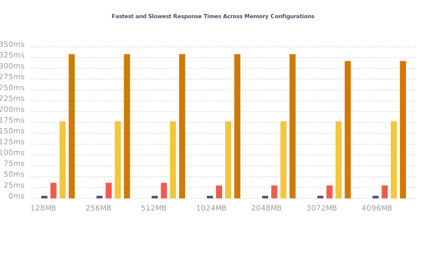

# Benchmark: Response Times

The following are the response time results from AWS XRay, generated after running `npm run benchmark`.

- 🔵: Average cold startup times
- 🔴: Average warm startup times

- 🔵: Fastest warm response time
- 🔴: Slowest warm response time
- 🟡: Fastest cold response time
- 🟠: Slowest cold response time

## Overview

  
- [Results for 128 MB](#results-for-128-mb)
- [Results for 256 MB](#results-for-256-mb)
- [Results for 512 MB](#results-for-512-mb)
- [Results for 1024 MB](#results-for-1024-mb)
- [Results for 2048 MB](#results-for-2048-mb)
- [Results for 3072 MB](#results-for-3072-mb)
- [Results for 4096 MB](#results-for-4096-mb)

## Results for 128 MB

| Measurement (128 MB) | Time (ms) |
|-------------|------|
| Average warm start response time | NaN ms |
| Average cold start response time | NaN ms |
| Fastest warm response time | NaN ms |
| Slowest warm response time | NaN ms |
| Fastest cold response time  | NaN ms |
| Slowest cold response time | NaN ms |
  

| Response time | Initialization | Invocation | Overhead | Cold/ Warm Start | Memory Size | Trace ID |
|---------------|----------------|------------|----------|------------------|-------------|----------|

## Results for 256 MB

| Measurement (256 MB) | Time (ms) |
|-------------|------|
| Average warm start response time | NaN ms |
| Average cold start response time | NaN ms |
| Fastest warm response time | NaN ms |
| Slowest warm response time | NaN ms |
| Fastest cold response time  | NaN ms |
| Slowest cold response time | NaN ms |
  

| Response time | Initialization | Invocation | Overhead | Cold/ Warm Start | Memory Size | Trace ID |
|---------------|----------------|------------|----------|------------------|-------------|----------|

## Results for 512 MB

| Measurement (512 MB) | Time (ms) |
|-------------|------|
| Average warm start response time | NaN ms |
| Average cold start response time | NaN ms |
| Fastest warm response time | NaN ms |
| Slowest warm response time | NaN ms |
| Fastest cold response time  | NaN ms |
| Slowest cold response time | NaN ms |
  

| Response time | Initialization | Invocation | Overhead | Cold/ Warm Start | Memory Size | Trace ID |
|---------------|----------------|------------|----------|------------------|-------------|----------|

## Results for 1024 MB

| Measurement (1024 MB) | Time (ms) |
|-------------|------|
| Average warm start response time | NaN ms |
| Average cold start response time | NaN ms |
| Fastest warm response time | NaN ms |
| Slowest warm response time | NaN ms |
| Fastest cold response time  | NaN ms |
| Slowest cold response time | NaN ms |
  

| Response time | Initialization | Invocation | Overhead | Cold/ Warm Start | Memory Size | Trace ID |
|---------------|----------------|------------|----------|------------------|-------------|----------|

## Results for 2048 MB

| Measurement (2048 MB) | Time (ms) |
|-------------|------|
| Average warm start response time | NaN ms |
| Average cold start response time | NaN ms |
| Fastest warm response time | NaN ms |
| Slowest warm response time | NaN ms |
| Fastest cold response time  | NaN ms |
| Slowest cold response time | NaN ms |
  

| Response time | Initialization | Invocation | Overhead | Cold/ Warm Start | Memory Size | Trace ID |
|---------------|----------------|------------|----------|------------------|-------------|----------|

## Results for 3072 MB

| Measurement (3072 MB) | Time (ms) |
|-------------|------|
| Average warm start response time | NaN ms |
| Average cold start response time | NaN ms |
| Fastest warm response time | NaN ms |
| Slowest warm response time | NaN ms |
| Fastest cold response time  | NaN ms |
| Slowest cold response time | NaN ms |
  

| Response time | Initialization | Invocation | Overhead | Cold/ Warm Start | Memory Size | Trace ID |
|---------------|----------------|------------|----------|------------------|-------------|----------|

## Results for 4096 MB

| Measurement (4096 MB) | Time (ms) |
|-------------|------|
| Average warm start response time | NaN ms |
| Average cold start response time | NaN ms |
| Fastest warm response time | NaN ms |
| Slowest warm response time | NaN ms |
| Fastest cold response time  | NaN ms |
| Slowest cold response time | NaN ms |
  

| Response time | Initialization | Invocation | Overhead | Cold/ Warm Start | Memory Size | Trace ID |
|---------------|----------------|------------|----------|------------------|-------------|----------|

## XRay Example of a Cold Start

## XRay Example of a Warm Start

